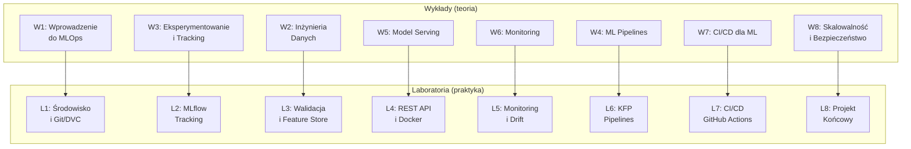
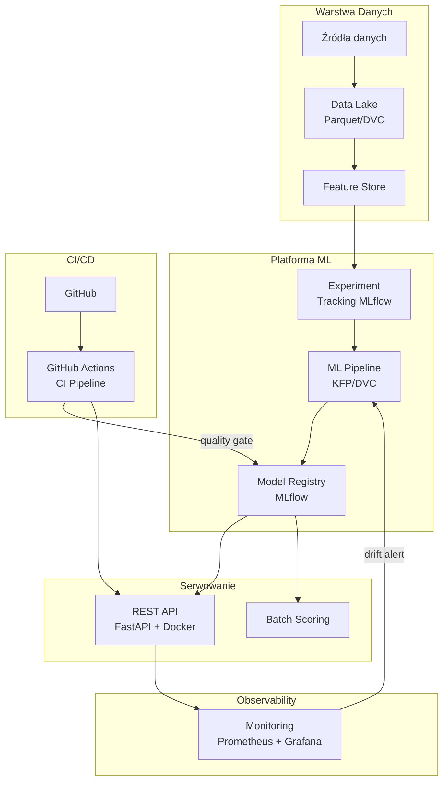

# MLOps i Inżynieria Systemów ML

Repozytorium zawiera kompletne materiały dydaktyczne do przedmiotu **„MLOps i Inżynieria Systemów ML"**: 8 wykładów i 8 laboratoriów z teorią, diagramami Mermaid i przykładami w Pythonie.

---

## Struktura repozytorium

```
materials-about-MLOps/
├── lectures/          # 8 wykładów (teoria + diagramy + przykłady)
├── labs/              # 8 laboratoriów (ćwiczenia praktyczne)
├── SYLLABUS.md        # Program przedmiotu
└── README.md          # Ten plik
```

---

## Wykłady

| # | Temat | Plik |
|---|-------|------|
| 1 | Wprowadzenie do MLOps i Inżynierii Systemów ML | [lecture_01](lectures/lecture_01_wprowadzenie_do_mlops.md) |
| 2 | Inżynieria Danych dla ML | [lecture_02](lectures/lecture_02_inzynieria_danych.md) |
| 3 | Eksperymentowanie i Śledzenie Eksperymentów | [lecture_03](lectures/lecture_03_eksperymentowanie_i_tracking.md) |
| 4 | ML Pipelines – Automatyzacja Przepływu Pracy | [lecture_04](lectures/lecture_04_ml_pipelines.md) |
| 5 | Wdrażanie i Serwowanie Modeli ML | [lecture_05](lectures/lecture_05_model_serving.md) |
| 6 | Monitoring Modeli ML w Produkcji | [lecture_06](lectures/lecture_06_monitoring.md) |
| 7 | CI/CD dla Machine Learning | [lecture_07](lectures/lecture_07_cicd_dla_ml.md) |
| 8 | Skalowalność, Bezpieczeństwo i Optymalizacja Kosztów | [lecture_08](lectures/lecture_08_skalowalnosc_i_bezpieczenstwo.md) |

---

## Laboratoria

| # | Temat | Plik | Poziom |
|---|-------|------|--------|
| 1 | Środowisko MLOps i Wersjonowanie Kodu | [lab_01](labs/lab_01_srodowisko_i_git.md) | Podstawowy |
| 2 | Śledzenie Eksperymentów z MLflow | [lab_02](labs/lab_02_mlflow_tracking.md) | Podstawowy–Średni |
| 3 | Walidacja Danych i Feature Store | [lab_03](labs/lab_03_walidacja_danych.md) | Średni |
| 4 | REST API i Serwowanie Modelu ML | [lab_04](labs/lab_04_rest_api_serwowanie.md) | Średni |
| 5 | Monitoring Modelu i Wykrywanie Dryfu | [lab_05](labs/lab_05_monitoring_dryft.md) | Średni–Zaawansowany |
| 6 | Budowanie ML Pipeline z Kubeflow Pipelines | [lab_06](labs/lab_06_ml_pipeline_kfp.md) | Zaawansowany |
| 7 | CI/CD dla ML z GitHub Actions | [lab_07](labs/lab_07_cicd_github_actions.md) | Zaawansowany |
| 8 | Projekt Końcowy – Kompletny System MLOps | [lab_08](labs/lab_08_projekt_koncowy.md) | Zaawansowany |

---

## Mapa tematyczna



---

## Wymagania techniczne

### Środowisko
- Python 3.11+
- Git 2.40+
- Docker 24+

### Główne biblioteki

```bash
pip install \
    scikit-learn pandas numpy matplotlib \
    mlflow dvc \
    fastapi uvicorn pydantic \
    kfp \
    prometheus-client \
    pytest ruff pre-commit \
    scipy joblib pyarrow
```

### Narzędzia zewnętrzne
- [MLflow](https://mlflow.org/) – śledzenie eksperymentów
- [DVC](https://dvc.org/) – wersjonowanie danych
- [Kubeflow Pipelines](https://www.kubeflow.org/docs/components/pipelines/) – orkiestracja ML
- [Prometheus](https://prometheus.io/) + [Grafana](https://grafana.com/) – monitoring
- [GitHub Actions](https://github.com/features/actions) – CI/CD

---

## Szybki start

```bash
# Klonowanie repozytorium
git clone https://github.com/TWOJ_LOGIN/materials-about-MLOps.git
cd materials-about-MLOps

# Przeglądanie wykładów
ls lectures/

# Przeglądanie laboratoriów
ls labs/

# Zacznij od Lab 1
cat labs/lab_01_srodowisko_i_git.md
```

---

## Program przedmiotu

Szczegółowy program znajduje się w pliku [SYLLABUS.md](SYLLABUS.md).

### Rozkład godzinowy
- **Wykłady:** 8 × 2h = 16h
- **Laboratoria:** 8 × 2h = 16h

### Tematy wykładów

| Wykład | Temat | Kluczowe pojęcia |
|--------|-------|-----------------|
| W1 | Wprowadzenie do MLOps | MLOps vs DevOps, cykl życia ML, poziomy dojrzałości |
| W2 | Inżynieria Danych | Data Lake, ETL/ELT, Feature Store, DVC, Parquet |
| W3 | Eksperymentowanie | MLflow, Optuna, hyperparameter tuning, reproducibility |
| W4 | ML Pipelines | KFP, DAG, komponenty, caching, Airflow |
| W5 | Model Serving | REST API, FastAPI, Docker, canary/blue-green, batch |
| W6 | Monitoring | Data drift, PSI, KS test, Prometheus, auto-retraining |
| W7 | CI/CD dla ML | GitHub Actions, quality gates, testing ML code |
| W8 | Skalowalność | Kubernetes HPA, quantization, distillation, koszty |

### Tematy laboratoriów

| Lab | Temat | Narzędzia |
|-----|-------|-----------|
| L1 | Środowisko i wersjonowanie | Git, DVC, pytest, pre-commit |
| L2 | Śledzenie eksperymentów | MLflow, scikit-learn, Optuna |
| L3 | Walidacja i Feature Store | Great Expectations, własny Feature Store |
| L4 | REST API i Docker | FastAPI, Pydantic, Docker, httpx |
| L5 | Monitoring i drift | KS test, PSI, Prometheus, Grafana |
| L6 | ML Pipeline KFP | Kubeflow Pipelines SDK v2 |
| L7 | CI/CD | GitHub Actions, quality gates, branching |
| L8 | Projekt końcowy | Integracja wszystkich komponentów |

---

## Architektura referencyjna systemu MLOps



---

## Licencja

Materiały udostępnione na licencji [MIT](LICENSE).
