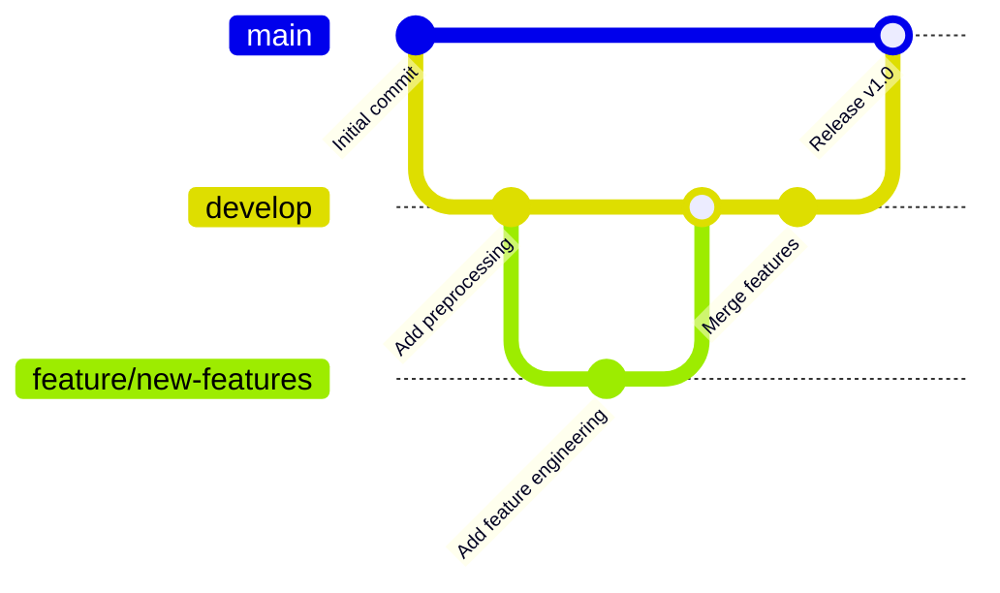

# Laboratorium 7: CI/CD dla ML z GitHub Actions

## Informacje ogólne
- **Czas:** 2 godziny
- **Poziom:** Zaawansowany
- **Wymagania wstępne:** Lab 1–6 ukończone, konto GitHub

## Cele laboratorium
Po tym laboratorium student:
- skonfiguruje repozytorium GitHub z branching strategy,
- zbuduje workflow CI/CD dla projektu ML,
- zaimplementuje quality gates blokujące wdrożenie słabych modeli,
- skonfiguruje automatyczne uruchamianie testów przy każdym push.

---

## Część 1: Konfiguracja repozytorium GitHub (20 min)

### Krok 1.1: Inicjalizacja repozytorium

```bash
cd mlops-project

# Upewnij się, że masz zainicjowane repozytorium Git
git status

# Utwórz repozytorium na GitHub (przez GitHub CLI lub ręcznie)
# gh repo create mlops-churn-prediction --public --source=. --push

# Lub ręcznie:
git remote add origin https://github.com/TWOJ_LOGIN/mlops-churn-prediction.git
git branch -M main
git push -u origin main
```

### Krok 1.2: Branching strategy



Strategia gałęzi:
- `main` – kod produkcyjny, tylko przez PR
- `develop` – integracja zmian
- `feature/*` – nowe funkcjonalności
- `hotfix/*` – pilne poprawki

```bash
# Utwórz gałąź develop
git checkout -b develop
git push -u origin develop

# Skonfiguruj ochronę gałęzi main (przez GitHub UI):
# Settings → Branches → Add rule → main
# ✅ Require pull request reviews
# ✅ Require status checks to pass
# ✅ Require branches to be up to date
```

---

## Część 2: Workflow CI – Testy i Walidacja (40 min)

### Krok 2.1: Podstawowy workflow CI

Utwórz `.github/workflows/ci.yml`:

```yaml
# .github/workflows/ci.yml
name: CI – Testy i Walidacja

on:
  push:
    branches: [main, develop]
  pull_request:
    branches: [main, develop]

env:
  PYTHON_VERSION: '3.11'

jobs:
  # ── Job 1: Linting i formatowanie ────────────────────────────────────────
  lint:
    name: Linting
    runs-on: ubuntu-latest

    steps:
      - uses: actions/checkout@v4

      - name: Setup Python
        uses: actions/setup-python@v5
        with:
          python-version: ${{ env.PYTHON_VERSION }}
          cache: 'pip'

      - name: Install linting tools
        run: pip install ruff==0.3.0 mypy==1.8.0

      - name: Run ruff (linting)
        run: ruff check src/ tests/ pipeline/ --output-format=github

      - name: Run ruff (formatting check)
        run: ruff format --check src/ tests/ pipeline/

  # ── Job 2: Testy jednostkowe ──────────────────────────────────────────────
  unit-tests:
    name: Unit Tests
    runs-on: ubuntu-latest
    needs: lint

    steps:
      - uses: actions/checkout@v4

      - name: Setup Python
        uses: actions/setup-python@v5
        with:
          python-version: ${{ env.PYTHON_VERSION }}
          cache: 'pip'

      - name: Install dependencies
        run: |
          pip install -r requirements.txt
          pip install pytest==8.0.0 pytest-cov==4.1.0

      - name: Run unit tests
        run: |
          pytest tests/unit/ -v \
            --cov=src \
            --cov-report=xml \
            --cov-report=term-missing \
            --junitxml=reports/junit-unit.xml

      - name: Upload coverage report
        uses: codecov/codecov-action@v4
        with:
          file: coverage.xml
          flags: unit-tests
        continue-on-error: true

      - name: Upload test results
        uses: actions/upload-artifact@v4
        if: always()
        with:
          name: unit-test-results
          path: reports/junit-unit.xml

  # ── Job 3: Testy danych ───────────────────────────────────────────────────
  data-tests:
    name: Data Tests
    runs-on: ubuntu-latest
    needs: lint

    steps:
      - uses: actions/checkout@v4

      - name: Setup Python
        uses: actions/setup-python@v5
        with:
          python-version: ${{ env.PYTHON_VERSION }}
          cache: 'pip'

      - name: Install dependencies
        run: pip install -r requirements.txt pytest==8.0.0

      - name: Generate test data
        run: python scripts/generate_data.py --n-samples 2000 --output data/raw/customers.parquet

      - name: Run preprocessing
        run: python src/data/preprocess.py

      - name: Run data tests
        run: pytest tests/data/ -v --junitxml=reports/junit-data.xml

      - name: Upload test results
        uses: actions/upload-artifact@v4
        if: always()
        with:
          name: data-test-results
          path: reports/junit-data.xml

  # ── Job 4: Testy API ──────────────────────────────────────────────────────
  api-tests:
    name: API Tests
    runs-on: ubuntu-latest
    needs: unit-tests

    steps:
      - uses: actions/checkout@v4

      - name: Setup Python
        uses: actions/setup-python@v5
        with:
          python-version: ${{ env.PYTHON_VERSION }}
          cache: 'pip'

      - name: Install dependencies
        run: pip install -r requirements.txt pytest==8.0.0 httpx==0.27.0

      - name: Run API tests
        run: pytest tests/model/test_api.py -v --junitxml=reports/junit-api.xml

      - name: Upload test results
        uses: actions/upload-artifact@v4
        if: always()
        with:
          name: api-test-results
          path: reports/junit-api.xml
```

### Krok 2.2: Workflow treningu i ewaluacji modelu

Utwórz `.github/workflows/train_evaluate.yml`:

```yaml
# .github/workflows/train_evaluate.yml
name: Train & Evaluate Model

on:
  push:
    branches: [main]
    paths:
      - 'src/**'
      - 'params.yaml'
      - 'data/**/*.dvc'
  workflow_dispatch:
    inputs:
      n_samples:
        description: 'Liczba próbek treningowych'
        required: false
        default: '10000'
      min_auc:
        description: 'Minimalny AUC-ROC'
        required: false
        default: '0.75'

env:
  PYTHON_VERSION: '3.11'

jobs:
  train-and-evaluate:
    name: Train & Evaluate
    runs-on: ubuntu-latest

    steps:
      - uses: actions/checkout@v4

      - name: Setup Python
        uses: actions/setup-python@v5
        with:
          python-version: ${{ env.PYTHON_VERSION }}
          cache: 'pip'

      - name: Install dependencies
        run: pip install -r requirements.txt

      - name: Generate training data
        run: |
          python scripts/generate_data.py \
            --n-samples ${{ github.event.inputs.n_samples || '10000' }} \
            --output data/raw/customers.parquet

      - name: Preprocess data
        run: python src/data/preprocess.py

      - name: Validate data
        run: |
          python scripts/validate_data.py \
            --input data/processed/train.parquet \
            --output-report reports/metrics/validation_report.json

      - name: Train model
        run: python src/models/train.py

      - name: Evaluate model
        id: evaluate
        run: |
          python scripts/evaluate_model.py \
            --model models/churn_model.pkl \
            --test-data data/processed/test.parquet \
            --output reports/metrics/eval_metrics.json

          # Odczytaj AUC i ustaw jako output
          AUC=$(python -c "
          import json
          with open('reports/metrics/eval_metrics.json') as f:
              m = json.load(f)
          print(m.get('test_auc_roc', 0))
          ")
          echo "auc_roc=$AUC" >> $GITHUB_OUTPUT
          echo "Model AUC-ROC: $AUC"

      - name: Quality Gate
        run: |
          python -c "
          import json, sys
          with open('reports/metrics/eval_metrics.json') as f:
              metrics = json.load(f)
          
          min_auc = float('${{ github.event.inputs.min_auc || 0.75 }}')
          auc = metrics.get('test_auc_roc', 0)
          f1 = metrics.get('test_f1', 0)
          
          print(f'AUC-ROC: {auc:.4f} (min: {min_auc})')
          print(f'F1-Score: {f1:.4f}')
          
          failures = []
          if auc < min_auc:
              failures.append(f'AUC {auc:.4f} < {min_auc}')
          if f1 < 0.60:
              failures.append(f'F1 {f1:.4f} < 0.60')
          
          if failures:
              print(f'❌ Quality Gate FAILED: {failures}')
              sys.exit(1)
          print('✅ Quality Gate PASSED')
          "

      - name: Upload model artifacts
        uses: actions/upload-artifact@v4
        with:
          name: trained-model-${{ github.sha }}
          path: |
            models/churn_model.pkl
            reports/metrics/eval_metrics.json
          retention-days: 30

      - name: Comment PR with metrics
        if: github.event_name == 'pull_request'
        uses: actions/github-script@v7
        with:
          script: |
            const fs = require('fs');
            const metrics = JSON.parse(fs.readFileSync('reports/metrics/eval_metrics.json'));
            const body = `## 📊 Wyniki ewaluacji modelu
            
            | Metryka | Wartość |
            |---------|---------|
            | AUC-ROC | ${metrics.test_auc_roc?.toFixed(4) || 'N/A'} |
            | F1-Score | ${metrics.test_f1?.toFixed(4) || 'N/A'} |
            | Accuracy | ${metrics.test_accuracy?.toFixed(4) || 'N/A'} |
            | Precision | ${metrics.test_precision?.toFixed(4) || 'N/A'} |
            | Recall | ${metrics.test_recall?.toFixed(4) || 'N/A'} |
            
            **Commit:** \`${{ github.sha }}\`
            `;
            
            github.rest.issues.createComment({
              issue_number: context.issue.number,
              owner: context.repo.owner,
              repo: context.repo.repo,
              body: body
            });
```

---

## Część 3: Skrypt ewaluacji modelu (20 min)

### Krok 3.1: Skrypt evaluate_model.py

Utwórz `scripts/evaluate_model.py`:

```python
# scripts/evaluate_model.py
"""Ewaluacja modelu na zbiorze testowym."""

import sys
import json
import argparse
import time
from pathlib import Path

import pandas as pd
import numpy as np
import joblib
from sklearn.metrics import (
    roc_auc_score, f1_score, accuracy_score,
    precision_score, recall_score, average_precision_score
)

sys.path.insert(0, '.')

FEATURE_COLS = [
    'age', 'income', 'tenure_months', 'num_products',
    'has_credit_card', 'is_active', 'balance',
    'num_transactions_30d', 'income_per_age',
    'balance_per_product', 'is_long_tenure'
]


def evaluate_model(model_path: str, test_data_path: str) -> dict:
    """Ewaluuje model i zwraca metryki."""
    print(f"Ładowanie modelu: {model_path}")
    model = joblib.load(model_path)

    print(f"Wczytywanie danych testowych: {test_data_path}")
    test_df = pd.read_parquet(test_data_path)

    available_features = [c for c in FEATURE_COLS if c in test_df.columns]
    X_test = test_df[available_features]
    y_test = test_df['churn']

    print(f"Ewaluacja na {len(X_test):,} próbkach, {len(available_features)} cechach")

    # Pomiar latencji
    t0 = time.time()
    y_pred = model.predict(X_test)
    y_prob = model.predict_proba(X_test)[:, 1]
    latency_ms = (time.time() - t0) * 1000 / len(X_test)

    metrics = {
        "test_auc_roc": float(roc_auc_score(y_test, y_prob)),
        "test_f1": float(f1_score(y_test, y_pred)),
        "test_accuracy": float(accuracy_score(y_test, y_pred)),
        "test_precision": float(precision_score(y_test, y_pred)),
        "test_recall": float(recall_score(y_test, y_pred)),
        "test_avg_precision": float(average_precision_score(y_test, y_prob)),
        "avg_latency_ms": round(latency_ms, 3),
        "n_test_samples": len(y_test),
        "churn_rate_test": float(y_test.mean()),
        "n_features": len(available_features)
    }

    print("\n=== Wyniki ewaluacji ===")
    for k, v in metrics.items():
        if isinstance(v, float):
            print(f"  {k}: {v:.4f}")
        else:
            print(f"  {k}: {v}")

    return metrics


def main():
    parser = argparse.ArgumentParser()
    parser.add_argument("--model", required=True, help="Ścieżka do modelu")
    parser.add_argument("--test-data", required=True, help="Ścieżka do danych testowych")
    parser.add_argument("--output", default="reports/metrics/eval_metrics.json")
    args = parser.parse_args()

    metrics = evaluate_model(args.model, args.test_data)

    Path(args.output).parent.mkdir(parents=True, exist_ok=True)
    with open(args.output, "w") as f:
        json.dump(metrics, f, indent=2)

    print(f"\n✅ Metryki zapisane: {args.output}")


if __name__ == "__main__":
    main()
```

---

## Część 4: Workflow wdrożenia (20 min)

### Krok 4.1: Workflow CD

Utwórz `.github/workflows/deploy.yml`:

```yaml
# .github/workflows/deploy.yml
name: Deploy Model

on:
  workflow_run:
    workflows: ["Train & Evaluate Model"]
    types: [completed]
    branches: [main]

jobs:
  deploy:
    name: Deploy to Production
    runs-on: ubuntu-latest
    if: ${{ github.event.workflow_run.conclusion == 'success' }}
    environment: production

    steps:
      - uses: actions/checkout@v4

      - name: Download model artifacts
        uses: actions/download-artifact@v4
        with:
          name: trained-model-${{ github.event.workflow_run.head_sha }}
          run-id: ${{ github.event.workflow_run.id }}
          github-token: ${{ secrets.GITHUB_TOKEN }}

      - name: Setup Python
        uses: actions/setup-python@v5
        with:
          python-version: '3.11'
          cache: 'pip'

      - name: Install dependencies
        run: pip install -r requirements.txt

      - name: Final quality check before deploy
        run: |
          python -c "
          import json, sys
          with open('reports/metrics/eval_metrics.json') as f:
              m = json.load(f)
          auc = m.get('test_auc_roc', 0)
          print(f'Final AUC check: {auc:.4f}')
          if auc < 0.75:
              print('❌ AUC zbyt niskie – wstrzymuję wdrożenie')
              sys.exit(1)
          print('✅ Model zatwierdzony do wdrożenia')
          "

      - name: Build Docker image
        run: |
          docker build -t churn-api:${{ github.sha }} .
          docker tag churn-api:${{ github.sha }} churn-api:latest
          echo "✅ Obraz Docker zbudowany"

      - name: Smoke test Docker image
        run: |
          docker run -d --name test-api -p 8080:8080 churn-api:latest
          sleep 10
          curl -f http://localhost:8080/health || (docker logs test-api && exit 1)
          docker stop test-api && docker rm test-api
          echo "✅ Smoke test przeszedł"

      - name: Deploy (symulacja)
        run: |
          echo "🚀 Wdrażanie modelu na endpoint..."
          echo "   Commit: ${{ github.sha }}"
          echo "   Model: churn-api:${{ github.sha }}"
          # W produkcji:
          # gcloud ai endpoints deploy-model ENDPOINT_ID \
          #   --model=MODEL_ID \
          #   --display-name="churn-v${{ github.sha }}"
          echo "✅ Wdrożenie zakończone (symulacja)"

      - name: Create deployment summary
        run: |
          cat >> $GITHUB_STEP_SUMMARY << 'EOF'
          ## 🚀 Wdrożenie zakończone
          
          - **Commit:** `${{ github.sha }}`
          - **Środowisko:** Production
          - **Status:** ✅ Sukces
          EOF

      - name: Notify team
        if: always()
        run: |
          STATUS="${{ job.status }}"
          if [ "$STATUS" = "success" ]; then
            echo "✅ Wdrożenie zakończone sukcesem"
          else
            echo "❌ Wdrożenie nieudane"
          fi
          # W produkcji: wyślij powiadomienie Slack/email
```

---

## Część 5: Lokalne testowanie workflow (20 min)

### Krok 5.1: Skrypt lokalnego CI

Utwórz `scripts/run_ci_locally.sh`:

```bash
#!/bin/bash
# scripts/run_ci_locally.sh
# Symuluje workflow CI lokalnie

set -e  # zatrzymaj przy błędzie

echo "=================================================="
echo "  Lokalne CI – MLOps Churn Prediction"
echo "=================================================="

# Kolory
GREEN='\033[0;32m'
RED='\033[0;31m'
YELLOW='\033[1;33m'
NC='\033[0m'

step() { echo -e "\n${YELLOW}▶ $1${NC}"; }
ok()   { echo -e "${GREEN}✅ $1${NC}"; }
fail() { echo -e "${RED}❌ $1${NC}"; exit 1; }

# ── Krok 1: Linting ──────────────────────────────────────────────────────────
step "Linting (ruff)"
ruff check src/ tests/ --quiet && ok "Linting OK" || fail "Linting FAILED"

# ── Krok 2: Testy jednostkowe ─────────────────────────────────────────────────
step "Testy jednostkowe"
pytest tests/unit/ -q --tb=short && ok "Unit tests OK" || fail "Unit tests FAILED"

# ── Krok 3: Generowanie danych ────────────────────────────────────────────────
step "Generowanie danych testowych"
python scripts/generate_data.py --n-samples 2000 --output data/raw/customers.parquet
ok "Dane wygenerowane"

# ── Krok 4: Preprocessing ────────────────────────────────────────────────────
step "Preprocessing danych"
python src/data/preprocess.py && ok "Preprocessing OK" || fail "Preprocessing FAILED"

# ── Krok 5: Walidacja danych ──────────────────────────────────────────────────
step "Walidacja danych"
python scripts/validate_data.py --input data/processed/train.parquet && ok "Walidacja OK" || fail "Walidacja FAILED"

# ── Krok 6: Testy danych ──────────────────────────────────────────────────────
step "Testy danych"
pytest tests/data/ -q --tb=short && ok "Data tests OK" || fail "Data tests FAILED"

# ── Krok 7: Trening modelu ────────────────────────────────────────────────────
step "Trening modelu"
python src/models/train.py && ok "Trening OK" || fail "Trening FAILED"

# ── Krok 8: Ewaluacja modelu ──────────────────────────────────────────────────
step "Ewaluacja modelu"
python scripts/evaluate_model.py \
    --model models/churn_model.pkl \
    --test-data data/processed/test.parquet \
    --output reports/metrics/eval_metrics.json && ok "Ewaluacja OK" || fail "Ewaluacja FAILED"

# ── Krok 9: Quality Gate ──────────────────────────────────────────────────────
step "Quality Gate"
python -c "
import json, sys
with open('reports/metrics/eval_metrics.json') as f:
    m = json.load(f)
auc = m.get('test_auc_roc', 0)
f1 = m.get('test_f1', 0)
print(f'AUC-ROC: {auc:.4f}')
print(f'F1-Score: {f1:.4f}')
if auc < 0.70 or f1 < 0.50:
    print('❌ Quality Gate FAILED')
    sys.exit(1)
print('✅ Quality Gate PASSED')
" && ok "Quality Gate OK" || fail "Quality Gate FAILED"

# ── Krok 10: Testy API ────────────────────────────────────────────────────────
step "Testy API"
pytest tests/model/test_api.py -q --tb=short && ok "API tests OK" || fail "API tests FAILED"

echo ""
echo "=================================================="
echo -e "${GREEN}  ✅ Wszystkie kroki CI zakończone sukcesem!${NC}"
echo "=================================================="
```

```bash
# Nadaj uprawnienia i uruchom
chmod +x scripts/run_ci_locally.sh
./scripts/run_ci_locally.sh
```

### Krok 5.2: Commitowanie i testowanie workflow

```bash
# Utwórz gałąź feature
git checkout -b feature/add-ci-workflow

# Dodaj pliki workflow
git add .github/ scripts/evaluate_model.py scripts/run_ci_locally.sh
git commit -m "feat: add CI/CD workflows and evaluation script"

# Push i utwórz PR
git push -u origin feature/add-ci-workflow

# Na GitHub: utwórz Pull Request do develop
# Obserwuj jak uruchamiają się workflow CI
```

---

## Zadania do samodzielnego wykonania

1. **Dodaj job** `security-scan` używający `bandit` do skanowania kodu Python pod kątem podatności.
2. **Skonfiguruj cache** dla pip w workflow – zmierz jak skraca czas wykonania.
3. **Dodaj badge** statusu CI do README.md (`[]`).
4. **Zaimplementuj** workflow `scheduled_retraining.yml` uruchamiający trening co tydzień.

## Pytania kontrolne

1. Dlaczego Quality Gate powinien być osobnym krokiem, a nie częścią treningu?
2. Co to jest `environment: production` w GitHub Actions i jak chroni wdrożenie?
3. Jak `workflow_run` różni się od `on: push` jako trigger?
4. Dlaczego warto uruchamiać CI lokalnie przed push?

## Podsumowanie

W tym laboratorium:
- ✅ Skonfigurowałeś branching strategy dla projektu ML
- ✅ Zbudowałeś workflow CI z lintingiem, testami i walidacją danych
- ✅ Zaimplementowałeś Quality Gate blokujący słabe modele
- ✅ Zbudowałeś workflow CD z smoke testami
- ✅ Uruchomiłeś pełne CI lokalnie
