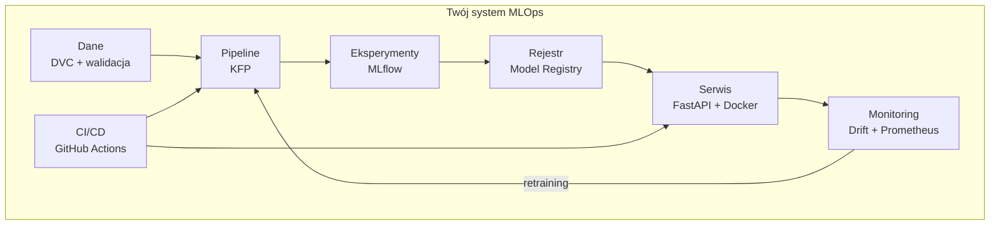
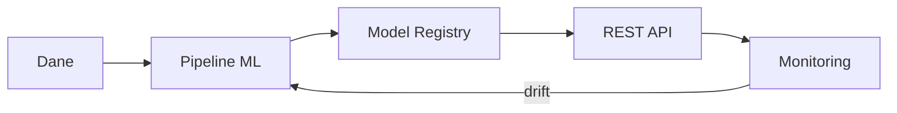
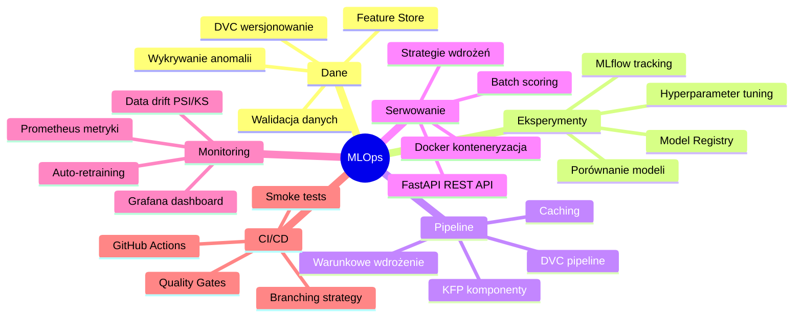

# Laboratorium 8: Projekt Końcowy – Kompletny System MLOps

## Informacje ogólne
- **Czas:** 2 godziny (+ praca własna)
- **Poziom:** Zaawansowany
- **Wymagania wstępne:** Lab 1–7 ukończone

## Cel projektu

Zbuduj **kompletny system MLOps** dla wybranego problemu ML, integrując wszystkie elementy poznane na zajęciach:



---

## Część 1: Wybór problemu i planowanie (20 min)

### Krok 1.1: Wybór problemu ML

Wybierz jeden z poniższych problemów lub zaproponuj własny:

| Problem | Typ | Zbiór danych | Trudność |
|---------|-----|-------------|----------|
| Predykcja churnu klientów | Klasyfikacja | Syntetyczny (Lab 1) | ⭐⭐ |
| Wykrywanie fraudów | Klasyfikacja | [Kaggle Credit Card Fraud](https://www.kaggle.com/datasets/mlg-ulb/creditcardfraud) | ⭐⭐⭐ |
| Predykcja cen mieszkań | Regresja | [Boston Housing / Ames](https://www.kaggle.com/c/house-prices-advanced-regression-techniques) | ⭐⭐ |
| Klasyfikacja sentymentu | NLP | [IMDB Reviews](https://huggingface.co/datasets/imdb) | ⭐⭐⭐ |
| Własny problem | Dowolny | Własne dane | ⭐⭐–⭐⭐⭐⭐ |

### Krok 1.2: Karta projektu

Wypełnij kartę projektu przed rozpoczęciem implementacji:

```markdown
# Karta Projektu MLOps

## Informacje podstawowe
- **Nazwa projektu:** [np. fraud-detection-mlops]
- **Autor:** [imię i nazwisko]
- **Data:** [data]

## Problem ML
- **Typ problemu:** [klasyfikacja / regresja / inne]
- **Opis:** [1-2 zdania opisu problemu]
- **Metryka sukcesu ML:** [np. AUC-ROC >= 0.85]
- **Metryka biznesowa:** [np. wykrycie 90% fraudów]

## Dane
- **Źródło danych:** [skąd pochodzą dane]
- **Liczba próbek:** [szacowana]
- **Liczba cech:** [szacowana]
- **Etykieta:** [nazwa kolumny docelowej]

## Architektura systemu
- **Serwowanie:** [online / batch / oba]
- **Częstotliwość retreningu:** [np. co tydzień]
- **SLA latencji:** [np. < 100ms]

## Harmonogram
- [ ] Tydzień 1: Dane i preprocessing
- [ ] Tydzień 2: Eksperymenty i model
- [ ] Tydzień 3: Pipeline i API
- [ ] Tydzień 4: Monitoring i CI/CD
```

---

## Część 2: Implementacja systemu (90 min)

### Krok 2.1: Checklist implementacji

Użyj poniższej checklisty jako przewodnika:

#### 📁 Struktura projektu
```
moj-projekt-mlops/
├── .github/
│   └── workflows/
│       ├── ci.yml
│       └── train_evaluate.yml
├── data/
│   ├── raw/           # śledzone przez DVC
│   └── processed/     # śledzone przez DVC
├── src/
│   ├── data/
│   │   ├── preprocess.py
│   │   └── validation.py
│   ├── models/
│   │   └── train.py
│   ├── serving/
│   │   └── api.py
│   └── monitoring/
│       └── drift_monitor.py
├── pipeline/
│   ├── components/
│   └── pipeline.py
├── tests/
│   ├── unit/
│   ├── data/
│   └── model/
├── scripts/
│   ├── generate_data.py
│   ├── validate_data.py
│   └── evaluate_model.py
├── Dockerfile
├── docker-compose.yml
├── params.yaml
├── dvc.yaml
├── requirements.txt
└── README.md
```

#### ✅ Wymagania minimalne (ocena dostateczna)

```python
# Sprawdź czy spełniasz wymagania minimalne
requirements_minimal = {
    "dane_wersjonowane_dvc": False,        # dvc add + dvc push
    "pipeline_dvc": False,                  # dvc.yaml z min. 2 krokami
    "eksperymenty_mlflow": False,           # min. 3 eksperymenty zalogowane
    "model_w_registry": False,              # model w MLflow Registry
    "rest_api_fastapi": False,              # /health + /predict
    "testy_jednostkowe": False,             # min. 5 testów
    "dockerfile": False,                    # działający kontener
    "readme_z_instrukcja": False,           # jak uruchomić projekt
}

# Wymagania rozszerzone (ocena dobra/bardzo dobra)
requirements_extended = {
    "pipeline_kfp": False,                  # min. 3 komponenty KFP
    "monitoring_dryfu": False,              # PSI/KS test
    "cicd_github_actions": False,           # workflow CI z testami
    "quality_gate": False,                  # automatyczna bramka jakości
    "docker_compose": False,                # docker-compose z API
    "testy_api": False,                     # testy integracyjne API
    "dokumentacja_techniczna": False,       # opis architektury
}
```

### Krok 2.2: Szablon README projektu

Utwórz `README.md` dla swojego projektu:

```markdown
# [Nazwa Projektu] – System MLOps

[](https://github.com/TWOJ_LOGIN/REPO/actions/workflows/ci.yml)

## Opis projektu

[Krótki opis problemu ML i rozwiązania]

## Architektura systemu



## Szybki start

### Wymagania
- Python 3.11+
- Docker
- Git + DVC

### Instalacja

```bash
# Klonowanie repozytorium
git clone https://github.com/TWOJ_LOGIN/REPO.git
cd REPO

# Środowisko wirtualne
python -m venv venv
source venv/bin/activate

# Zależności
pip install -r requirements.txt

# Dane (przez DVC)
dvc pull
```

### Uruchomienie pipeline'u

```bash
# Pełny pipeline (dane → model)
dvc repro

# Lub krok po kroku
python scripts/generate_data.py
python src/data/preprocess.py
python src/models/train.py
python scripts/evaluate_model.py --model models/model.pkl --test-data data/processed/test.parquet
```

### Uruchomienie API

```bash
# Lokalnie
uvicorn src.serving.api:app --port 8080

# Docker
docker-compose up -d

# Test
curl http://localhost:8080/health
```

### Uruchomienie testów

```bash
pytest tests/ -v
```

## Wyniki modelu

| Metryka | Wartość |
|---------|---------|
| AUC-ROC | [wartość] |
| F1-Score | [wartość] |
| Latencja p95 | [wartość] ms |

## Struktura projektu

[Opis struktury katalogów]

## Autor

[Imię i nazwisko], [rok]
```

---

## Część 3: Integracja komponentów (30 min)

### Krok 3.1: Skrypt end-to-end

Utwórz `scripts/run_full_pipeline.py`:

```python
# scripts/run_full_pipeline.py
"""
Uruchamia kompletny pipeline MLOps end-to-end.
Używaj do weryfikacji że wszystkie komponenty działają razem.
"""

import sys
import time
import json
import subprocess
import logging
from pathlib import Path
from datetime import datetime

logging.basicConfig(
    level=logging.INFO,
    format="%(asctime)s %(levelname)s %(message)s"
)
logger = logging.getLogger(__name__)


class PipelineRunner:
    """Uruchamia i monitoruje kompletny pipeline MLOps."""

    def __init__(self, config: dict):
        self.config = config
        self.results = {}
        self.start_time = time.time()

    def run_step(self, name: str, cmd: list[str], required: bool = True) -> bool:
        """Uruchamia jeden krok pipeline'u."""
        logger.info(f"▶ {name}")
        t0 = time.time()

        try:
            result = subprocess.run(
                cmd,
                capture_output=True,
                text=True,
                timeout=300
            )
            elapsed = time.time() - t0

            if result.returncode == 0:
                logger.info(f"  ✅ {name} ({elapsed:.1f}s)")
                self.results[name] = {"status": "success", "time_s": elapsed}
                return True
            else:
                logger.error(f"  ❌ {name} FAILED:\n{result.stderr}")
                self.results[name] = {
                    "status": "failed",
                    "time_s": elapsed,
                    "error": result.stderr[:500]
                }
                if required:
                    raise RuntimeError(f"Krok '{name}' zakończył się błędem")
                return False

        except subprocess.TimeoutExpired:
            logger.error(f"  ⏰ {name} TIMEOUT (>300s)")
            self.results[name] = {"status": "timeout"}
            if required:
                raise
            return False

    def run(self) -> dict:
        """Uruchamia pełny pipeline."""
        logger.info("=" * 60)
        logger.info("  KOMPLETNY PIPELINE MLOPS")
        logger.info(f"  Start: {datetime.now().strftime('%Y-%m-%d %H:%M:%S')}")
        logger.info("=" * 60)

        try:
            # 1. Generowanie danych
            self.run_step(
                "Generowanie danych",
                ["python", "scripts/generate_data.py",
                 "--n-samples", str(self.config.get("n_samples", 5000))]
            )

            # 2. Preprocessing
            self.run_step(
                "Preprocessing",
                ["python", "src/data/preprocess.py"]
            )

            # 3. Walidacja danych
            self.run_step(
                "Walidacja danych",
                ["python", "scripts/validate_data.py",
                 "--input", "data/processed/train.parquet"]
            )

            # 4. Trening modelu
            self.run_step(
                "Trening modelu",
                ["python", "src/models/train.py"]
            )

            # 5. Ewaluacja modelu
            self.run_step(
                "Ewaluacja modelu",
                ["python", "scripts/evaluate_model.py",
                 "--model", "models/churn_model.pkl",
                 "--test-data", "data/processed/test.parquet",
                 "--output", "reports/metrics/eval_metrics.json"]
            )

            # 6. Sprawdź metryki
            self._check_quality_gate()

            # 7. Testy
            self.run_step(
                "Testy jednostkowe",
                ["pytest", "tests/unit/", "-q", "--tb=short"],
                required=False
            )

            self.run_step(
                "Testy API",
                ["pytest", "tests/model/test_api.py", "-q", "--tb=short"],
                required=False
            )

        except RuntimeError as e:
            logger.error(f"\n❌ Pipeline przerwany: {e}")
            self.results["pipeline_status"] = "failed"
        else:
            self.results["pipeline_status"] = "success"

        # Podsumowanie
        total_time = time.time() - self.start_time
        self.results["total_time_s"] = round(total_time, 1)

        self._print_summary()
        self._save_report()

        return self.results

    def _check_quality_gate(self):
        """Sprawdza bramkę jakości."""
        metrics_path = Path("reports/metrics/eval_metrics.json")
        if not metrics_path.exists():
            logger.warning("Brak pliku metryk – pomijam quality gate")
            return

        with open(metrics_path) as f:
            metrics = json.load(f)

        auc = metrics.get("test_auc_roc", 0)
        min_auc = self.config.get("min_auc", 0.70)

        logger.info(f"Quality Gate: AUC={auc:.4f} (min={min_auc})")

        if auc < min_auc:
            self.results["quality_gate"] = {"status": "failed", "auc": auc}
            raise RuntimeError(f"Quality Gate FAILED: AUC {auc:.4f} < {min_auc}")

        self.results["quality_gate"] = {"status": "passed", "auc": auc}
        logger.info(f"  ✅ Quality Gate PASSED")

    def _print_summary(self):
        """Drukuje podsumowanie pipeline'u."""
        logger.info("\n" + "=" * 60)
        logger.info("  PODSUMOWANIE PIPELINE'U")
        logger.info("=" * 60)

        for step, result in self.results.items():
            if isinstance(result, dict) and "status" in result:
                icon = "✅" if result["status"] == "success" else "❌"
                time_str = f" ({result.get('time_s', 0):.1f}s)" if "time_s" in result else ""
                logger.info(f"  {icon} {step}{time_str}")

        status = self.results.get("pipeline_status", "unknown")
        total = self.results.get("total_time_s", 0)
        logger.info(f"\nStatus: {'✅ SUKCES' if status == 'success' else '❌ BŁĄD'}")
        logger.info(f"Czas całkowity: {total:.1f}s")

    def _save_report(self):
        """Zapisuje raport pipeline'u."""
        report_path = Path("reports/metrics/pipeline_report.json")
        report_path.parent.mkdir(parents=True, exist_ok=True)

        report = {
            "timestamp": datetime.now().isoformat(),
            "config": self.config,
            "results": self.results
        }

        with open(report_path, "w") as f:
            json.dump(report, f, indent=2)

        logger.info(f"\nRaport zapisany: {report_path}")


if __name__ == "__main__":
    config = {
        "n_samples": 5000,
        "min_auc": 0.70,
        "run_api_tests": True
    }

    runner = PipelineRunner(config)
    results = runner.run()

    # Zakończ z kodem błędu jeśli pipeline nie powiódł się
    if results.get("pipeline_status") != "success":
        sys.exit(1)
```

```bash
# Uruchom kompletny pipeline
python scripts/run_full_pipeline.py
```

---

## Część 4: Kryteria oceny i prezentacja (10 min)

### Krok 4.1: Kryteria oceny projektu

| Kryterium | Waga | Opis |
|-----------|------|------|
| **Dane i preprocessing** | 15% | DVC, walidacja, feature engineering |
| **Eksperymenty ML** | 15% | MLflow, min. 3 eksperymenty, model registry |
| **Pipeline** | 20% | DVC pipeline lub KFP, reprodukowalność |
| **REST API** | 15% | FastAPI, testy, Docker |
| **Monitoring** | 15% | Wykrywanie dryfu, metryki |
| **CI/CD** | 10% | GitHub Actions, quality gate |
| **Dokumentacja** | 10% | README, komentarze, architektura |

### Krok 4.2: Samoocena projektu

```python
# scripts/self_assessment.py
"""Automatyczna samoocena projektu MLOps."""

import os
import json
from pathlib import Path


def check_requirement(name: str, check_fn, points: int) -> tuple[bool, int]:
    """Sprawdza jedno wymaganie i zwraca (spełnione, punkty)."""
    try:
        result = check_fn()
        if result:
            print(f"  ✅ [{points}p] {name}")
            return True, points
        else:
            print(f"  ❌ [0p]  {name}")
            return False, 0
    except Exception as e:
        print(f"  ⚠️  [0p]  {name} (błąd: {e})")
        return False, 0


def run_self_assessment():
    """Uruchamia pełną samoocenę projektu."""
    print("=" * 60)
    print("  SAMOOCENA PROJEKTU MLOPS")
    print("=" * 60)

    total_points = 0
    max_points = 0

    # ── Dane i preprocessing ─────────────────────────────────────────────────
    print("\n📁 Dane i preprocessing (15p)")

    checks = [
        ("Dane wersjonowane przez DVC",
         lambda: Path("data/raw/customers.parquet.dvc").exists(), 5),
        ("Pipeline DVC zdefiniowany",
         lambda: Path("dvc.yaml").exists() and
                 len(Path("dvc.yaml").read_text()) > 100, 5),
        ("Walidacja danych zaimplementowana",
         lambda: Path("src/data/validation.py").exists(), 5),
    ]

    for name, fn, pts in checks:
        ok, earned = check_requirement(name, fn, pts)
        total_points += earned
        max_points += pts

    # ── Eksperymenty ML ───────────────────────────────────────────────────────
    print("\n🧪 Eksperymenty ML (15p)")

    checks = [
        ("MLflow tracking skonfigurowany",
         lambda: Path("src/models/experiment.py").exists() or
                 Path("src/models/train.py").read_text().__contains__("mlflow"), 5),
        ("Model zapisany w models/",
         lambda: any(Path("models/").glob("*.pkl")), 5),
        ("Metryki ewaluacji dostępne",
         lambda: Path("reports/metrics/eval_metrics.json").exists(), 5),
    ]

    for name, fn, pts in checks:
        ok, earned = check_requirement(name, fn, pts)
        total_points += earned
        max_points += pts

    # ── REST API ──────────────────────────────────────────────────────────────
    print("\n🌐 REST API (15p)")

    checks = [
        ("FastAPI serwis zaimplementowany",
         lambda: Path("src/serving/api.py").exists(), 5),
        ("Dockerfile istnieje",
         lambda: Path("Dockerfile").exists(), 5),
        ("Testy API napisane",
         lambda: Path("tests/model/test_api.py").exists(), 5),
    ]

    for name, fn, pts in checks:
        ok, earned = check_requirement(name, fn, pts)
        total_points += earned
        max_points += pts

    # ── Monitoring ────────────────────────────────────────────────────────────
    print("\n📊 Monitoring (15p)")

    checks = [
        ("Monitor dryfu zaimplementowany",
         lambda: Path("src/monitoring/drift_monitor.py").exists(), 10),
        ("Raport dryfu generowany",
         lambda: any(Path("reports/metrics/").glob("drift_report*.json"))
                 if Path("reports/metrics/").exists() else False, 5),
    ]

    for name, fn, pts in checks:
        ok, earned = check_requirement(name, fn, pts)
        total_points += earned
        max_points += pts

    # ── CI/CD ─────────────────────────────────────────────────────────────────
    print("\n⚙️  CI/CD (10p)")

    checks = [
        ("GitHub Actions workflow CI",
         lambda: Path(".github/workflows/ci.yml").exists(), 5),
        ("Quality Gate zaimplementowany",
         lambda: Path("scripts/evaluate_model.py").exists(), 5),
    ]

    for name, fn, pts in checks:
        ok, earned = check_requirement(name, fn, pts)
        total_points += earned
        max_points += pts

    # ── Testy ─────────────────────────────────────────────────────────────────
    print("\n🧪 Testy (15p)")

    checks = [
        ("Testy jednostkowe (min. 5)",
         lambda: sum(1 for f in Path("tests/").rglob("test_*.py")
                     for line in f.read_text().split("\n")
                     if line.strip().startswith("def test_")) >= 5, 10),
        ("Testy danych napisane",
         lambda: Path("tests/data/").exists() and
                 any(Path("tests/data/").glob("test_*.py")), 5),
    ]

    for name, fn, pts in checks:
        ok, earned = check_requirement(name, fn, pts)
        total_points += earned
        max_points += pts

    # ── Dokumentacja ──────────────────────────────────────────────────────────
    print("\n📝 Dokumentacja (15p)")

    checks = [
        ("README.md z instrukcją uruchomienia",
         lambda: Path("README.md").exists() and
                 len(Path("README.md").read_text()) > 500, 10),
        ("Komentarze w kodzie",
         lambda: any("\"\"\"" in f.read_text()
                     for f in Path("src/").rglob("*.py")), 5),
    ]

    for name, fn, pts in checks:
        ok, earned = check_requirement(name, fn, pts)
        total_points += earned
        max_points += pts

    # ── Podsumowanie ──────────────────────────────────────────────────────────
    percentage = total_points / max_points * 100 if max_points > 0 else 0

    grade = (
        "5.0 (bardzo dobry)" if percentage >= 90 else
        "4.5" if percentage >= 80 else
        "4.0 (dobry)" if percentage >= 70 else
        "3.5" if percentage >= 60 else
        "3.0 (dostateczny)" if percentage >= 50 else
        "2.0 (niedostateczny)"
    )

    print("\n" + "=" * 60)
    print(f"  WYNIK: {total_points}/{max_points} punktów ({percentage:.0f}%)")
    print(f"  OCENA: {grade}")
    print("=" * 60)

    return total_points, max_points


if __name__ == "__main__":
    run_self_assessment()
```

```bash
# Uruchom samoocenę
python scripts/self_assessment.py
```

---

## Wskazówki i dobre praktyki

### Reprodukowalność
```bash
# Zawsze ustawiaj seed
SEED = 42
np.random.seed(SEED)

# Zapisuj wersję środowiska
pip freeze > requirements.txt
git log --oneline -5  # sprawdź historię commitów
```

### Struktura commitów (Conventional Commits)
```bash
git commit -m "feat: add drift monitoring for age feature"
git commit -m "fix: handle missing values in preprocessing"
git commit -m "test: add unit tests for data validator"
git commit -m "docs: update README with API examples"
git commit -m "refactor: extract feature engineering to separate module"
```

### Debugowanie pipeline'u
```bash
# Sprawdź status DVC
dvc status
dvc dag  # wizualizacja DAG

# Sprawdź logi MLflow
mlflow ui  # http://localhost:5000

# Sprawdź logi Docker
docker logs churn-api --tail 50

# Uruchom testy z verbose
pytest tests/ -v --tb=long -s
```

---

## Prezentacja projektu

### Struktura prezentacji (10 minut)

1. **Problem i dane** (2 min)
   - Jaki problem rozwiązujesz?
   - Skąd dane, ile próbek, jakie cechy?

2. **Architektura systemu** (2 min)
   - Diagram architektury (Mermaid)
   - Jakie narzędzia wybrałeś i dlaczego?

3. **Demo na żywo** (4 min)
   - Uruchom pipeline: `python scripts/run_full_pipeline.py`
   - Pokaż MLflow UI z eksperymentami
   - Wyślij żądanie do API: `curl http://localhost:8080/predict`
   - Pokaż wyniki monitoringu dryfu

4. **Wyniki i wnioski** (2 min)
   - Metryki modelu
   - Co było najtrudniejsze?
   - Co byś zrobił inaczej?

---

## Zadania bonusowe (+punkty)

1. **Explainability** – dodaj endpoint `/explain` zwracający SHAP values dla predykcji.
2. **A/B Testing** – zaimplementuj canary deployment z 10% ruchu na nowy model.
3. **Federated Learning** – zasymuluj trening na rozproszonych danych bez ich centralizacji.
4. **Model Compression** – zastosuj quantization i porównaj latencję przed/po.
5. **Alerting** – skonfiguruj powiadomienia Slack przy wykryciu dryfu.

---

## Podsumowanie kursu

Po ukończeniu wszystkich laboratoriów potrafisz:



---

## Typowe problemy i rozwiązania

| Problem | Przyczyna | Rozwiązanie |
|---------|-----------|-------------|
| Nie wiem od czego zacząć | Zbyt duży zakres projektu | Zacznij od minimalnego MVP: dane → trening → API → test. Dodawaj kolejne elementy iteracyjnie |
| Pipeline DVC nie działa end-to-end | Brakujące zależności między krokami | Użyj `dvc dag` do wizualizacji i sprawdź, czy wszystkie `deps` i `outs` są poprawne |
| Docker build się nie udaje | Brakujące zależności systemowe | Dodaj `apt-get install` w Dockerfile dla bibliotek C (np. `libgomp1` dla scikit-learn) |
| Monitoring nie wykrywa dryfu | Dane referencyjne i produkcyjne są zbyt podobne | Użyj syntetycznych danych z kontrolowanym dryftem do testowania |
| CI/CD pipeline trwa zbyt długo | Trening na pełnych danych w CI | Użyj podzbioru danych w CI (smoke test), pełny trening uruchamiaj osobno |

> 💡 **Wskazówka:** Traktuj projekt jak prawdziwy produkt — zacznij od MVP, zbieraj feedback, iteruj. Lepiej mieć działający system z 3 komponentami niż niedokończony z 8.

> 💡 **Wskazówka:** Dokumentuj decyzje architektoniczne w README — dlaczego wybrałeś dany model, format danych, strategię wdrożenia. To pomoże przy prezentacji projektu i przyszłym utrzymaniu.

### Checklist przed oddaniem projektu

- [ ] Pipeline DVC działa end-to-end (`dvc repro`)
- [ ] Eksperymenty są zalogowane w MLflow z metrykami i artefaktami
- [ ] API działa w Dockerze i przechodzi health check
- [ ] Testy jednostkowe przechodzą (`pytest`)
- [ ] Monitoring dryfu jest skonfigurowany i testowany
- [ ] README zawiera instrukcję uruchomienia projektu
- [ ] Kod jest sformatowany i przechodzi linting

---

**Gratulacje!** Ukończyłeś kurs MLOps i Inżynierii Systemów ML. 🎉
