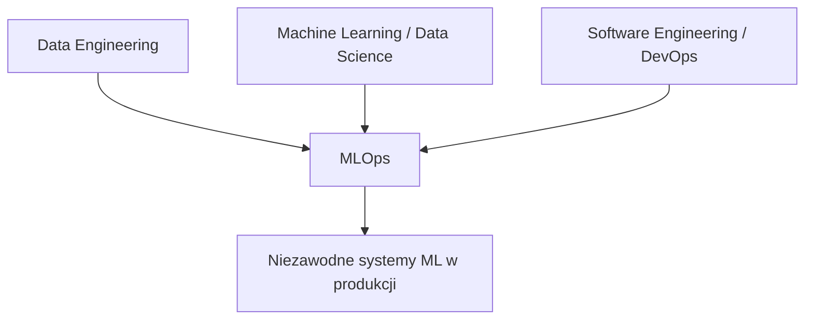
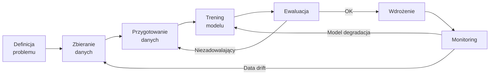
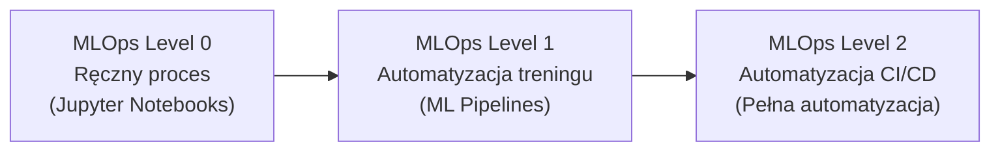
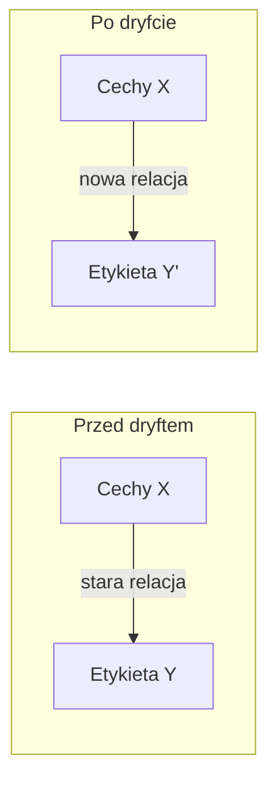
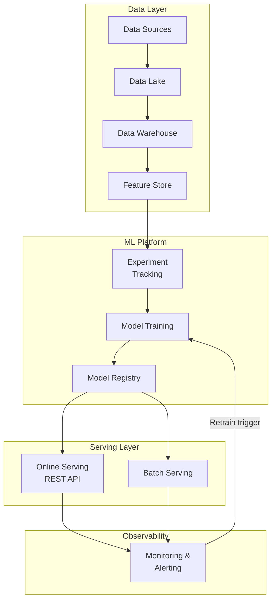
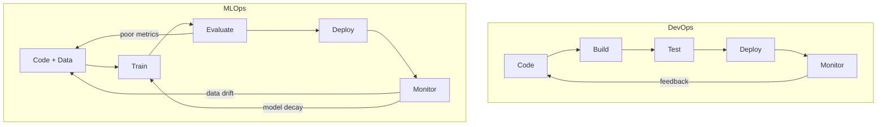

# Wykład 1: Wprowadzenie do MLOps i Inżynierii Systemów ML

## Cel wykładu
Po tym wykładzie student:
- rozumie, czym jest MLOps i dlaczego jest potrzebny,
- zna cykl życia modelu ML w produkcji,
- potrafi opisać różnice między tradycyjnym DevOps a MLOps,
- zna główne wyzwania wdrażania modeli ML.

---

## 1. Czym jest MLOps?

**MLOps** (Machine Learning Operations) to zbiór praktyk, narzędzi i kultury organizacyjnej, które mają na celu ustandaryzowanie i usprawnienie cyklu życia modeli uczenia maszynowego — od eksperymentu do produkcji i z powrotem.

> „MLOps to DevOps zastosowany do uczenia maszynowego."

MLOps łączy trzy światy:



### Dlaczego MLOps jest trudny?

W odróżnieniu od klasycznego oprogramowania, systemy ML mają dodatkowy wymiar złożoności:

| Aspekt | Klasyczne oprogramowanie | System ML |
|--------|--------------------------|-----------|
| Kod | Deterministyczny | Probabilistyczny |
| Testowanie | Unit/integration tests | Testy danych + modelu |
| Wersjonowanie | Kod (git) | Kod + dane + model |
| Degradacja | Błędy w kodzie | Data drift, concept drift |
| Reprodukowalność | Łatwa | Trudna (losowość, dane) |

---

## 2. Cykl życia modelu ML



### Fazy cyklu życia

1. **Definicja problemu** – co chcemy przewidzieć? Jaka jest metryka sukcesu?
2. **Zbieranie danych** – skąd dane? Jak często są aktualizowane?
3. **Przygotowanie danych** – czyszczenie, feature engineering, podział na zbiory.
4. **Trening modelu** – wybór algorytmu, hiperparametry, eksperymenty.
5. **Ewaluacja** – metryki ML (AUC, RMSE, F1) i metryki biznesowe.
6. **Wdrożenie** – serwowanie predykcji (online/batch).
7. **Monitoring** – czy model nadal działa poprawnie?

---

## 3. Poziomy dojrzałości MLOps

Google definiuje trzy poziomy dojrzałości MLOps:



### Level 0 – Ręczny proces
- Data Scientist trenuje model lokalnie w notebooku.
- Model jest eksportowany i wdrażany ręcznie.
- Brak wersjonowania danych i modeli.
- Brak monitoringu.

**Problem:** „Works on my machine" – model działa u Data Scientista, ale nie w produkcji.

### Level 1 – Automatyzacja treningu
- Zdefiniowane ML Pipelines (automatyczny trening).
- Wersjonowanie danych, kodu i modeli.
- Automatyczne wyzwalanie retreningu (np. po wykryciu driftu).
- Monitoring modelu w produkcji.

### Level 2 – CI/CD dla ML
- Pełna automatyzacja: od commita do wdrożenia.
- Testy jednostkowe dla komponentów pipeline'u.
- Automatyczne testy A/B nowych modeli.
- Canary deployments, rollback.

---

## 4. Główne wyzwania MLOps

### 4.1 Reprodukowalność

```python
# Złe podejście - brak kontroli losowości
import numpy as np
from sklearn.ensemble import RandomForestClassifier

model = RandomForestClassifier()
model.fit(X_train, y_train)

# Dobre podejście - pełna reprodukowalność
import numpy as np
from sklearn.ensemble import RandomForestClassifier

SEED = 42
np.random.seed(SEED)

model = RandomForestClassifier(
    n_estimators=100,
    random_state=SEED,
    n_jobs=-1
)
model.fit(X_train, y_train)

# Zapisz parametry eksperymentu
experiment_config = {
    "seed": SEED,
    "model": "RandomForestClassifier",
    "n_estimators": 100,
    "data_version": "v2024-01-15",
    "train_size": len(X_train)
}
```

### 4.2 Data Drift

**Data drift** – rozkład danych wejściowych zmienia się w czasie.

```python
import numpy as np
from scipy import stats

def detect_data_drift(reference_data: np.ndarray, 
                       current_data: np.ndarray,
                       threshold: float = 0.05) -> dict:
    """
    Wykrywa data drift za pomocą testu Kolmogorova-Smirnova.
    
    Args:
        reference_data: dane referencyjne (z treningu)
        current_data: aktualne dane produkcyjne
        threshold: próg p-value dla odrzucenia H0
    
    Returns:
        dict z wynikami testu
    """
    statistic, p_value = stats.ks_2samp(reference_data, current_data)
    
    return {
        "statistic": statistic,
        "p_value": p_value,
        "drift_detected": p_value < threshold,
        "severity": "high" if p_value < 0.01 else "medium" if p_value < threshold else "none"
    }

# Przykład użycia
reference = np.random.normal(0, 1, 1000)   # dane treningowe
current = np.random.normal(0.5, 1.2, 500)  # dane produkcyjne (z dryftem)

result = detect_data_drift(reference, current)
print(f"Drift wykryty: {result['drift_detected']}")
print(f"P-value: {result['p_value']:.4f}")
print(f"Nasilenie: {result['severity']}")
```

### 4.3 Concept Drift

**Concept drift** – relacja między cechami a etykietą zmienia się w czasie.

Przykład: model przewidujący ceny mieszkań przestaje działać po kryzysie finansowym.



---

## 5. Architektura systemu MLOps



---

## 6. Kluczowe narzędzia ekosystemu MLOps

| Kategoria | Narzędzia Open Source | Narzędzia Cloud |
|-----------|----------------------|-----------------|
| Experiment Tracking | MLflow, Weights & Biases | Vertex AI Experiments |
| Pipeline Orchestration | Kubeflow, Apache Airflow | Vertex AI Pipelines |
| Model Registry | MLflow Registry | Vertex AI Model Registry |
| Feature Store | Feast | Vertex AI Feature Store |
| Model Serving | BentoML, Seldon | Vertex AI Endpoints |
| Monitoring | Evidently AI, Prometheus | Vertex AI Model Monitoring |
| CI/CD | GitHub Actions, Jenkins | Cloud Build |

---

## 7. MLOps vs DevOps – kluczowe różnice



**Dodatkowe elementy w MLOps:**
- Wersjonowanie **danych** (nie tylko kodu)
- Wersjonowanie **modeli** (artefakty binarne)
- **Metryki ML** jako warunek wdrożenia
- **Automatyczny retraining** po wykryciu driftu
- **Explainability** – wyjaśnialność predykcji

---

## 8. Przykład: Prosty system MLOps od zera

```python
from dataclasses import dataclass, field
from datetime import datetime
from typing import Optional
import json
import hashlib

@dataclass
class ModelVersion:
    """Reprezentuje wersję modelu w rejestrze."""
    name: str
    version: str
    metrics: dict
    data_version: str
    created_at: str = field(default_factory=lambda: datetime.now().isoformat())
    status: str = "staging"  # staging | production | archived
    
    def to_dict(self) -> dict:
        return {
            "name": self.name,
            "version": self.version,
            "metrics": self.metrics,
            "data_version": self.data_version,
            "created_at": self.created_at,
            "status": self.status
        }

class SimpleModelRegistry:
    """Prosty rejestr modeli (demonstracja konceptu)."""
    
    def __init__(self):
        self.models: dict[str, list[ModelVersion]] = {}
    
    def register(self, model: ModelVersion) -> str:
        """Rejestruje nową wersję modelu."""
        if model.name not in self.models:
            self.models[model.name] = []
        self.models[model.name].append(model)
        print(f"✅ Zarejestrowano: {model.name} v{model.version}")
        return model.version
    
    def promote_to_production(self, name: str, version: str):
        """Promuje wersję modelu do produkcji."""
        for mv in self.models.get(name, []):
            if mv.status == "production":
                mv.status = "archived"
            if mv.version == version:
                mv.status = "production"
                print(f"🚀 Wdrożono: {name} v{version} → produkcja")
    
    def get_production_model(self, name: str) -> Optional[ModelVersion]:
        """Zwraca aktualny model produkcyjny."""
        for mv in self.models.get(name, []):
            if mv.status == "production":
                return mv
        return None

# Użycie
registry = SimpleModelRegistry()

# Rejestracja modelu v1
v1 = ModelVersion(
    name="churn_predictor",
    version="1.0.0",
    metrics={"auc": 0.82, "f1": 0.75},
    data_version="data-2024-01"
)
registry.register(v1)
registry.promote_to_production("churn_predictor", "1.0.0")

# Rejestracja lepszego modelu v2
v2 = ModelVersion(
    name="churn_predictor",
    version="2.0.0",
    metrics={"auc": 0.89, "f1": 0.83},
    data_version="data-2024-06"
)
registry.register(v2)
registry.promote_to_production("churn_predictor", "2.0.0")

# Sprawdzenie aktualnego modelu produkcyjnego
prod = registry.get_production_model("churn_predictor")
print(f"\nAktualny model produkcyjny: {prod.name} v{prod.version}")
print(f"Metryki: {prod.metrics}")
```

---

## Podsumowanie

- **MLOps** to praktyki łączące ML, inżynierię oprogramowania i operacje IT.
- Główne wyzwania: reprodukowalność, data drift, concept drift, skalowalność.
- Trzy poziomy dojrzałości: ręczny → automatyzacja treningu → pełne CI/CD.
- Kluczowe komponenty: Feature Store, Experiment Tracking, Model Registry, Monitoring.
- MLOps to nie jednorazowy projekt, ale **ciągły proces**.

## Literatura i zasoby

- [Google MLOps: Continuous delivery and automation pipelines in machine learning](https://cloud.google.com/architecture/mlops-continuous-delivery-and-automation-pipelines-in-machine-learning)
- [Sculley et al. "Hidden Technical Debt in Machine Learning Systems" (NIPS 2015)](https://papers.nips.cc/paper/2015/hash/86df7dcfd896fcaf2674f757a2463eba-Abstract.html)
- [Chip Huyen "Designing Machine Learning Systems" (O'Reilly, 2022)](https://www.oreilly.com/library/view/designing-machine-learning/9781098107956/)
- [ml-ops.org](https://ml-ops.org/)
