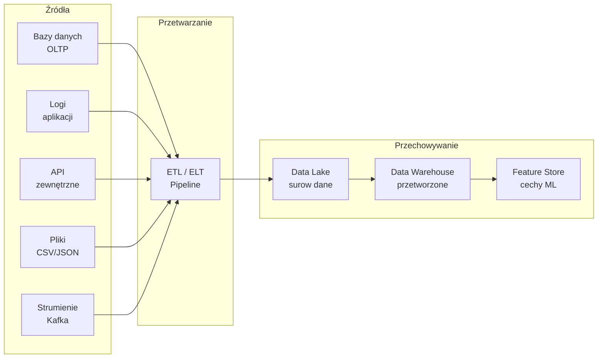
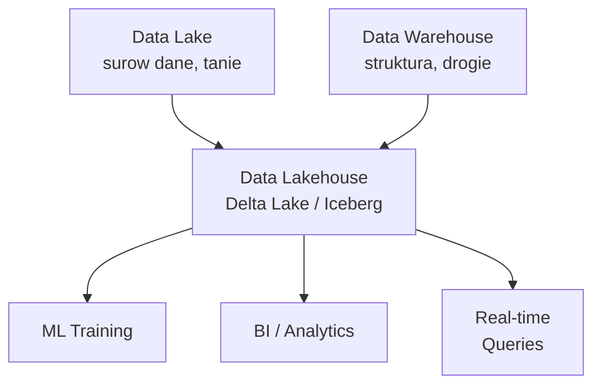
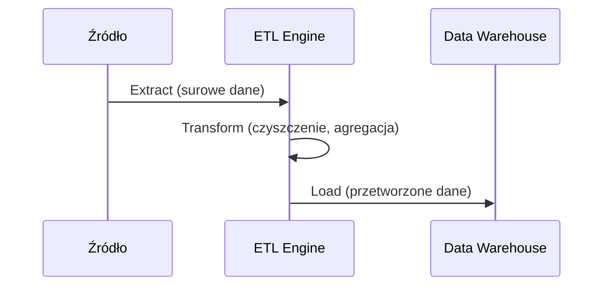
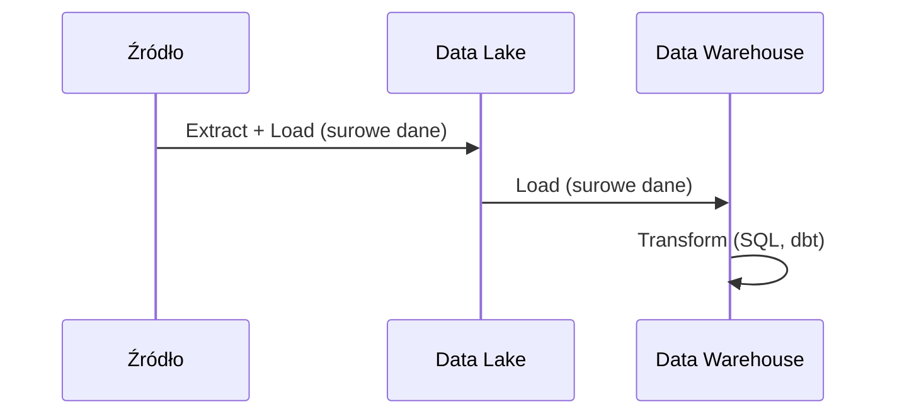
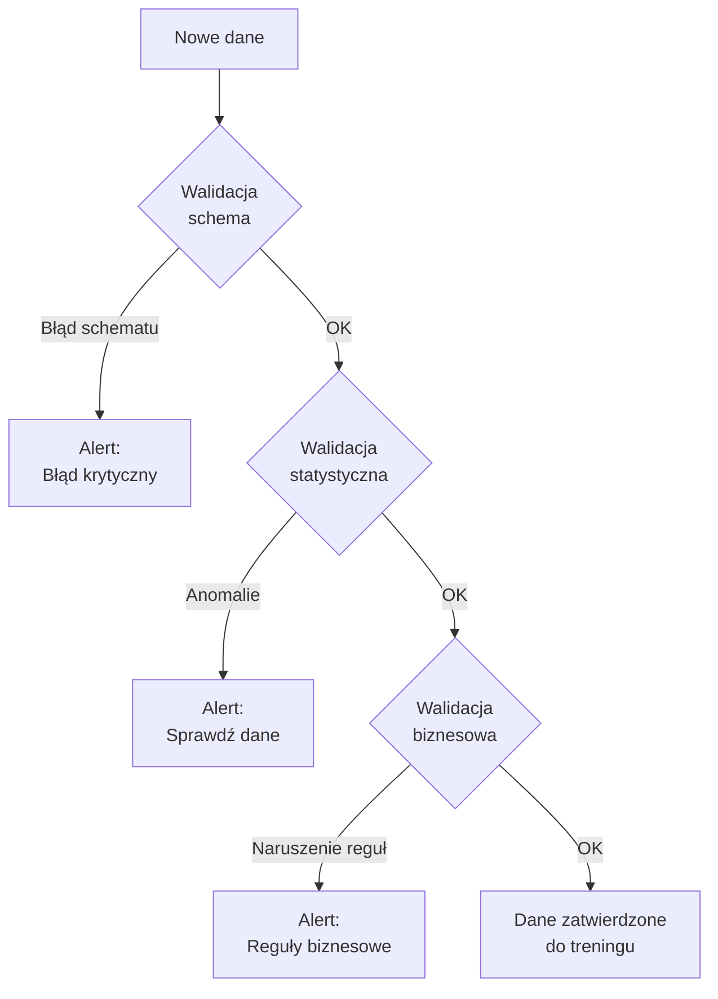
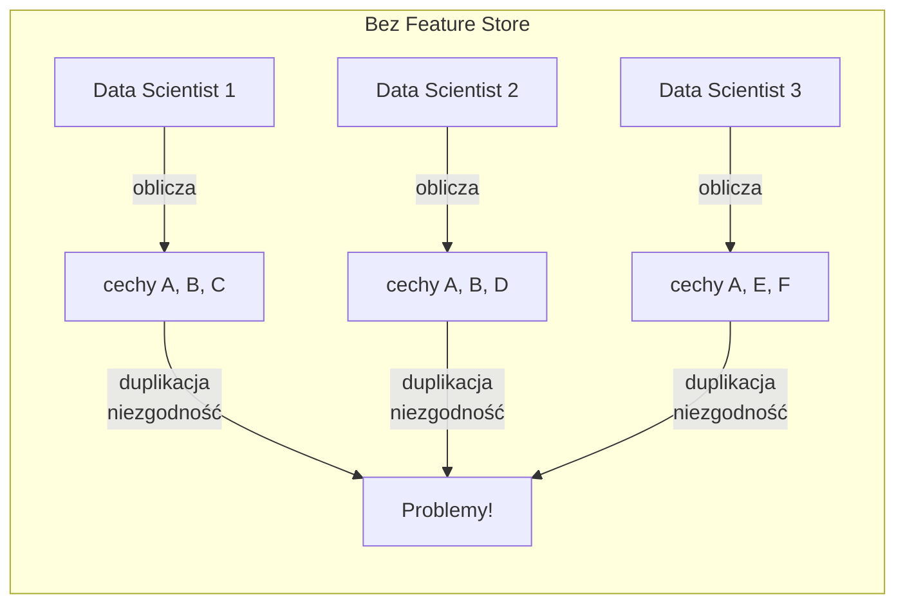
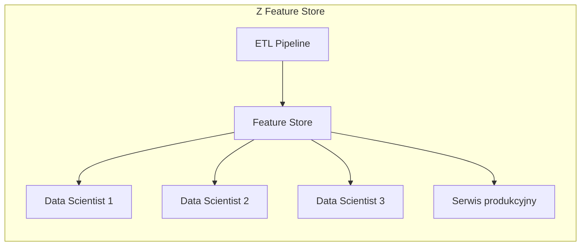
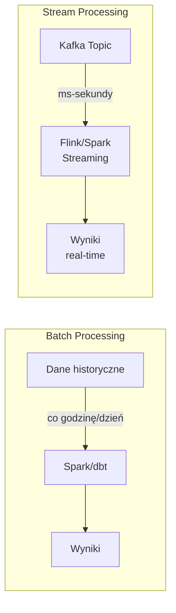

# Wykład 2: Inżynieria Danych dla ML

## Cel wykładu
Po tym wykładzie student:
- rozumie rolę inżynierii danych w systemach ML,
- zna wzorce architektoniczne Data Lake i Data Warehouse,
- potrafi zaprojektować pipeline przetwarzania danych,
- rozumie koncepcję Feature Store i jego znaczenie.

---

## 1. Dane jako fundament ML

> „Garbage in, garbage out" – jakość modelu jest ograniczona jakością danych.

W systemach produkcyjnych dane są najważniejszym zasobem. Inżynieria danych (Data Engineering) zajmuje się:
- **zbieraniem** danych z różnych źródeł,
- **przechowywaniem** w odpowiednich formatach i strukturach,
- **przetwarzaniem** (czyszczenie, transformacja, agregacja),
- **udostępnianiem** dla modeli ML.



---

## 2. Architektura danych: Data Lake vs Data Warehouse

### Data Lake
- Przechowuje **surowe dane** w oryginalnym formacie (pliki, JSON, Parquet, Avro).
- Schemat definiowany przy odczycie (*schema-on-read*).
- Tanie przechowywanie dużych wolumenów.
- Przykłady: AWS S3, Google Cloud Storage, Azure Data Lake.

### Data Warehouse
- Przechowuje **przetworzone, ustrukturyzowane dane**.
- Schemat definiowany przy zapisie (*schema-on-write*).
- Zoptymalizowany pod kątem zapytań analitycznych (OLAP).
- Przykłady: BigQuery, Snowflake, Redshift.

### Data Lakehouse
Nowoczesne podejście łączące zalety obu:



---

## 3. Formaty danych dla ML

### Porównanie formatów

| Format | Typ | Kompresja | Schemat | Użycie |
|--------|-----|-----------|---------|--------|
| CSV | Wierszowy | Brak | Brak | Małe zbiory, prototypy |
| JSON | Wierszowy | Opcjonalna | Brak | API, logi |
| Parquet | Kolumnowy | Snappy/ZSTD | Tak | Analityka, ML |
| Avro | Wierszowy | Deflate | Tak | Kafka, streaming |
| TFRecord | Binarny | Opcjonalna | Tak | TensorFlow |
| HDF5 | Hierarchiczny | Tak | Tak | Duże macierze, DL |

### Dlaczego Parquet dla ML?

```python
import pandas as pd
import pyarrow as pa
import pyarrow.parquet as pq
import time
import os

# Generowanie przykładowych danych
df = pd.DataFrame({
    'user_id': range(1_000_000),
    'age': pd.Series(range(1_000_000)) % 80 + 18,
    'income': pd.Series(range(1_000_000)) * 0.05 + 20000,
    'churn': pd.Series(range(1_000_000)) % 2
})

# Zapis CSV
t0 = time.time()
df.to_csv('/tmp/data.csv', index=False)
csv_time = time.time() - t0
csv_size = os.path.getsize('/tmp/data.csv') / 1024 / 1024

# Zapis Parquet
t0 = time.time()
df.to_parquet('/tmp/data.parquet', compression='snappy', index=False)
parquet_time = time.time() - t0
parquet_size = os.path.getsize('/tmp/data.parquet') / 1024 / 1024

print(f"CSV:     {csv_size:.1f} MB, zapis: {csv_time:.2f}s")
print(f"Parquet: {parquet_size:.1f} MB, zapis: {parquet_time:.2f}s")
print(f"Oszczędność miejsca: {(1 - parquet_size/csv_size)*100:.0f}%")

# Odczyt tylko wybranych kolumn (column pruning)
t0 = time.time()
df_partial = pd.read_parquet('/tmp/data.parquet', columns=['user_id', 'churn'])
print(f"\nOdczyt 2 kolumn z Parquet: {time.time()-t0:.3f}s")
```

---

## 4. ETL vs ELT

### ETL (Extract → Transform → Load)
Tradycyjne podejście: transformacja przed załadowaniem do magazynu.



### ELT (Extract → Load → Transform)
Nowoczesne podejście: ładowanie surowych danych, transformacja w miejscu.



**Zalety ELT:**
- Zachowanie surowych danych (możliwość ponownego przetworzenia).
- Wykorzystanie mocy obliczeniowej magazynu danych.
- Łatwiejsze debugowanie.

---

## 5. Pipeline przetwarzania danych w Pythonie

### Przykład: Pipeline z użyciem pandas i scikit-learn

```python
import pandas as pd
import numpy as np
from sklearn.pipeline import Pipeline
from sklearn.preprocessing import StandardScaler, OneHotEncoder
from sklearn.impute import SimpleImputer
from sklearn.compose import ColumnTransformer
from sklearn.model_selection import train_test_split

# --- Krok 1: Wczytanie danych ---
def load_data(path: str) -> pd.DataFrame:
    """Wczytuje dane i wykonuje podstawową walidację."""
    df = pd.read_parquet(path)
    
    required_cols = ['age', 'income', 'category', 'churn']
    missing = set(required_cols) - set(df.columns)
    if missing:
        raise ValueError(f"Brakujące kolumny: {missing}")
    
    print(f"Wczytano {len(df):,} wierszy, {df.shape[1]} kolumn")
    return df

# --- Krok 2: Czyszczenie danych ---
def clean_data(df: pd.DataFrame) -> pd.DataFrame:
    """Usuwa duplikaty i oczywiste błędy."""
    initial_size = len(df)
    
    # Usuń duplikaty
    df = df.drop_duplicates()
    
    # Usuń wiersze z ujemnym wiekiem
    df = df[df['age'] > 0]
    
    # Usuń wartości odstające (IQR method)
    Q1 = df['income'].quantile(0.25)
    Q3 = df['income'].quantile(0.75)
    IQR = Q3 - Q1
    df = df[df['income'].between(Q1 - 3*IQR, Q3 + 3*IQR)]
    
    removed = initial_size - len(df)
    print(f"Usunięto {removed:,} wierszy ({removed/initial_size*100:.1f}%)")
    return df

# --- Krok 3: Feature Engineering ---
def engineer_features(df: pd.DataFrame) -> pd.DataFrame:
    """Tworzy nowe cechy."""
    df = df.copy()
    
    # Cechy pochodne
    df['income_per_age'] = df['income'] / df['age']
    df['age_group'] = pd.cut(df['age'], 
                              bins=[0, 25, 35, 50, 65, 100],
                              labels=['<25', '25-35', '35-50', '50-65', '65+'])
    
    return df

# --- Krok 4: Preprocessing Pipeline ---
def build_preprocessing_pipeline(
    numeric_features: list[str],
    categorical_features: list[str]
) -> ColumnTransformer:
    """Buduje pipeline preprocessingu."""
    
    numeric_transformer = Pipeline(steps=[
        ('imputer', SimpleImputer(strategy='median')),
        ('scaler', StandardScaler())
    ])
    
    categorical_transformer = Pipeline(steps=[
        ('imputer', SimpleImputer(strategy='most_frequent')),
        ('encoder', OneHotEncoder(handle_unknown='ignore', sparse_output=False))
    ])
    
    preprocessor = ColumnTransformer(transformers=[
        ('num', numeric_transformer, numeric_features),
        ('cat', categorical_transformer, categorical_features)
    ])
    
    return preprocessor

# --- Główny pipeline ---
def run_data_pipeline(input_path: str) -> tuple:
    """Uruchamia pełny pipeline przetwarzania danych."""
    
    # Wczytaj i oczyść
    df = load_data(input_path)
    df = clean_data(df)
    df = engineer_features(df)
    
    # Podział na cechy i etykietę
    X = df.drop('churn', axis=1)
    y = df['churn']
    
    # Podział na zbiory
    X_train, X_test, y_train, y_test = train_test_split(
        X, y, test_size=0.2, random_state=42, stratify=y
    )
    
    # Preprocessing
    numeric_features = ['age', 'income', 'income_per_age']
    categorical_features = ['category', 'age_group']
    
    preprocessor = build_preprocessing_pipeline(numeric_features, categorical_features)
    
    X_train_processed = preprocessor.fit_transform(X_train)
    X_test_processed = preprocessor.transform(X_test)
    
    print(f"\nWymiary po preprocessingu:")
    print(f"  Train: {X_train_processed.shape}")
    print(f"  Test:  {X_test_processed.shape}")
    
    return X_train_processed, X_test_processed, y_train, y_test, preprocessor
```

---

## 6. Walidacja danych – Great Expectations

Walidacja danych to kluczowy element MLOps. Biblioteka **Great Expectations** pozwala definiować i weryfikować oczekiwania dotyczące danych.

```python
import great_expectations as gx
import pandas as pd

# Przykładowe dane
df = pd.DataFrame({
    'age': [25, 30, -5, 200, 45],       # -5 i 200 to błędy
    'income': [50000, 60000, None, 80000, 55000],
    'churn': [0, 1, 0, 1, 2]            # 2 to błąd (powinno być 0 lub 1)
})

# Tworzenie kontekstu GE
context = gx.get_context()

# Definicja oczekiwań (expectations)
validator = context.sources.pandas_default.read_dataframe(df)

# Oczekiwania dotyczące kolumny 'age'
validator.expect_column_values_to_be_between('age', min_value=0, max_value=120)
validator.expect_column_values_to_not_be_null('age')

# Oczekiwania dotyczące kolumny 'income'
validator.expect_column_values_to_not_be_null('income')
validator.expect_column_values_to_be_between('income', min_value=0)

# Oczekiwania dotyczące kolumny 'churn'
validator.expect_column_values_to_be_in_set('churn', value_set=[0, 1])

# Uruchomienie walidacji
results = validator.validate()
print(f"Walidacja: {'✅ OK' if results.success else '❌ FAILED'}")
for result in results.results:
    status = "✅" if result.success else "❌"
    print(f"  {status} {result.expectation_config.expectation_type}: "
          f"{result.expectation_config.kwargs}")
```

### Schemat walidacji danych w pipeline



---

## 7. Feature Store – centralne repozytorium cech

**Feature Store** to system do przechowywania, zarządzania i serwowania cech ML.

### Problem bez Feature Store



### Rozwiązanie z Feature Store



### Implementacja prostego Feature Store z Feast

```python
from feast import Entity, Feature, FeatureView, FileSource, ValueType
from feast.types import Float32, Int64
from datetime import timedelta

# Definicja encji
user = Entity(
    name="user_id",
    value_type=ValueType.INT64,
    description="Identyfikator użytkownika"
)

# Źródło danych
user_stats_source = FileSource(
    path="data/user_stats.parquet",
    timestamp_field="event_timestamp"
)

# Definicja Feature View
user_stats_fv = FeatureView(
    name="user_statistics",
    entities=["user_id"],
    ttl=timedelta(days=7),  # czas życia cechy
    features=[
        Feature(name="age", dtype=Float32),
        Feature(name="income", dtype=Float32),
        Feature(name="days_since_last_purchase", dtype=Int64),
        Feature(name="total_purchases_30d", dtype=Int64),
        Feature(name="avg_order_value", dtype=Float32),
    ],
    source=user_stats_source,
)

# Pobieranie cech dla treningu (historical features)
from feast import FeatureStore
import pandas as pd

store = FeatureStore(repo_path="feature_repo/")

# Pobierz historyczne cechy dla zbioru treningowego
entity_df = pd.DataFrame({
    "user_id": [1001, 1002, 1003],
    "event_timestamp": pd.to_datetime(["2024-01-15", "2024-01-15", "2024-01-15"])
})

training_df = store.get_historical_features(
    entity_df=entity_df,
    features=[
        "user_statistics:age",
        "user_statistics:income",
        "user_statistics:total_purchases_30d",
    ]
).to_df()

print(training_df)

# Pobieranie cech online (dla predykcji w czasie rzeczywistym)
online_features = store.get_online_features(
    features=["user_statistics:age", "user_statistics:income"],
    entity_rows=[{"user_id": 1001}]
).to_dict()

print(online_features)
```

---

## 8. Wersjonowanie danych z DVC

**DVC** (Data Version Control) to narzędzie do wersjonowania danych i modeli, działające razem z Git.

```bash
# Inicjalizacja DVC w projekcie
git init
dvc init

# Dodanie zdalnego storage (np. Google Cloud Storage)
dvc remote add -d myremote gs://my-bucket/dvc-storage

# Śledzenie pliku danych
dvc add data/train.parquet
git add data/train.parquet.dvc .gitignore
git commit -m "Add training data v1"

# Przesłanie danych do zdalnego storage
dvc push

# Przełączenie na inną wersję danych
git checkout v1.0
dvc checkout
```

### Struktura pliku .dvc

```yaml
# data/train.parquet.dvc
outs:
- md5: a1b2c3d4e5f6...
  size: 52428800
  path: train.parquet
```

### Pipeline DVC

```yaml
# dvc.yaml
stages:
  prepare:
    cmd: python src/prepare.py
    deps:
      - src/prepare.py
      - data/raw/
    outs:
      - data/prepared/

  train:
    cmd: python src/train.py
    deps:
      - src/train.py
      - data/prepared/
    params:
      - params.yaml:
          - train.n_estimators
          - train.max_depth
    outs:
      - models/model.pkl
    metrics:
      - metrics/scores.json:
          cache: false
```

```python
# params.yaml
train:
  n_estimators: 100
  max_depth: 5
  random_state: 42
test_size: 0.2
```

---

## 9. Streaming vs Batch Processing

### Batch Processing
- Przetwarzanie dużych zbiorów danych w regularnych interwałach.
- Narzędzia: Apache Spark, dbt, pandas.
- Użycie: trening modeli, raporty dzienne.

### Stream Processing
- Przetwarzanie danych w czasie rzeczywistym.
- Narzędzia: Apache Kafka, Apache Flink, Spark Streaming.
- Użycie: wykrywanie fraudów, rekomendacje real-time.



### Przykład: Kafka Producer/Consumer dla ML

```python
from kafka import KafkaProducer, KafkaConsumer
import json
import numpy as np

# Producer – wysyłanie zdarzeń do Kafka
producer = KafkaProducer(
    bootstrap_servers=['localhost:9092'],
    value_serializer=lambda v: json.dumps(v).encode('utf-8')
)

def send_prediction_request(user_id: int, features: dict):
    """Wysyła żądanie predykcji do Kafka."""
    message = {
        "user_id": user_id,
        "features": features,
        "timestamp": "2024-01-15T10:30:00Z"
    }
    producer.send('ml-predictions', value=message)
    producer.flush()

# Consumer – odbieranie i przetwarzanie zdarzeń
consumer = KafkaConsumer(
    'ml-predictions',
    bootstrap_servers=['localhost:9092'],
    value_deserializer=lambda m: json.loads(m.decode('utf-8')),
    group_id='ml-service-group',
    auto_offset_reset='earliest'
)

def process_predictions(model):
    """Przetwarza żądania predykcji ze strumienia."""
    for message in consumer:
        data = message.value
        features = np.array(list(data['features'].values())).reshape(1, -1)
        prediction = model.predict(features)[0]
        probability = model.predict_proba(features)[0][1]
        
        print(f"User {data['user_id']}: "
              f"churn={'TAK' if prediction else 'NIE'} "
              f"(p={probability:.2%})")
```

---

## 10. Typowe pułapki w inżynierii danych dla ML

> ⚠️ **Pułapka 1: Data Leakage (wyciek danych)**
> Najczęstszy i najgroźniejszy błąd — informacje z przyszłości „wyciekają" do danych treningowych. Przykład: normalizacja cech na całym zbiorze przed podziałem train/test powoduje, że statystyki zbioru testowego wpływają na trening.

```python
# ❌ ŹLE: normalizacja przed podziałem (data leakage!)
from sklearn.preprocessing import StandardScaler
scaler = StandardScaler()
X_scaled = scaler.fit_transform(X)  # fit na CAŁYM zbiorze
X_train, X_test = train_test_split(X_scaled, ...)

# ✅ DOBRZE: normalizacja po podziale
X_train, X_test = train_test_split(X, ...)
scaler = StandardScaler()
X_train_scaled = scaler.fit_transform(X_train)  # fit tylko na train
X_test_scaled = scaler.transform(X_test)         # transform na test
```

> ⚠️ **Pułapka 2: Training-Serving Skew**
> Preprocessing danych w treningu różni się od preprocessingu w produkcji. Rozwiązanie: używaj tego samego kodu (np. sklearn Pipeline) w obu środowiskach.

> ⚠️ **Pułapka 3: Ignorowanie brakujących wartości**
> Model wytrenowany na danych bez braków może się zachowywać nieprzewidywalnie, gdy w produkcji pojawią się wartości null. Zawsze testuj model z brakującymi danymi.

### Case Study: Zillow — katastrofa danych

**Zillow** (portal nieruchomości) stracił **304 miliony dolarów** w 2021 roku z powodu błędów w modelu wyceny nieruchomości. Główne przyczyny:
- Model był trenowany na danych historycznych, które nie uwzględniały gwałtownych zmian rynkowych (pandemia COVID-19).
- Brak odpowiedniego monitoringu dryfu danych — model kontynuował predykcje mimo fundamentalnej zmiany rozkładu cen.
- Niewystarczająca walidacja danych wejściowych — model akceptował nierealistyczne wartości cech.

---

## Pytania kontrolne i do dyskusji

1. Wyjaśnij różnicę między Data Lake a Data Warehouse. Kiedy użyjesz każdego z nich?
2. Dlaczego Parquet jest lepszym formatem niż CSV dla dużych zbiorów danych ML?
3. Czym różni się ETL od ELT? Jakie są zalety podejścia ELT?
4. Co to jest data leakage i jak go uniknąć?
5. Jakie korzyści daje Feature Store w porównaniu z ręcznym obliczaniem cech?
6. Dlaczego wersjonowanie danych (DVC) jest ważne w projektach ML?
7. **Dyskusja:** Kiedy warto użyć stream processingu zamiast batch processingu w kontekście ML?

---

## Podsumowanie

- Dane są fundamentem systemów ML – ich jakość determinuje jakość modelu.
- **Data Lake** przechowuje surowe dane, **Data Warehouse** przetworzone, **Data Lakehouse** łączy zalety obu.
- **Parquet** to preferowany format dla ML (kolumnowy, skompresowany, z schematem).
- **Walidacja danych** (Great Expectations) powinna być integralną częścią pipeline'u — nie opcjonalnym dodatkiem.
- **Feature Store** eliminuje duplikację i zapewnia spójność cech między treningiem a produkcją.
- **DVC** umożliwia wersjonowanie danych razem z kodem.
- Unikaj typowych pułapek: data leakage, training-serving skew, ignorowanie brakujących wartości.

## Literatura i zasoby

- [Fundamentals of Data Engineering (O'Reilly)](https://www.oreilly.com/library/view/fundamentals-of-data/9781098108298/)
- [Great Expectations Documentation](https://docs.greatexpectations.io/)
- [DVC Documentation](https://dvc.org/doc)
- [Feast Feature Store](https://feast.dev/)
- [Apache Parquet Format](https://parquet.apache.org/)
- [Zillow's iBuying Debacle – What Went Wrong](https://insidebigdata.com/2021/12/13/the-500-million-lesson-from-zillow/)
- [Data Leakage in Machine Learning (Kaggle)](https://www.kaggle.com/code/alexisbcook/data-leakage)
