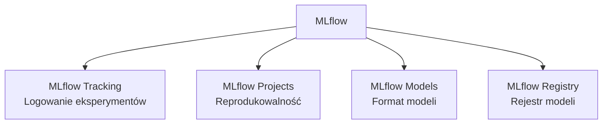
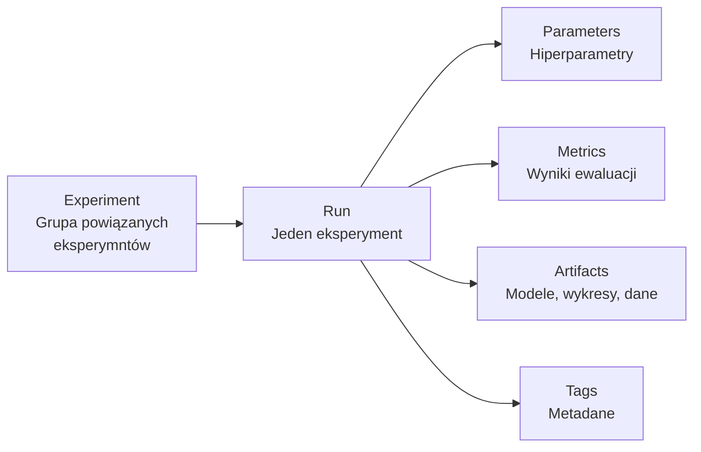
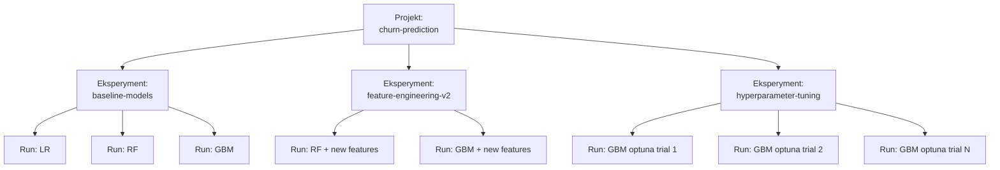

# Wykład 3: Eksperymentowanie i Śledzenie Eksperymentów

## Cel wykładu
Po tym wykładzie student:
- rozumie potrzebę systematycznego śledzenia eksperymentów ML,
- potrafi używać MLflow do logowania parametrów, metryk i artefaktów,
- zna wzorce organizacji eksperymentów,
- potrafi porównywać eksperymenty i wybierać najlepszy model.

---

## 1. Problem niekontrolowanych eksperymentów

Typowy scenariusz bez śledzenia eksperymentów:

```
model_final.pkl
model_final_v2.pkl
model_final_v2_NAPRAWDE_FINAL.pkl
model_best_20240115.pkl
model_DO_UZYCIA.pkl   ← który to jest?!
```

**Problemy:**
- Nie wiadomo, jakie hiperparametry dały najlepszy wynik.
- Nie wiadomo, na jakich danych trenowano.
- Nie można odtworzyć eksperymentu.
- Trudno porównać różne podejścia.

---

## 2. MLflow – platforma do śledzenia eksperymentów

**MLflow** to open-source'owa platforma do zarządzania cyklem życia ML, składająca się z czterech komponentów:



### Instalacja i uruchomienie

```bash
pip install mlflow scikit-learn pandas

# Uruchomienie UI (domyślnie http://localhost:5000)
mlflow ui
```

---

## 3. Podstawy MLflow Tracking

### Kluczowe pojęcia



### Przykład: Pełny eksperyment z MLflow

```python
import mlflow
import mlflow.sklearn
import pandas as pd
import numpy as np
from sklearn.datasets import make_classification
from sklearn.ensemble import RandomForestClassifier, GradientBoostingClassifier
from sklearn.linear_model import LogisticRegression
from sklearn.model_selection import train_test_split, cross_val_score
from sklearn.metrics import (accuracy_score, roc_auc_score, 
                              f1_score, classification_report)
import matplotlib.pyplot as plt
import json

# Generowanie danych
X, y = make_classification(
    n_samples=10_000,
    n_features=20,
    n_informative=10,
    n_redundant=5,
    random_state=42
)
X_train, X_test, y_train, y_test = train_test_split(
    X, y, test_size=0.2, random_state=42, stratify=y
)

# Konfiguracja MLflow
mlflow.set_tracking_uri("http://localhost:5000")
mlflow.set_experiment("churn-prediction-v1")

def evaluate_model(model, X_test, y_test) -> dict:
    """Oblicza metryki ewaluacji modelu."""
    y_pred = model.predict(X_test)
    y_prob = model.predict_proba(X_test)[:, 1]
    
    return {
        "accuracy": accuracy_score(y_test, y_pred),
        "auc_roc": roc_auc_score(y_test, y_prob),
        "f1_score": f1_score(y_test, y_pred),
    }

def run_experiment(model_class, params: dict, run_name: str):
    """Uruchamia jeden eksperyment i loguje wyniki do MLflow."""
    
    with mlflow.start_run(run_name=run_name) as run:
        # Logowanie parametrów
        mlflow.log_params(params)
        mlflow.log_param("model_class", model_class.__name__)
        mlflow.log_param("train_size", len(X_train))
        mlflow.log_param("test_size", len(X_test))
        
        # Trening modelu
        model = model_class(**params, random_state=42)
        model.fit(X_train, y_train)
        
        # Ewaluacja
        metrics = evaluate_model(model, X_test, y_test)
        
        # Cross-validation
        cv_scores = cross_val_score(model, X_train, y_train, cv=5, scoring='roc_auc')
        metrics["cv_auc_mean"] = cv_scores.mean()
        metrics["cv_auc_std"] = cv_scores.std()
        
        # Logowanie metryk
        mlflow.log_metrics(metrics)
        
        # Logowanie modelu
        mlflow.sklearn.log_model(
            model, 
            "model",
            registered_model_name=f"churn-{model_class.__name__.lower()}"
        )
        
        # Logowanie wykresu feature importance (dla RF)
        if hasattr(model, 'feature_importances_'):
            fig, ax = plt.subplots(figsize=(10, 6))
            importances = model.feature_importances_
            indices = np.argsort(importances)[::-1][:10]
            ax.bar(range(10), importances[indices])
            ax.set_title('Top 10 Feature Importances')
            ax.set_xlabel('Feature Index')
            plt.tight_layout()
            mlflow.log_figure(fig, "feature_importance.png")
            plt.close()
        
        # Logowanie raportu klasyfikacji jako artefakt
        report = classification_report(y_test, model.predict(X_test))
        with open("/tmp/classification_report.txt", "w") as f:
            f.write(report)
        mlflow.log_artifact("/tmp/classification_report.txt")
        
        print(f"Run: {run_name}")
        print(f"  AUC-ROC: {metrics['auc_roc']:.4f}")
        print(f"  F1:      {metrics['f1_score']:.4f}")
        print(f"  Run ID:  {run.info.run_id}")
        
        return run.info.run_id, metrics

# Eksperymenty z różnymi modelami i hiperparametrami
experiments = [
    (RandomForestClassifier, {"n_estimators": 100, "max_depth": 5}, "RF-shallow"),
    (RandomForestClassifier, {"n_estimators": 200, "max_depth": 10}, "RF-deep"),
    (GradientBoostingClassifier, {"n_estimators": 100, "learning_rate": 0.1}, "GBM-default"),
    (GradientBoostingClassifier, {"n_estimators": 200, "learning_rate": 0.05}, "GBM-slow"),
    (LogisticRegression, {"C": 1.0, "max_iter": 1000}, "LR-default"),
]

results = []
for model_class, params, name in experiments:
    run_id, metrics = run_experiment(model_class, params, name)
    results.append({"name": name, "run_id": run_id, **metrics})

# Podsumowanie wyników
results_df = pd.DataFrame(results).sort_values("auc_roc", ascending=False)
print("\n=== Ranking eksperymentów ===")
print(results_df[["name", "auc_roc", "f1_score", "cv_auc_mean"]].to_string(index=False))
```

---

## 4. Porównywanie eksperymentów

### Programowe porównanie przez MLflow API

```python
import mlflow
from mlflow.tracking import MlflowClient

client = MlflowClient()

# Pobierz wszystkie runy z eksperymentu
experiment = client.get_experiment_by_name("churn-prediction-v1")
runs = client.search_runs(
    experiment_ids=[experiment.experiment_id],
    order_by=["metrics.auc_roc DESC"],
    max_results=10
)

print("Top 5 eksperymentów wg AUC-ROC:")
for i, run in enumerate(runs[:5], 1):
    print(f"{i}. {run.data.tags.get('mlflow.runName', 'N/A')}")
    print(f"   AUC-ROC: {run.data.metrics.get('auc_roc', 0):.4f}")
    print(f"   F1:      {run.data.metrics.get('f1_score', 0):.4f}")
    print(f"   Params:  {run.data.params}")
    print()

# Pobierz najlepszy model
best_run = runs[0]
best_run_id = best_run.info.run_id
print(f"Najlepszy model: {best_run_id}")

# Załaduj najlepszy model
best_model = mlflow.sklearn.load_model(f"runs:/{best_run_id}/model")
```

---

## 5. Organizacja eksperymentów – dobre praktyki

### Hierarchia eksperymentów



### Konwencje nazewnictwa

```python
# Dobra konwencja nazewnictwa runów
run_name = f"{model_type}-{feature_set}-{date}-{author}"
# Przykład: "GBM-v2features-20240115-jkowalski"

# Tagi dla łatwego filtrowania
tags = {
    "author": "jan.kowalski",
    "feature_set": "v2",
    "data_version": "2024-01-15",
    "purpose": "hyperparameter_search",
    "environment": "development"
}

with mlflow.start_run(run_name=run_name, tags=tags):
    pass  # ... trening
```

---

## 6. Optuna – automatyczne strojenie hiperparametrów

**Optuna** to framework do automatycznej optymalizacji hiperparametrów (AutoML).

```python
import optuna
import mlflow
from sklearn.ensemble import GradientBoostingClassifier
from sklearn.model_selection import cross_val_score

# Integracja Optuna z MLflow
mlflow.set_experiment("hyperparameter-tuning-gbm")

def objective(trial: optuna.Trial) -> float:
    """Funkcja celu dla Optuna."""
    
    # Przestrzeń hiperparametrów
    params = {
        "n_estimators": trial.suggest_int("n_estimators", 50, 500),
        "max_depth": trial.suggest_int("max_depth", 2, 10),
        "learning_rate": trial.suggest_float("learning_rate", 0.01, 0.3, log=True),
        "subsample": trial.suggest_float("subsample", 0.6, 1.0),
        "min_samples_split": trial.suggest_int("min_samples_split", 2, 20),
        "random_state": 42
    }
    
    with mlflow.start_run(run_name=f"trial-{trial.number}", nested=True):
        mlflow.log_params(params)
        
        model = GradientBoostingClassifier(**params)
        scores = cross_val_score(model, X_train, y_train, cv=5, scoring='roc_auc')
        
        mean_auc = scores.mean()
        mlflow.log_metric("cv_auc_mean", mean_auc)
        mlflow.log_metric("cv_auc_std", scores.std())
    
    return mean_auc

# Uruchomienie optymalizacji
with mlflow.start_run(run_name="optuna-study"):
    study = optuna.create_study(
        direction="maximize",
        sampler=optuna.samplers.TPESampler(seed=42),
        pruner=optuna.pruners.MedianPruner()
    )
    study.optimize(objective, n_trials=50, timeout=300)
    
    # Logowanie najlepszych wyników
    mlflow.log_params(study.best_params)
    mlflow.log_metric("best_auc", study.best_value)
    
    print(f"Najlepsze hiperparametry: {study.best_params}")
    print(f"Najlepsze AUC: {study.best_value:.4f}")
```

### Wizualizacja przestrzeni hiperparametrów

```python
import optuna.visualization as vis

# Wykres ważności hiperparametrów
fig = vis.plot_param_importances(study)
fig.write_html("/tmp/param_importances.html")
mlflow.log_artifact("/tmp/param_importances.html")

# Historia optymalizacji
fig = vis.plot_optimization_history(study)
fig.write_html("/tmp/optimization_history.html")
mlflow.log_artifact("/tmp/optimization_history.html")
```

---

## 7. Śledzenie eksperymentów głębokiego uczenia

### Integracja z PyTorch

```python
import mlflow
import torch
import torch.nn as nn
from torch.utils.data import DataLoader, TensorDataset

class SimpleNN(nn.Module):
    def __init__(self, input_dim: int, hidden_dim: int, dropout: float):
        super().__init__()
        self.network = nn.Sequential(
            nn.Linear(input_dim, hidden_dim),
            nn.ReLU(),
            nn.Dropout(dropout),
            nn.Linear(hidden_dim, hidden_dim // 2),
            nn.ReLU(),
            nn.Dropout(dropout),
            nn.Linear(hidden_dim // 2, 1),
            nn.Sigmoid()
        )
    
    def forward(self, x):
        return self.network(x).squeeze()

def train_neural_network(
    hidden_dim: int = 128,
    dropout: float = 0.3,
    lr: float = 0.001,
    epochs: int = 50,
    batch_size: int = 256
):
    """Trenuje sieć neuronową z logowaniem do MLflow."""
    
    with mlflow.start_run():
        # Logowanie hiperparametrów
        params = {
            "hidden_dim": hidden_dim,
            "dropout": dropout,
            "learning_rate": lr,
            "epochs": epochs,
            "batch_size": batch_size,
            "optimizer": "Adam"
        }
        mlflow.log_params(params)
        
        # Przygotowanie danych
        X_t = torch.FloatTensor(X_train)
        y_t = torch.FloatTensor(y_train.values)
        dataset = TensorDataset(X_t, y_t)
        loader = DataLoader(dataset, batch_size=batch_size, shuffle=True)
        
        # Model i optymalizator
        model = SimpleNN(X_train.shape[1], hidden_dim, dropout)
        optimizer = torch.optim.Adam(model.parameters(), lr=lr)
        criterion = nn.BCELoss()
        
        # Trening z logowaniem metryk per epoka
        for epoch in range(epochs):
            model.train()
            total_loss = 0
            
            for X_batch, y_batch in loader:
                optimizer.zero_grad()
                y_pred = model(X_batch)
                loss = criterion(y_pred, y_batch)
                loss.backward()
                optimizer.step()
                total_loss += loss.item()
            
            avg_loss = total_loss / len(loader)
            
            # Logowanie metryki per krok (epoka)
            mlflow.log_metric("train_loss", avg_loss, step=epoch)
            
            if (epoch + 1) % 10 == 0:
                print(f"Epoch {epoch+1}/{epochs}, Loss: {avg_loss:.4f}")
        
        # Logowanie modelu PyTorch
        mlflow.pytorch.log_model(model, "neural_network")
        
        return model
```

---

## 8. Reproducibility – gwarancja powtarzalności

```python
import os
import sys
import platform
import subprocess
import mlflow

def log_environment_info():
    """Loguje informacje o środowisku do MLflow."""
    
    env_info = {
        "python_version": sys.version,
        "platform": platform.platform(),
        "cpu_count": os.cpu_count(),
    }
    
    # Wersje bibliotek
    import sklearn, numpy, pandas
    lib_versions = {
        "sklearn_version": sklearn.__version__,
        "numpy_version": numpy.__version__,
        "pandas_version": pandas.__version__,
    }
    
    # Git commit hash
    try:
        git_hash = subprocess.check_output(
            ["git", "rev-parse", "HEAD"]
        ).decode().strip()
        lib_versions["git_commit"] = git_hash
    except Exception:
        lib_versions["git_commit"] = "unknown"
    
    mlflow.log_params({**env_info, **lib_versions})
    
    # Zapisz requirements.txt jako artefakt
    subprocess.run(["pip", "freeze"], 
                   stdout=open("/tmp/requirements_snapshot.txt", "w"))
    mlflow.log_artifact("/tmp/requirements_snapshot.txt")

# Użycie w eksperymencie
with mlflow.start_run():
    log_environment_info()
    # ... reszta eksperymentu
```

---

## 9. Weights & Biases (W&B) – alternatywa dla MLflow

**W&B** to chmurowa platforma do śledzenia eksperymentów, popularna w środowiskach badawczych.

```python
import wandb
from sklearn.ensemble import RandomForestClassifier
from sklearn.metrics import roc_auc_score

# Inicjalizacja projektu W&B
wandb.init(
    project="churn-prediction",
    name="RF-experiment-01",
    config={
        "n_estimators": 200,
        "max_depth": 8,
        "random_state": 42
    }
)

config = wandb.config

# Trening
model = RandomForestClassifier(
    n_estimators=config.n_estimators,
    max_depth=config.max_depth,
    random_state=config.random_state
)
model.fit(X_train, y_train)

# Logowanie metryk
auc = roc_auc_score(y_test, model.predict_proba(X_test)[:, 1])
wandb.log({"auc_roc": auc, "n_features": X_train.shape[1]})

# Logowanie modelu
wandb.save("model.pkl")

wandb.finish()
```

### Porównanie MLflow vs W&B

| Cecha | MLflow | Weights & Biases |
|-------|--------|-----------------|
| Hosting | Self-hosted / Managed | Cloud (SaaS) |
| Koszt | Open Source (darmowy) | Freemium |
| UI | Podstawowy | Zaawansowany |
| Integracje | Szerokie | Bardzo szerokie |
| Kolaboracja | Ograniczona | Wbudowana |
| Model Registry | Tak | Tak |

---

## 10. Typowe pułapki w śledzeniu eksperymentów

> ⚠️ **Pułapka 1: Porównywanie jabłek z gruszkami**
> Porównywanie modeli trenowanych na różnych wersjach danych lub z różnym preprocessingiem. Zawsze loguj `data_version` i `preprocessing_version` jako parametry.

> ⚠️ **Pułapka 2: Overfitting do zbioru testowego**
> Wielokrotne strojenie hiperparametrów na tym samym zbiorze testowym prowadzi do overfittingu. Rozwiązanie: używaj trzech zbiorów (train/validation/test) lub cross-validation, a zbiór testowy traktuj jako „ostateczny egzamin".

> ⚠️ **Pułapka 3: Brak logowania negatywnych wyników**
> Zespoły często logują tylko udane eksperymenty. Negatywne wyniki są równie wartościowe — pokazują, czego nie warto próbować. Loguj **każdy** eksperyment, nawet nieudany.

```python
# ✅ Dobra praktyka: loguj też nieudane eksperymenty z odpowiednim tagiem
with mlflow.start_run(run_name="failed-experiment", tags={"status": "failed"}):
    mlflow.log_param("reason", "OOM - model zbyt duży dla dostępnej pamięci")
    mlflow.log_param("model_class", "TransformerXL")
    mlflow.log_param("memory_required_gb", 32)
    mlflow.log_param("memory_available_gb", 16)
```

> ⚠️ **Pułapka 4: Metryki ML vs metryki biznesowe**
> Wysoki AUC-ROC nie zawsze oznacza wartość biznesową. Model z AUC=0.85 może generować więcej zysku niż model z AUC=0.92, jeśli lepiej identyfikuje klientów o wysokiej wartości. Zawsze loguj metryki biznesowe obok metryk ML.

### Case Study: Netflix — eksperymenty na skalę

**Netflix** prowadzi tysiące eksperymentów ML jednocześnie (rekomendacje, thumbnails, personalizacja UI):
- Każdy eksperyment jest śledzony z pełnym kontekstem: dane, parametry, metryki ML i metryki biznesowe (czas oglądania, retencja).
- Używają wewnętrznej platformy do A/B testowania modeli na żywym ruchu.
- Kluczowa lekcja: **metryka offline (AUC) nie zawsze koreluje z metryką online (czas oglądania)**. Dlatego każdy model przechodzi testy A/B przed pełnym wdrożeniem.

---

## Pytania kontrolne i do dyskusji

1. Dlaczego systematyczne śledzenie eksperymentów jest ważniejsze niż sam wybór algorytmu?
2. Jakie informacje powinien zawierać każdy zalogowany eksperyment w MLflow?
3. Czym różni się `mlflow.log_param` od `mlflow.log_metric`? Kiedy użyjesz każdego?
4. Wyjaśnij, jak Optuna wybiera kolejne hiperparametry do przetestowania (TPE sampler).
5. Porównaj MLflow i Weights & Biases — kiedy wybierzesz jedno, a kiedy drugie?
6. Co to jest overfitting do zbioru testowego i jak go uniknąć?
7. **Dyskusja:** Czy warto logować eksperymenty, które zakończyły się niepowodzeniem? Uzasadnij.

---

## Podsumowanie

- Systematyczne śledzenie eksperymentów jest kluczowe dla reprodukowalności i porównywania modeli.
- **MLflow** oferuje kompletne rozwiązanie: tracking, registry, serving.
- Loguj **wszystko**: parametry, metryki, artefakty, środowisko, wersję kodu — także nieudane eksperymenty.
- **Optuna** automatyzuje poszukiwanie optymalnych hiperparametrów (TPE, pruning).
- Dobra organizacja eksperymentów (nazewnictwo, tagi, hierarchia) oszczędza czas w przyszłości.
- Pamiętaj o różnicy między metrykami ML a metrykami biznesowymi.

## Literatura i zasoby

- [MLflow Documentation](https://mlflow.org/docs/latest/index.html)
- [Optuna Documentation](https://optuna.readthedocs.io/)
- [Weights & Biases Documentation](https://docs.wandb.ai/)
- [Hyperparameter Optimization: A Spectral Approach](https://arxiv.org/abs/1706.00764)
- [Netflix Technology Blog – ML Experimentation](https://netflixtechblog.com/)
- [How to Track ML Experiments (Neptune.ai Blog)](https://neptune.ai/blog/ml-experiment-tracking)
