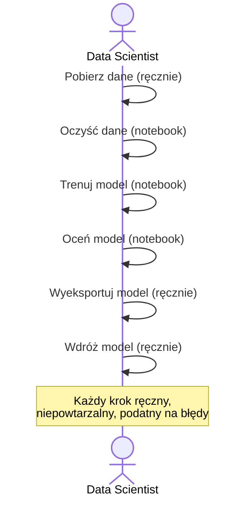
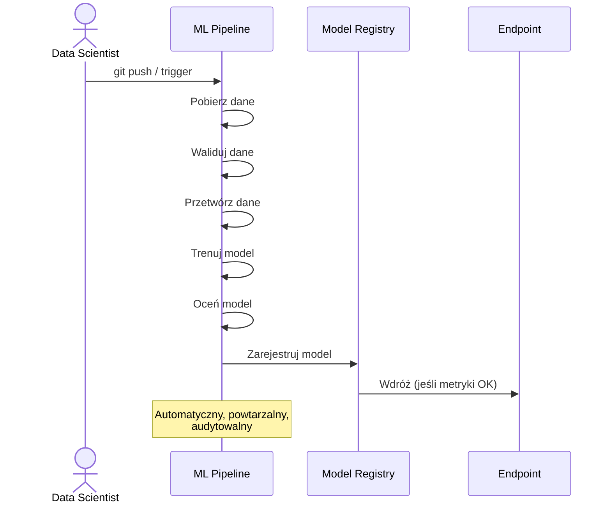
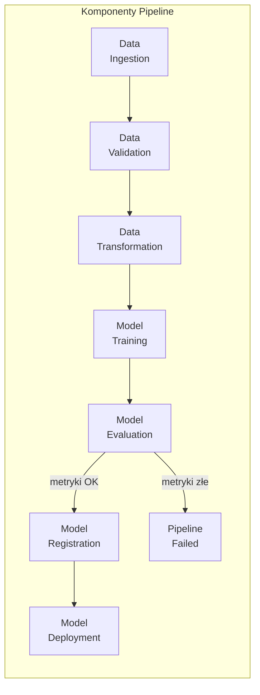
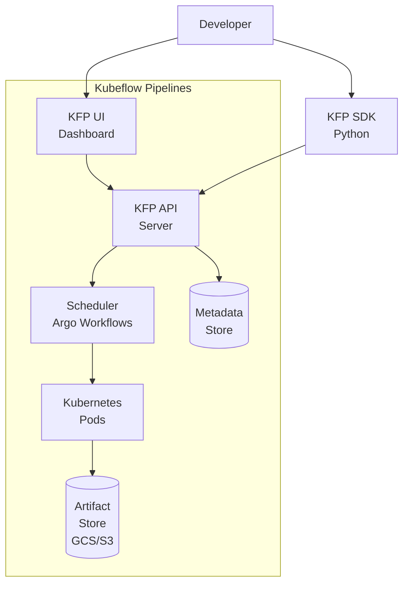
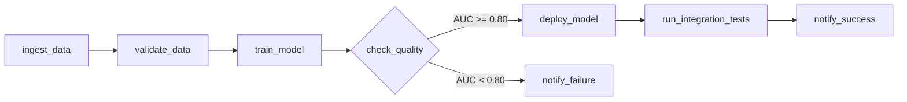
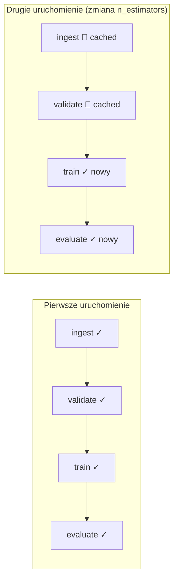

# Wykład 4: ML Pipelines – Automatyzacja Przepływu Pracy

## Cel wykładu
Po tym wykładzie student:
- rozumie, czym są ML Pipelines i dlaczego są kluczowe w MLOps,
- zna różnicę między pipeline'em danych a pipeline'em ML,
- potrafi zbudować pipeline z użyciem Kubeflow Pipelines (KFP),
- rozumie koncepcję DAG i orkiestracji zadań.

---

## 1. Czym jest ML Pipeline?

**ML Pipeline** to zautomatyzowany, powtarzalny przepływ pracy, który łączy wszystkie etapy cyklu życia modelu ML — od danych do wdrożenia.

### Bez pipeline'u (ręczny proces)



### Z ML Pipeline



---

## 2. Anatomia ML Pipeline



### Właściwości dobrego pipeline'u

| Właściwość | Opis |
|-----------|------|
| **Idempotentność** | Wielokrotne uruchomienie daje ten sam wynik |
| **Modularność** | Każdy krok jest niezależnym komponentem |
| **Audytowalność** | Pełna historia uruchomień i artefaktów |
| **Skalowalność** | Możliwość równoległego wykonania kroków |
| **Odporność na błędy** | Retry, checkpointing, rollback |

---

## 3. Kubeflow Pipelines (KFP)

**Kubeflow Pipelines** to platforma do budowania i uruchamiania ML Pipelines na Kubernetes.

### Architektura KFP



### Instalacja KFP SDK

```bash
pip install kfp==2.7.0
```

---

## 4. Budowanie komponentów KFP

### Komponent jako funkcja Python

```python
from kfp import dsl
from kfp.dsl import Dataset, Model, Metrics, Input, Output
import pandas as pd
import numpy as np

# --- Komponent 1: Pobieranie danych ---
@dsl.component(
    base_image="python:3.11-slim",
    packages_to_install=["pandas", "scikit-learn"]
)
def ingest_data(
    n_samples: int,
    output_dataset: Output[Dataset]
):
    """Pobiera i zapisuje dane treningowe."""
    from sklearn.datasets import make_classification
    import pandas as pd
    
    X, y = make_classification(
        n_samples=n_samples,
        n_features=20,
        n_informative=10,
        random_state=42
    )
    
    df = pd.DataFrame(X, columns=[f"feature_{i}" for i in range(20)])
    df['target'] = y
    
    df.to_parquet(output_dataset.path, index=False)
    print(f"Zapisano {len(df)} wierszy do {output_dataset.path}")


# --- Komponent 2: Walidacja danych ---
@dsl.component(
    base_image="python:3.11-slim",
    packages_to_install=["pandas", "pyarrow"]
)
def validate_data(
    input_dataset: Input[Dataset],
    min_rows: int = 1000
) -> bool:
    """Waliduje dane wejściowe."""
    import pandas as pd
    
    df = pd.read_parquet(input_dataset.path)
    
    # Sprawdzenia
    assert len(df) >= min_rows, f"Za mało wierszy: {len(df)} < {min_rows}"
    assert df.isnull().sum().sum() == 0, "Dane zawierają wartości null"
    assert 'target' in df.columns, "Brak kolumny 'target'"
    
    print(f"✅ Walidacja OK: {len(df)} wierszy, {df.shape[1]} kolumn")
    return True


# --- Komponent 3: Trening modelu ---
@dsl.component(
    base_image="python:3.11-slim",
    packages_to_install=["pandas", "scikit-learn", "pyarrow", "joblib"]
)
def train_model(
    input_dataset: Input[Dataset],
    n_estimators: int,
    max_depth: int,
    output_model: Output[Model],
    output_metrics: Output[Metrics]
):
    """Trenuje model i zapisuje artefakty."""
    import pandas as pd
    import joblib
    from sklearn.ensemble import RandomForestClassifier
    from sklearn.model_selection import train_test_split
    from sklearn.metrics import roc_auc_score, f1_score, accuracy_score
    
    # Wczytaj dane
    df = pd.read_parquet(input_dataset.path)
    X = df.drop('target', axis=1)
    y = df['target']
    
    X_train, X_test, y_train, y_test = train_test_split(
        X, y, test_size=0.2, random_state=42, stratify=y
    )
    
    # Trening
    model = RandomForestClassifier(
        n_estimators=n_estimators,
        max_depth=max_depth,
        random_state=42,
        n_jobs=-1
    )
    model.fit(X_train, y_train)
    
    # Ewaluacja
    y_pred = model.predict(X_test)
    y_prob = model.predict_proba(X_test)[:, 1]
    
    auc = roc_auc_score(y_test, y_prob)
    f1 = f1_score(y_test, y_pred)
    acc = accuracy_score(y_test, y_pred)
    
    # Logowanie metryk do KFP
    output_metrics.log_metric("auc_roc", auc)
    output_metrics.log_metric("f1_score", f1)
    output_metrics.log_metric("accuracy", acc)
    output_metrics.log_metric("n_estimators", n_estimators)
    output_metrics.log_metric("max_depth", max_depth)
    
    # Zapis modelu
    joblib.dump(model, output_model.path)
    print(f"Model zapisany. AUC-ROC: {auc:.4f}")


# --- Komponent 4: Ewaluacja i decyzja o wdrożeniu ---
@dsl.component(
    base_image="python:3.11-slim",
    packages_to_install=["pandas", "scikit-learn", "pyarrow", "joblib"]
)
def evaluate_and_decide(
    input_model: Input[Model],
    input_dataset: Input[Dataset],
    auc_threshold: float = 0.80
) -> str:
    """Ocenia model i decyduje o wdrożeniu."""
    import pandas as pd
    import joblib
    from sklearn.metrics import roc_auc_score
    from sklearn.model_selection import train_test_split
    
    df = pd.read_parquet(input_dataset.path)
    X = df.drop('target', axis=1)
    y = df['target']
    _, X_test, _, y_test = train_test_split(X, y, test_size=0.2, random_state=42)
    
    model = joblib.load(input_model.path)
    auc = roc_auc_score(y_test, model.predict_proba(X_test)[:, 1])
    
    decision = "deploy" if auc >= auc_threshold else "reject"
    print(f"AUC: {auc:.4f}, próg: {auc_threshold}, decyzja: {decision}")
    return decision
```

---

## 5. Definiowanie Pipeline'u

```python
from kfp import dsl, compiler

@dsl.pipeline(
    name="churn-prediction-pipeline",
    description="Pełny pipeline ML dla predykcji churnu"
)
def churn_pipeline(
    n_samples: int = 10000,
    n_estimators: int = 100,
    max_depth: int = 5,
    auc_threshold: float = 0.80
):
    """Definiuje pełny pipeline ML."""
    
    # Krok 1: Pobierz dane
    ingest_task = ingest_data(n_samples=n_samples)
    
    # Krok 2: Waliduj dane
    validate_task = validate_data(
        input_dataset=ingest_task.outputs["output_dataset"]
    )
    
    # Krok 3: Trenuj model (po walidacji)
    train_task = train_model(
        input_dataset=ingest_task.outputs["output_dataset"],
        n_estimators=n_estimators,
        max_depth=max_depth
    )
    train_task.after(validate_task)  # zależność
    
    # Krok 4: Oceń i zdecyduj
    evaluate_task = evaluate_and_decide(
        input_model=train_task.outputs["output_model"],
        input_dataset=ingest_task.outputs["output_dataset"],
        auc_threshold=auc_threshold
    )
    
    # Konfiguracja zasobów
    train_task.set_cpu_request("2")
    train_task.set_memory_request("4Gi")
    train_task.set_cpu_limit("4")
    train_task.set_memory_limit("8Gi")

# Kompilacja pipeline'u do YAML
compiler.Compiler().compile(
    pipeline_func=churn_pipeline,
    package_path="churn_pipeline.yaml"
)
print("Pipeline skompilowany do churn_pipeline.yaml")
```

### Uruchomienie pipeline'u

```python
import kfp

# Połączenie z KFP (Vertex AI Pipelines lub lokalny KFP)
client = kfp.Client(host="https://your-kfp-endpoint")

# Uruchomienie pipeline'u
run = client.create_run_from_pipeline_func(
    churn_pipeline,
    arguments={
        "n_samples": 50000,
        "n_estimators": 200,
        "max_depth": 8,
        "auc_threshold": 0.82
    },
    run_name="churn-pipeline-run-20240115",
    experiment_name="churn-experiments"
)

print(f"Pipeline uruchomiony: {run.run_id}")
print(f"URL: {client.get_run(run.run_id).run.status}")
```

---

## 6. Warunkowe wykonanie kroków

```python
from kfp import dsl

@dsl.pipeline(name="conditional-pipeline")
def pipeline_with_conditions(auc_threshold: float = 0.80):
    
    # ... poprzednie kroki ...
    evaluate_task = evaluate_and_decide(...)
    
    # Warunkowe wdrożenie
    with dsl.If(evaluate_task.output == "deploy", name="deploy-condition"):
        deploy_task = deploy_model(
            input_model=train_task.outputs["output_model"]
        )
        notify_task = send_notification(
            message="Model wdrożony pomyślnie!"
        )
        notify_task.after(deploy_task)
    
    with dsl.Else(name="reject-condition"):
        alert_task = send_notification(
            message=f"Model odrzucony - AUC poniżej progu {auc_threshold}"
        )
```

---

## 7. Apache Airflow dla ML

**Apache Airflow** to alternatywny orkiestrator, popularny w środowiskach data engineering.

```python
from airflow import DAG
from airflow.operators.python import PythonOperator, BranchPythonOperator
from airflow.utils.dates import days_ago
from datetime import timedelta

# Definicja DAG
default_args = {
    'owner': 'mlops-team',
    'depends_on_past': False,
    'email_on_failure': True,
    'email': ['mlops@company.com'],
    'retries': 2,
    'retry_delay': timedelta(minutes=5),
}

with DAG(
    dag_id='ml_training_pipeline',
    default_args=default_args,
    description='Pipeline treningu modelu ML',
    schedule_interval='0 2 * * *',  # codziennie o 2:00
    start_date=days_ago(1),
    catchup=False,
    tags=['ml', 'training', 'churn'],
) as dag:
    
    def ingest_data_fn(**context):
        """Pobiera dane z Data Warehouse."""
        import pandas as pd
        # ... logika pobierania danych
        print(f"Pobrano dane dla: {context['ds']}")
        return "data/train_2024-01-15.parquet"
    
    def validate_data_fn(**context):
        """Waliduje dane."""
        ti = context['task_instance']
        data_path = ti.xcom_pull(task_ids='ingest_data')
        # ... logika walidacji
        print(f"Walidacja danych: {data_path}")
    
    def train_model_fn(**context):
        """Trenuje model."""
        # ... logika treningu
        auc = 0.87  # wynik treningu
        context['task_instance'].xcom_push(key='auc', value=auc)
        return auc
    
    def check_model_quality(**context):
        """Sprawdza jakość modelu i decyduje o wdrożeniu."""
        ti = context['task_instance']
        auc = ti.xcom_pull(task_ids='train_model', key='auc')
        
        if auc >= 0.80:
            return 'deploy_model'
        else:
            return 'notify_failure'
    
    # Definicja zadań
    ingest = PythonOperator(
        task_id='ingest_data',
        python_callable=ingest_data_fn,
    )
    
    validate = PythonOperator(
        task_id='validate_data',
        python_callable=validate_data_fn,
    )
    
    train = PythonOperator(
        task_id='train_model',
        python_callable=train_model_fn,
    )
    
    check_quality = BranchPythonOperator(
        task_id='check_model_quality',
        python_callable=check_model_quality,
    )
    
    # Zależności między zadaniami
    ingest >> validate >> train >> check_quality
```

### Wizualizacja DAG Airflow



---

## 8. Vertex AI Pipelines

**Vertex AI Pipelines** to zarządzana usługa Google Cloud do uruchamiania KFP pipeline'ów.

```python
from google.cloud import aiplatform
from kfp import compiler

# Inicjalizacja Vertex AI
aiplatform.init(
    project="my-gcp-project",
    location="us-central1",
    staging_bucket="gs://my-bucket/staging"
)

# Kompilacja pipeline'u
compiler.Compiler().compile(
    pipeline_func=churn_pipeline,
    package_path="churn_pipeline.yaml"
)

# Uruchomienie na Vertex AI
job = aiplatform.PipelineJob(
    display_name="churn-pipeline-20240115",
    template_path="churn_pipeline.yaml",
    pipeline_root="gs://my-bucket/pipeline-runs",
    parameter_values={
        "n_samples": 100000,
        "n_estimators": 300,
        "max_depth": 10,
        "auc_threshold": 0.85
    },
    enable_caching=True  # cache wyników komponentów
)

job.submit()
print(f"Pipeline uruchomiony: {job.resource_name}")
```

### Caching w pipeline'ach



**Caching** oszczędza czas i koszty — jeśli dane wejściowe komponentu nie zmieniły się, wynik jest pobierany z cache.

---

## 9. Testowanie pipeline'ów

```python
import pytest
from unittest.mock import patch, MagicMock
import pandas as pd
import numpy as np

class TestPipelineComponents:
    """Testy jednostkowe komponentów pipeline'u."""
    
    def test_ingest_data_creates_correct_shape(self, tmp_path):
        """Test: komponent ingest_data tworzy dane o poprawnym kształcie."""
        output_path = tmp_path / "dataset.parquet"
        
        # Symulacja Output[Dataset]
        mock_output = MagicMock()
        mock_output.path = str(output_path)
        
        # Wywołanie funkcji komponentu (bez dekoratora KFP)
        from lecture_04_components import ingest_data_fn
        ingest_data_fn(n_samples=1000, output_path=str(output_path))
        
        df = pd.read_parquet(output_path)
        assert len(df) == 1000
        assert 'target' in df.columns
        assert df.shape[1] == 21  # 20 features + target
    
    def test_validate_data_rejects_empty_dataset(self, tmp_path):
        """Test: walidacja odrzuca pusty zbiór danych."""
        empty_df = pd.DataFrame()
        empty_path = tmp_path / "empty.parquet"
        empty_df.to_parquet(empty_path)
        
        with pytest.raises(AssertionError, match="Za mało wierszy"):
            from lecture_04_components import validate_data_fn
            validate_data_fn(input_path=str(empty_path), min_rows=1000)
    
    def test_train_model_produces_valid_metrics(self, tmp_path):
        """Test: trening modelu produkuje metryki w oczekiwanym zakresie."""
        # Przygotuj dane testowe
        from sklearn.datasets import make_classification
        X, y = make_classification(n_samples=500, random_state=42)
        df = pd.DataFrame(X, columns=[f"f{i}" for i in range(20)])
        df['target'] = y
        
        data_path = tmp_path / "data.parquet"
        model_path = tmp_path / "model.pkl"
        df.to_parquet(data_path)
        
        from lecture_04_components import train_model_fn
        metrics = train_model_fn(
            input_path=str(data_path),
            output_path=str(model_path),
            n_estimators=10,
            max_depth=3
        )
        
        assert 0.5 <= metrics['auc_roc'] <= 1.0
        assert 0.0 <= metrics['f1_score'] <= 1.0

# Uruchomienie testów
# pytest test_pipeline_components.py -v
```

---

## Podsumowanie

- **ML Pipeline** automatyzuje i standaryzuje cały przepływ pracy ML.
- **KFP** (Kubeflow Pipelines) to standard dla pipeline'ów ML na Kubernetes.
- Każdy komponent pipeline'u powinien być **niezależny, testowalny i idempotentny**.
- **Caching** komponentów oszczędza czas i koszty przy ponownych uruchomieniach.
- **Warunkowe wykonanie** pozwala na automatyczne decyzje o wdrożeniu.
- Testuj komponenty pipeline'u jak zwykły kod Python.

## Literatura i zasoby

- [Kubeflow Pipelines Documentation](https://www.kubeflow.org/docs/components/pipelines/)
- [Vertex AI Pipelines](https://cloud.google.com/vertex-ai/docs/pipelines/introduction)
- [Apache Airflow Documentation](https://airflow.apache.org/docs/)
- [KFP SDK v2 Migration Guide](https://www.kubeflow.org/docs/components/pipelines/v2/migration/)
