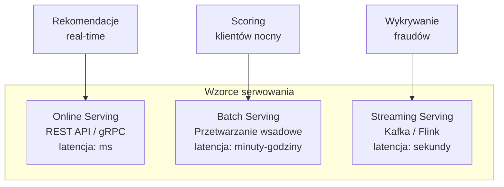
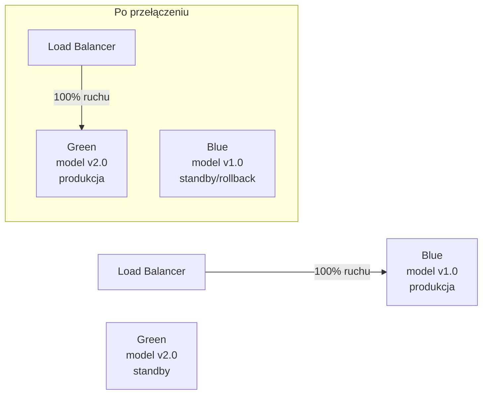
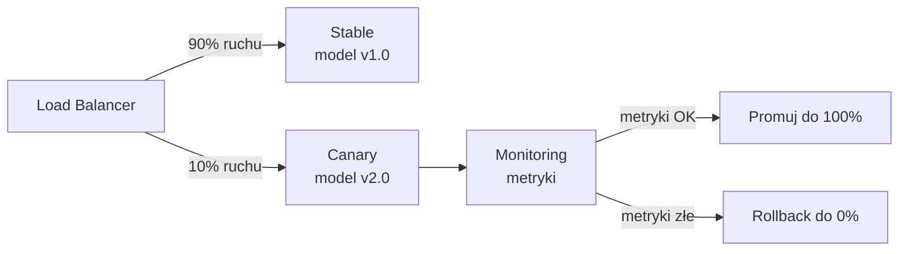
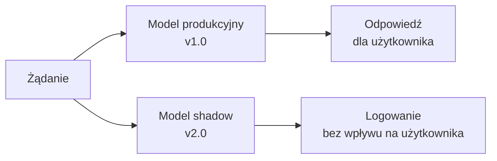
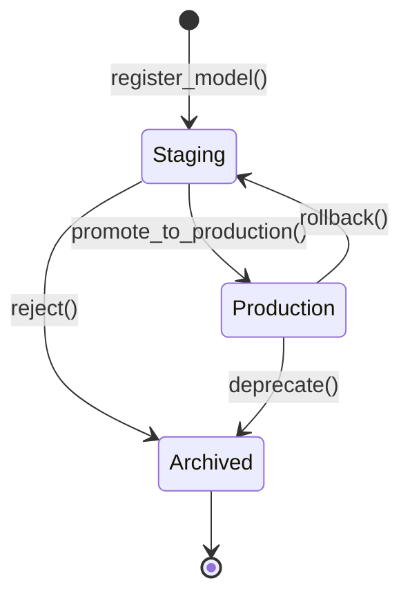

# Wykład 5: Wdrażanie i Serwowanie Modeli ML

## Cel wykładu
Po tym wykładzie student:
- zna wzorce wdrażania modeli ML (online, batch, streaming),
- potrafi zbudować REST API dla modelu ML z użyciem FastAPI,
- rozumie strategie wdrożeń (canary, blue-green, shadow),
- zna narzędzia do serwowania modeli (BentoML, Seldon, Triton).

---

## 1. Wzorce serwowania modeli



### Porównanie wzorców

| Wzorzec | Latencja | Throughput | Koszt | Przykład |
|---------|----------|------------|-------|---------|
| Online (REST) | < 100ms | Średni | Wysoki | Rekomendacje, chatbot |
| Batch | Minuty–godziny | Bardzo wysoki | Niski | Scoring klientów |
| Streaming | Sekundy | Wysoki | Średni | Wykrywanie fraudów |

---

## 2. REST API z FastAPI

**FastAPI** to nowoczesny framework Python do budowania API, idealny do serwowania modeli ML.

### Podstawowy serwis predykcji

```python
from fastapi import FastAPI, HTTPException, BackgroundTasks
from pydantic import BaseModel, Field, validator
from typing import Optional
import joblib
import numpy as np
import time
import logging
from contextlib import asynccontextmanager

# Konfiguracja logowania
logging.basicConfig(level=logging.INFO)
logger = logging.getLogger(__name__)

# --- Modele danych (Pydantic) ---
class PredictionRequest(BaseModel):
    """Schemat żądania predykcji."""
    user_id: int = Field(..., description="ID użytkownika", gt=0)
    age: float = Field(..., description="Wiek użytkownika", ge=0, le=120)
    income: float = Field(..., description="Dochód miesięczny", ge=0)
    tenure_months: int = Field(..., description="Staż klienta w miesiącach", ge=0)
    num_products: int = Field(..., description="Liczba produktów", ge=1, le=10)
    
    @validator('income')
    def income_must_be_reasonable(cls, v):
        if v > 1_000_000:
            raise ValueError("Dochód wydaje się zbyt wysoki")
        return v

class PredictionResponse(BaseModel):
    """Schemat odpowiedzi z predykcją."""
    user_id: int
    churn_probability: float = Field(..., ge=0, le=1)
    churn_prediction: bool
    risk_level: str  # low / medium / high
    model_version: str
    prediction_time_ms: float

class HealthResponse(BaseModel):
    status: str
    model_loaded: bool
    model_version: str
    uptime_seconds: float

# --- Zarządzanie cyklem życia aplikacji ---
model = None
model_version = "unknown"
start_time = time.time()

@asynccontextmanager
async def lifespan(app: FastAPI):
    """Ładuje model przy starcie, zwalnia zasoby przy zamknięciu."""
    global model, model_version
    
    logger.info("Ładowanie modelu...")
    try:
        model = joblib.load("models/churn_model.pkl")
        model_version = "v2.1.0"
        logger.info(f"Model załadowany: {model_version}")
    except FileNotFoundError:
        logger.warning("Plik modelu nie znaleziony - używam modelu demo")
        from sklearn.ensemble import RandomForestClassifier
        from sklearn.datasets import make_classification
        X, y = make_classification(n_samples=1000, random_state=42)
        model = RandomForestClassifier(random_state=42).fit(X, y)
        model_version = "demo-v1.0"
    
    yield  # aplikacja działa
    
    logger.info("Zamykanie aplikacji...")

# --- Aplikacja FastAPI ---
app = FastAPI(
    title="Churn Prediction API",
    description="API do predykcji churnu klientów",
    version="1.0.0",
    lifespan=lifespan
)

def get_risk_level(probability: float) -> str:
    """Klasyfikuje ryzyko churnu."""
    if probability < 0.3:
        return "low"
    elif probability < 0.7:
        return "medium"
    else:
        return "high"

def log_prediction(request: PredictionRequest, response: PredictionResponse):
    """Loguje predykcję do systemu monitoringu."""
    logger.info(
        f"prediction | user_id={request.user_id} | "
        f"prob={response.churn_probability:.4f} | "
        f"risk={response.risk_level} | "
        f"time_ms={response.prediction_time_ms:.2f}"
    )

# --- Endpointy ---
@app.get("/health", response_model=HealthResponse)
async def health_check():
    """Sprawdza stan serwisu."""
    return HealthResponse(
        status="healthy" if model is not None else "degraded",
        model_loaded=model is not None,
        model_version=model_version,
        uptime_seconds=time.time() - start_time
    )

@app.post("/predict", response_model=PredictionResponse)
async def predict(
    request: PredictionRequest,
    background_tasks: BackgroundTasks
):
    """Zwraca predykcję churnu dla użytkownika."""
    if model is None:
        raise HTTPException(status_code=503, detail="Model nie jest załadowany")
    
    t0 = time.time()
    
    # Przygotowanie cech
    features = np.array([[
        request.age,
        request.income,
        request.tenure_months,
        request.num_products,
        request.income / max(request.age, 1),  # income_per_age
    ]])
    
    # Predykcja
    try:
        probability = float(model.predict_proba(features)[0][1])
        prediction = probability >= 0.5
    except Exception as e:
        logger.error(f"Błąd predykcji: {e}")
        raise HTTPException(status_code=500, detail=f"Błąd predykcji: {str(e)}")
    
    prediction_time = (time.time() - t0) * 1000
    
    response = PredictionResponse(
        user_id=request.user_id,
        churn_probability=probability,
        churn_prediction=prediction,
        risk_level=get_risk_level(probability),
        model_version=model_version,
        prediction_time_ms=prediction_time
    )
    
    # Logowanie w tle (nie blokuje odpowiedzi)
    background_tasks.add_task(log_prediction, request, response)
    
    return response

@app.post("/predict/batch", response_model=list[PredictionResponse])
async def predict_batch(requests: list[PredictionRequest]):
    """Predykcja dla wielu użytkowników naraz."""
    if len(requests) > 1000:
        raise HTTPException(
            status_code=400,
            detail="Maksymalnie 1000 rekordów w jednym żądaniu"
        )
    
    features = np.array([[
        r.age, r.income, r.tenure_months,
        r.num_products, r.income / max(r.age, 1)
    ] for r in requests])
    
    t0 = time.time()
    probabilities = model.predict_proba(features)[:, 1]
    prediction_time = (time.time() - t0) * 1000 / len(requests)
    
    return [
        PredictionResponse(
            user_id=req.user_id,
            churn_probability=float(prob),
            churn_prediction=prob >= 0.5,
            risk_level=get_risk_level(float(prob)),
            model_version=model_version,
            prediction_time_ms=prediction_time
        )
        for req, prob in zip(requests, probabilities)
    ]
```

### Uruchomienie i testowanie

```bash
# Uruchomienie serwisu
uvicorn main:app --host 0.0.0.0 --port 8080 --workers 4

# Test health check
curl http://localhost:8080/health

# Test predykcji
curl -X POST http://localhost:8080/predict \
  -H "Content-Type: application/json" \
  -d '{
    "user_id": 1001,
    "age": 35,
    "income": 55000,
    "tenure_months": 24,
    "num_products": 2
  }'
```

---

## 3. Konteneryzacja z Docker

```dockerfile
# Dockerfile
FROM python:3.11-slim

WORKDIR /app

# Instalacja zależności (warstwa cache)
COPY requirements.txt .
RUN pip install --no-cache-dir -r requirements.txt

# Kopiowanie kodu aplikacji
COPY src/ ./src/
COPY models/ ./models/

# Użytkownik bez uprawnień root (bezpieczeństwo)
RUN useradd -m -u 1000 mluser
USER mluser

EXPOSE 8080

# Health check
HEALTHCHECK --interval=30s --timeout=10s --start-period=5s --retries=3 \
    CMD curl -f http://localhost:8080/health || exit 1

CMD ["uvicorn", "src.main:app", "--host", "0.0.0.0", "--port", "8080", "--workers", "2"]
```

```yaml
# docker-compose.yml
version: '3.8'

services:
  ml-api:
    build: .
    ports:
      - "8080:8080"
    environment:
      - MODEL_PATH=/app/models/churn_model.pkl
      - LOG_LEVEL=INFO
    volumes:
      - ./models:/app/models:ro
    deploy:
      resources:
        limits:
          cpus: '2'
          memory: 4G
    restart: unless-stopped
    
  prometheus:
    image: prom/prometheus:latest
    ports:
      - "9090:9090"
    volumes:
      - ./prometheus.yml:/etc/prometheus/prometheus.yml
```

---

## 4. Strategie wdrożeń

### Blue-Green Deployment



**Zalety:** Natychmiastowy rollback, zero downtime.
**Wady:** Podwójne zasoby podczas przełączania.

### Canary Deployment



**Zalety:** Stopniowe wdrożenie, ograniczone ryzyko.
**Wady:** Złożoność konfiguracji, dłuższy czas wdrożenia.

### Shadow Mode (Shadow Deployment)



**Zalety:** Testowanie nowego modelu na prawdziwym ruchu bez ryzyka.
**Wady:** Podwójne koszty obliczeniowe.

### Implementacja Canary w Pythonie

```python
import random
from typing import Callable
import logging

logger = logging.getLogger(__name__)

class CanaryRouter:
    """Router implementujący strategię canary deployment."""
    
    def __init__(
        self,
        stable_model,
        canary_model,
        canary_traffic_pct: float = 0.1
    ):
        self.stable_model = stable_model
        self.canary_model = canary_model
        self.canary_traffic_pct = canary_traffic_pct
        self._canary_requests = 0
        self._stable_requests = 0
    
    def predict(self, features):
        """Kieruje żądanie do odpowiedniego modelu."""
        use_canary = random.random() < self.canary_traffic_pct
        
        if use_canary:
            self._canary_requests += 1
            result = self.canary_model.predict_proba(features)
            logger.info(f"canary_request | total={self._canary_requests}")
        else:
            self._stable_requests += 1
            result = self.stable_model.predict_proba(features)
        
        return result
    
    def get_traffic_stats(self) -> dict:
        total = self._canary_requests + self._stable_requests
        return {
            "total_requests": total,
            "canary_requests": self._canary_requests,
            "stable_requests": self._stable_requests,
            "actual_canary_pct": self._canary_requests / max(total, 1)
        }
    
    def promote_canary(self):
        """Promuje canary do roli stable."""
        self.stable_model = self.canary_model
        self.canary_traffic_pct = 0.0
        logger.info("Canary model promoted to stable!")
    
    def rollback(self):
        """Wycofuje canary deployment."""
        self.canary_traffic_pct = 0.0
        logger.warning("Canary deployment rolled back!")
```

---

## 5. BentoML – framework do serwowania modeli

**BentoML** upraszcza pakowanie i wdrażanie modeli ML.

```python
import bentoml
import numpy as np
from bentoml.io import NumpyNdarray, JSON
from sklearn.ensemble import RandomForestClassifier

# Zapisanie modelu do BentoML Store
model = RandomForestClassifier(n_estimators=100, random_state=42)
# model.fit(X_train, y_train)  # zakładamy wytrenowany model

saved_model = bentoml.sklearn.save_model(
    "churn_predictor",
    model,
    signatures={
        "predict": {"batchable": True, "batch_dim": 0},
        "predict_proba": {"batchable": True, "batch_dim": 0}
    },
    metadata={
        "auc_roc": 0.89,
        "training_data": "2024-01-15",
        "author": "mlops-team"
    }
)
print(f"Model zapisany: {saved_model.tag}")

# Definicja serwisu BentoML
runner = bentoml.sklearn.get("churn_predictor:latest").to_runner()

svc = bentoml.Service("churn_prediction_service", runners=[runner])

@svc.api(input=JSON(), output=JSON())
async def predict(input_data: dict) -> dict:
    """Endpoint predykcji."""
    features = np.array([[
        input_data["age"],
        input_data["income"],
        input_data["tenure_months"],
        input_data["num_products"]
    ]])
    
    probability = await runner.predict_proba.async_run(features)
    churn_prob = float(probability[0][1])
    
    return {
        "user_id": input_data.get("user_id"),
        "churn_probability": churn_prob,
        "churn_prediction": churn_prob >= 0.5,
        "risk_level": "high" if churn_prob > 0.7 else "medium" if churn_prob > 0.3 else "low"
    }
```

```bash
# Uruchomienie serwisu BentoML
bentoml serve churn_prediction_service:latest --port 3000

# Budowanie Bento (pakiet do wdrożenia)
bentoml build

# Konteneryzacja
bentoml containerize churn_prediction_service:latest
```

---

## 6. Batch Serving

```python
import pandas as pd
import joblib
import numpy as np
from pathlib import Path
from datetime import datetime
import logging

logger = logging.getLogger(__name__)

def run_batch_scoring(
    input_path: str,
    output_path: str,
    model_path: str,
    batch_size: int = 10_000
) -> dict:
    """
    Uruchamia batch scoring dla dużego zbioru danych.
    
    Args:
        input_path: ścieżka do danych wejściowych (Parquet)
        output_path: ścieżka do wyników (Parquet)
        model_path: ścieżka do modelu
        batch_size: rozmiar batcha
    
    Returns:
        Statystyki przetwarzania
    """
    logger.info(f"Ładowanie modelu z {model_path}")
    model = joblib.load(model_path)
    
    logger.info(f"Wczytywanie danych z {input_path}")
    df = pd.read_parquet(input_path)
    
    feature_cols = ['age', 'income', 'tenure_months', 'num_products']
    total_rows = len(df)
    results = []
    
    logger.info(f"Przetwarzanie {total_rows:,} wierszy w batchach po {batch_size:,}")
    
    for i in range(0, total_rows, batch_size):
        batch = df.iloc[i:i+batch_size]
        X_batch = batch[feature_cols].values
        
        probabilities = model.predict_proba(X_batch)[:, 1]
        
        batch_results = pd.DataFrame({
            'user_id': batch['user_id'].values,
            'churn_probability': probabilities,
            'churn_prediction': probabilities >= 0.5,
            'risk_level': pd.cut(
                probabilities,
                bins=[0, 0.3, 0.7, 1.0],
                labels=['low', 'medium', 'high']
            ),
            'scored_at': datetime.now().isoformat()
        })
        results.append(batch_results)
        
        processed = min(i + batch_size, total_rows)
        logger.info(f"Przetworzono {processed:,}/{total_rows:,} ({processed/total_rows*100:.1f}%)")
    
    # Zapis wyników
    final_df = pd.concat(results, ignore_index=True)
    final_df.to_parquet(output_path, index=False)
    
    stats = {
        "total_rows": total_rows,
        "high_risk_count": int((final_df['risk_level'] == 'high').sum()),
        "medium_risk_count": int((final_df['risk_level'] == 'medium').sum()),
        "low_risk_count": int((final_df['risk_level'] == 'low').sum()),
        "avg_churn_probability": float(final_df['churn_probability'].mean()),
        "output_path": output_path
    }
    
    logger.info(f"Batch scoring zakończony: {stats}")
    return stats

# Użycie
if __name__ == "__main__":
    stats = run_batch_scoring(
        input_path="data/customers_2024-01-15.parquet",
        output_path="results/churn_scores_2024-01-15.parquet",
        model_path="models/churn_model.pkl",
        batch_size=50_000
    )
    print(f"Wyniki: {stats}")
```

---

## 7. Model Registry i zarządzanie wersjami



```python
import mlflow
from mlflow.tracking import MlflowClient

client = MlflowClient()

def promote_model_to_production(
    model_name: str,
    version: int,
    min_auc: float = 0.80
) -> bool:
    """
    Promuje model do produkcji po weryfikacji metryk.
    
    Returns:
        True jeśli model został wdrożony, False w przeciwnym razie
    """
    # Pobierz informacje o modelu
    model_version = client.get_model_version(model_name, str(version))
    run_id = model_version.run_id
    
    # Sprawdź metryki
    run = client.get_run(run_id)
    auc = run.data.metrics.get("auc_roc", 0)
    
    if auc < min_auc:
        print(f"❌ Model odrzucony: AUC {auc:.4f} < próg {min_auc}")
        client.transition_model_version_stage(
            name=model_name,
            version=str(version),
            stage="Archived"
        )
        return False
    
    # Archiwizuj poprzedni model produkcyjny
    prod_versions = client.get_latest_versions(model_name, stages=["Production"])
    for pv in prod_versions:
        client.transition_model_version_stage(
            name=model_name,
            version=pv.version,
            stage="Archived"
        )
        print(f"📦 Zarchiwizowano: v{pv.version}")
    
    # Promuj nowy model
    client.transition_model_version_stage(
        name=model_name,
        version=str(version),
        stage="Production"
    )
    
    # Dodaj opis
    client.update_model_version(
        name=model_name,
        version=str(version),
        description=f"Wdrożony automatycznie. AUC: {auc:.4f}"
    )
    
    print(f"✅ Model {model_name} v{version} wdrożony do produkcji (AUC: {auc:.4f})")
    return True

# Użycie
promote_model_to_production("churn_predictor", version=5, min_auc=0.82)
```

---

## 8. Typowe pułapki w serwowaniu modeli

> ⚠️ **Pułapka 1: Brak walidacji wejść**
> Model przyjmuje dowolne dane bez sprawdzenia zakresu, typu czy kompletności. W produkcji mogą pojawić się wartości null, ujemne wiek czy nierealistyczne dochody. Zawsze waliduj dane wejściowe (Pydantic).

> ⚠️ **Pułapka 2: Synchroniczne ładowanie modelu**
> Ładowanie modelu przy każdym żądaniu zamiast jednorazowo przy starcie serwisu. Model powinien być załadowany do pamięci raz (lifespan) i współdzielony między żądaniami.

> ⚠️ **Pułapka 3: Brak health checków**
> Serwis bez endpointu `/health` nie może być poprawnie zarządzany przez Kubernetes (readiness/liveness probes). Zawsze implementuj health check.

> ⚠️ **Pułapka 4: Brak wersjonowania API**
> Zmiana formatu odpowiedzi bez wersjonowania łamie istniejących klientów. Używaj wersjonowania URL (`/v1/predict`, `/v2/predict`) lub nagłówków.

### Case Study: Instagram — serwowanie modeli rekomendacji

**Instagram** serwuje modele ML dla ponad 2 miliardów użytkowników:
- Używają **gRPC** zamiast REST dla wewnętrznych serwisów (niższa latencja, mniejszy overhead).
- Modele są serwowane na **GPU** z użyciem NVIDIA Triton Inference Server.
- Stosują **model ensembling** — kilka modeli jest wywoływanych równolegle, a wyniki są agregowane.
- Kluczowa metryka: **p99 latencja < 50ms** — każda milisekunda opóźnienia wpływa na engagement użytkowników.

### Kiedy użyć gRPC zamiast REST?

| Aspekt | REST (JSON) | gRPC (Protocol Buffers) |
|--------|-------------|------------------------|
| Format danych | JSON (tekstowy) | Protobuf (binarny) |
| Latencja | Wyższa | Niższa (~2-5x) |
| Rozmiar payload | Większy | Mniejszy (~3-10x) |
| Streaming | Ograniczony | Natywny (bidirectional) |
| Debugowanie | Łatwe (curl) | Trudniejsze |
| Najlepszy dla | Publiczne API, prototypy | Wewnętrzne serwisy, niska latencja |

---

## Pytania kontrolne i do dyskusji

1. Porównaj trzy wzorce serwowania modeli (online, batch, streaming). Kiedy użyjesz każdego?
2. Dlaczego FastAPI jest lepszym wyborem niż Flask do serwowania modeli ML?
3. Wyjaśnij różnicę między blue-green, canary i shadow deployment. Jakie są zalety i wady każdego?
4. Jak zapewnić zero-downtime deployment modelu ML?
5. Dlaczego konteneryzacja (Docker) jest ważna dla serwowania modeli?
6. Co to jest Model Registry i jakie stany może mieć model (staging, production, archived)?
7. **Dyskusja:** Kiedy warto użyć gRPC zamiast REST do serwowania modeli? Jakie są trade-offy?

---

## Podsumowanie

- Trzy główne wzorce serwowania: **online** (REST/gRPC), **batch**, **streaming**.
- **FastAPI** + **Pydantic** to solidna podstawa dla serwisów ML (walidacja, dokumentacja, async).
- Konteneryzacja z **Docker** zapewnia przenośność i reprodukowalność.
- Strategie wdrożeń: **blue-green** (szybki rollback), **canary** (stopniowe wdrożenie), **shadow** (testowanie bez ryzyka).
- **Model Registry** zarządza cyklem życia modeli i umożliwia rollback.
- Dla niskiej latencji rozważ **gRPC** zamiast REST i **BentoML/Triton** zamiast ręcznego serwisu.

## Literatura i zasoby

- [FastAPI Documentation](https://fastapi.tiangolo.com/)
- [BentoML Documentation](https://docs.bentoml.com/)
- [MLflow Model Registry](https://mlflow.org/docs/latest/model-registry.html)
- [Seldon Core](https://docs.seldon.io/projects/seldon-core/en/latest/)
- [NVIDIA Triton Inference Server](https://developer.nvidia.com/triton-inference-server)
- [gRPC Documentation](https://grpc.io/docs/)
- [Instagram Engineering – ML at Scale](https://engineering.fb.com/category/ml-applications/)
