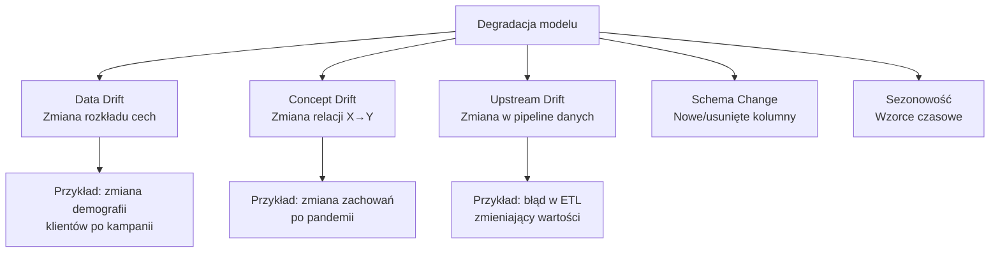
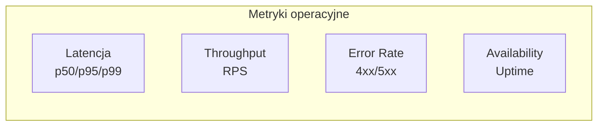
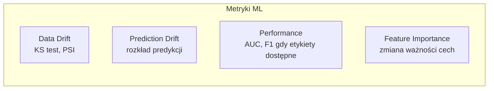
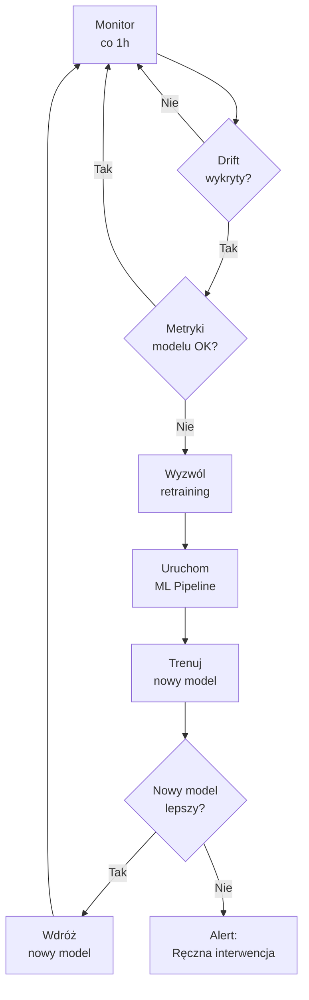
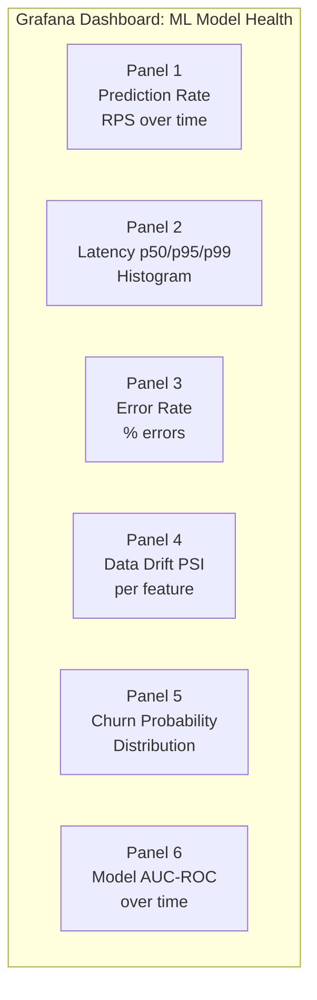

# Wykład 6: Monitoring Modeli ML w Produkcji

## Cel wykładu
Po tym wykładzie student:
- rozumie, dlaczego monitoring jest kluczowy w systemach ML,
- zna rodzaje dryfu danych i metody ich wykrywania,
- potrafi zbudować system monitoringu z użyciem Evidently AI i Prometheus,
- wie, jak skonfigurować alerty i automatyczny retraining.

---

## 1. Dlaczego modele degradują?

Model wytrenowany dziś może jutro dawać gorsze wyniki. Przyczyny:



### Rodzaje dryfu

| Typ | Definicja | Wykrywanie |
|-----|-----------|------------|
| **Data Drift** | P(X) się zmienia | Testy statystyczne na cechach |
| **Concept Drift** | P(Y\|X) się zmienia | Monitoring metryk modelu |
| **Label Drift** | P(Y) się zmienia | Monitoring rozkładu etykiet |
| **Prediction Drift** | P(Ŷ) się zmienia | Monitoring rozkładu predykcji |

---

## 2. Metryki monitoringu

### Metryki operacyjne (infrastruktura)



### Metryki ML (jakość modelu)



---

## 3. Wykrywanie dryfu – metody statystyczne

### Test Kolmogorova-Smirnova (KS Test)

```python
import numpy as np
import pandas as pd
from scipy import stats
from typing import Optional
import warnings

def ks_drift_test(
    reference: np.ndarray,
    current: np.ndarray,
    feature_name: str,
    threshold: float = 0.05
) -> dict:
    """
    Wykrywa data drift za pomocą testu KS.
    
    Hipoteza zerowa H0: obie próbki pochodzą z tego samego rozkładu.
    Odrzucamy H0 gdy p-value < threshold → drift wykryty.
    """
    statistic, p_value = stats.ks_2samp(reference, current)
    drift_detected = p_value < threshold
    
    return {
        "feature": feature_name,
        "test": "KS",
        "statistic": round(statistic, 4),
        "p_value": round(p_value, 4),
        "drift_detected": drift_detected,
        "severity": (
            "critical" if p_value < 0.001 else
            "high" if p_value < 0.01 else
            "medium" if p_value < threshold else
            "none"
        )
    }

### Population Stability Index (PSI)

def calculate_psi(
    reference: np.ndarray,
    current: np.ndarray,
    n_bins: int = 10,
    feature_name: str = "feature"
) -> dict:
    """
    Oblicza PSI (Population Stability Index).
    
    PSI < 0.1:  brak istotnej zmiany
    PSI 0.1-0.2: umiarkowana zmiana (monitoruj)
    PSI > 0.2:  znacząca zmiana (retraining wymagany)
    """
    # Tworzenie binów na podstawie danych referencyjnych
    bins = np.percentile(reference, np.linspace(0, 100, n_bins + 1))
    bins[0] = -np.inf
    bins[-1] = np.inf
    
    # Obliczenie proporcji w każdym binie
    ref_counts, _ = np.histogram(reference, bins=bins)
    cur_counts, _ = np.histogram(current, bins=bins)
    
    # Unikamy dzielenia przez zero
    ref_pct = ref_counts / len(reference)
    cur_pct = cur_counts / len(current)
    
    ref_pct = np.where(ref_pct == 0, 0.0001, ref_pct)
    cur_pct = np.where(cur_pct == 0, 0.0001, cur_pct)
    
    # PSI = Σ (cur - ref) * ln(cur/ref)
    psi = np.sum((cur_pct - ref_pct) * np.log(cur_pct / ref_pct))
    
    return {
        "feature": feature_name,
        "test": "PSI",
        "psi_value": round(psi, 4),
        "drift_detected": psi > 0.2,
        "severity": (
            "critical" if psi > 0.5 else
            "high" if psi > 0.2 else
            "medium" if psi > 0.1 else
            "none"
        )
    }

# Przykład użycia
np.random.seed(42)
reference_data = np.random.normal(50, 10, 10000)  # dane treningowe
current_data = np.random.normal(55, 12, 2000)      # dane produkcyjne (z dryftem)

ks_result = ks_drift_test(reference_data, current_data, "age")
psi_result = calculate_psi(reference_data, current_data, feature_name="age")

print(f"KS Test: drift={ks_result['drift_detected']}, severity={ks_result['severity']}")
print(f"PSI:     drift={psi_result['drift_detected']}, PSI={psi_result['psi_value']}")
```

### Kompleksowy monitor dryfu

```python
import pandas as pd
import numpy as np
from dataclasses import dataclass, field
from datetime import datetime
from typing import Callable

@dataclass
class DriftReport:
    """Raport z monitoringu dryfu."""
    timestamp: str = field(default_factory=lambda: datetime.now().isoformat())
    feature_results: list = field(default_factory=list)
    overall_drift: bool = False
    critical_features: list = field(default_factory=list)
    
    def summary(self) -> str:
        status = "🔴 DRIFT WYKRYTY" if self.overall_drift else "🟢 OK"
        lines = [f"=== Raport Dryfu [{self.timestamp}] ===", f"Status: {status}"]
        
        for r in self.feature_results:
            icon = "❌" if r['drift_detected'] else "✅"
            lines.append(
                f"  {icon} {r['feature']}: "
                f"PSI={r.get('psi_value', 'N/A')}, "
                f"severity={r['severity']}"
            )
        
        if self.critical_features:
            lines.append(f"\n⚠️  Krytyczne cechy: {', '.join(self.critical_features)}")
        
        return "\n".join(lines)

class DataDriftMonitor:
    """Monitor dryfu danych dla modelu ML."""
    
    def __init__(
        self,
        reference_df: pd.DataFrame,
        feature_columns: list[str],
        alert_callback: Optional[Callable] = None
    ):
        self.reference_df = reference_df
        self.feature_columns = feature_columns
        self.alert_callback = alert_callback
        self._drift_history: list[DriftReport] = []
    
    def check_drift(self, current_df: pd.DataFrame) -> DriftReport:
        """Sprawdza dryft dla wszystkich cech."""
        report = DriftReport()
        
        for feature in self.feature_columns:
            if feature not in current_df.columns:
                continue
            
            ref_values = self.reference_df[feature].dropna().values
            cur_values = current_df[feature].dropna().values
            
            # Oblicz PSI
            psi_result = calculate_psi(ref_values, cur_values, feature_name=feature)
            report.feature_results.append(psi_result)
            
            if psi_result['severity'] in ('high', 'critical'):
                report.critical_features.append(feature)
        
        report.overall_drift = len(report.critical_features) > 0
        self._drift_history.append(report)
        
        # Wywołaj alert jeśli wykryto drift
        if report.overall_drift and self.alert_callback:
            self.alert_callback(report)
        
        return report
    
    def get_drift_trend(self) -> pd.DataFrame:
        """Zwraca historię dryfu jako DataFrame."""
        rows = []
        for rep in self._drift_history:
            for feat_result in rep.feature_results:
                rows.append({
                    "timestamp": rep.timestamp,
                    "feature": feat_result["feature"],
                    "psi": feat_result.get("psi_value", 0),
                    "drift": feat_result["drift_detected"]
                })
        return pd.DataFrame(rows)

# Przykład użycia
def send_alert(report: DriftReport):
    print(f"🚨 ALERT: Wykryto drift w cechach: {report.critical_features}")
    # W produkcji: wyślij email, Slack, PagerDuty...

# Dane referencyjne (z treningu)
reference = pd.DataFrame({
    'age': np.random.normal(40, 10, 5000),
    'income': np.random.normal(50000, 15000, 5000),
    'tenure': np.random.exponential(24, 5000)
})

# Dane produkcyjne (z dryftem)
current = pd.DataFrame({
    'age': np.random.normal(45, 12, 1000),      # drift!
    'income': np.random.normal(50500, 15000, 1000),  # brak dryfu
    'tenure': np.random.exponential(18, 1000)    # drift!
})

monitor = DataDriftMonitor(
    reference_df=reference,
    feature_columns=['age', 'income', 'tenure'],
    alert_callback=send_alert
)

report = monitor.check_drift(current)
print(report.summary())
```

---

## 4. Evidently AI – biblioteka do monitoringu ML

**Evidently AI** to open-source'owa biblioteka do monitoringu i testowania modeli ML.

```python
import pandas as pd
import numpy as np
from evidently import ColumnMapping
from evidently.report import Report
from evidently.metric_preset import (
    DataDriftPreset,
    DataQualityPreset,
    ClassificationPreset
)
from evidently.metrics import (
    DatasetDriftMetric,
    ColumnDriftMetric,
    DatasetMissingValuesMetric
)
from evidently.test_suite import TestSuite
from evidently.test_preset import DataDriftTestPreset, DataQualityTestPreset

# Przygotowanie danych
np.random.seed(42)
n_ref = 5000
n_cur = 1000

reference_data = pd.DataFrame({
    'age': np.random.normal(40, 10, n_ref),
    'income': np.random.normal(50000, 15000, n_ref),
    'tenure': np.random.exponential(24, n_ref),
    'num_products': np.random.randint(1, 5, n_ref),
    'target': np.random.binomial(1, 0.2, n_ref),
    'prediction': np.random.uniform(0, 1, n_ref)
})

current_data = pd.DataFrame({
    'age': np.random.normal(45, 12, n_cur),       # drift
    'income': np.random.normal(50000, 15000, n_cur),
    'tenure': np.random.exponential(18, n_cur),    # drift
    'num_products': np.random.randint(1, 5, n_cur),
    'target': np.random.binomial(1, 0.25, n_cur),
    'prediction': np.random.uniform(0.1, 1, n_cur)
})

# Mapowanie kolumn
column_mapping = ColumnMapping(
    target='target',
    prediction='prediction',
    numerical_features=['age', 'income', 'tenure'],
    categorical_features=['num_products']
)

# --- Raport dryfu danych ---
data_drift_report = Report(metrics=[
    DataDriftPreset(),
    DataQualityPreset(),
])

data_drift_report.run(
    reference_data=reference_data,
    current_data=current_data,
    column_mapping=column_mapping
)

# Zapis raportu HTML
data_drift_report.save_html("reports/data_drift_report.html")
print("Raport zapisany: reports/data_drift_report.html")

# Pobierz wyniki jako dict
results = data_drift_report.as_dict()
drift_detected = results['metrics'][0]['result']['dataset_drift']
print(f"Dataset drift: {drift_detected}")

# --- Test Suite (pass/fail) ---
tests = TestSuite(tests=[
    DataDriftTestPreset(),
    DataQualityTestPreset(),
])

tests.run(
    reference_data=reference_data,
    current_data=current_data,
    column_mapping=column_mapping
)

tests.save_html("reports/test_suite.html")

# Sprawdź wyniki testów
test_results = tests.as_dict()
all_passed = all(t['status'] == 'SUCCESS' for t in test_results['tests'])
print(f"Wszystkie testy: {'✅ PASS' if all_passed else '❌ FAIL'}")
```

---

## 5. Prometheus + Grafana dla ML

### Eksportowanie metryk ML do Prometheus

```python
from prometheus_client import (
    Counter, Histogram, Gauge, Summary,
    start_http_server, CollectorRegistry
)
import time
import numpy as np

# Definicja metryk
PREDICTION_COUNTER = Counter(
    'ml_predictions_total',
    'Łączna liczba predykcji',
    ['model_version', 'risk_level']
)

PREDICTION_LATENCY = Histogram(
    'ml_prediction_latency_seconds',
    'Czas predykcji w sekundach',
    ['model_version'],
    buckets=[0.001, 0.005, 0.01, 0.025, 0.05, 0.1, 0.25, 0.5, 1.0]
)

CHURN_PROBABILITY_GAUGE = Gauge(
    'ml_churn_probability_avg',
    'Średnie prawdopodobieństwo churnu (ostatnie 1000 predykcji)'
)

DATA_DRIFT_GAUGE = Gauge(
    'ml_data_drift_psi',
    'PSI dla cechy',
    ['feature_name']
)

MODEL_AUC_GAUGE = Gauge(
    'ml_model_auc_roc',
    'AUC-ROC modelu na danych produkcyjnych',
    ['model_version']
)

ERROR_COUNTER = Counter(
    'ml_prediction_errors_total',
    'Liczba błędów predykcji',
    ['error_type']
)

class InstrumentedMLService:
    """Serwis ML z instrumentacją Prometheus."""
    
    def __init__(self, model, model_version: str):
        self.model = model
        self.model_version = model_version
        self._recent_probs = []
    
    def predict(self, features: np.ndarray, user_id: int) -> dict:
        """Predykcja z pełną instrumentacją."""
        start_time = time.time()
        
        try:
            probability = float(self.model.predict_proba(features)[0][1])
            risk_level = (
                "high" if probability > 0.7 else
                "medium" if probability > 0.3 else
                "low"
            )
            
            # Aktualizacja metryk
            PREDICTION_COUNTER.labels(
                model_version=self.model_version,
                risk_level=risk_level
            ).inc()
            
            # Aktualizacja średniej prawdopodobieństwa
            self._recent_probs.append(probability)
            if len(self._recent_probs) > 1000:
                self._recent_probs.pop(0)
            CHURN_PROBABILITY_GAUGE.set(np.mean(self._recent_probs))
            
            return {
                "user_id": user_id,
                "probability": probability,
                "risk_level": risk_level
            }
        
        except Exception as e:
            ERROR_COUNTER.labels(error_type=type(e).__name__).inc()
            raise
        
        finally:
            # Zawsze mierz latencję
            latency = time.time() - start_time
            PREDICTION_LATENCY.labels(
                model_version=self.model_version
            ).observe(latency)
    
    def update_drift_metrics(self, psi_scores: dict):
        """Aktualizuje metryki dryfu."""
        for feature, psi in psi_scores.items():
            DATA_DRIFT_GAUGE.labels(feature_name=feature).set(psi)

# Uruchomienie serwera metryk Prometheus
start_http_server(8000)
print("Metryki dostępne na http://localhost:8000/metrics")
```

### Konfiguracja Prometheus

```yaml
# prometheus.yml
global:
  scrape_interval: 15s
  evaluation_interval: 15s

rule_files:
  - "ml_alerts.yml"

alerting:
  alertmanagers:
    - static_configs:
        - targets: ['alertmanager:9093']

scrape_configs:
  - job_name: 'ml-service'
    static_configs:
      - targets: ['ml-api:8000']
    metrics_path: '/metrics'
```

### Reguły alertów

```yaml
# ml_alerts.yml
groups:
  - name: ml_alerts
    rules:
      # Alert: wysoka latencja predykcji
      - alert: HighPredictionLatency
        expr: histogram_quantile(0.95, ml_prediction_latency_seconds_bucket) > 0.5
        for: 5m
        labels:
          severity: warning
        annotations:
          summary: "Wysoka latencja predykcji (p95 > 500ms)"
          description: "Model {{ $labels.model_version }} ma p95 latencję {{ $value }}s"

      # Alert: data drift
      - alert: DataDriftDetected
        expr: ml_data_drift_psi > 0.2
        for: 10m
        labels:
          severity: critical
        annotations:
          summary: "Wykryto data drift"
          description: "Cecha {{ $labels.feature_name }} ma PSI={{ $value }}"

      # Alert: wysoki error rate
      - alert: HighErrorRate
        expr: rate(ml_prediction_errors_total[5m]) > 0.01
        for: 2m
        labels:
          severity: critical
        annotations:
          summary: "Wysoki error rate predykcji"
```

---

## 6. Automatyczny retraining



```python
import schedule
import time
import logging
from datetime import datetime

logger = logging.getLogger(__name__)

class AutoRetrainingSystem:
    """System automatycznego retreningu modelu."""
    
    def __init__(
        self,
        drift_monitor: DataDriftMonitor,
        pipeline_trigger,
        drift_threshold_psi: float = 0.2,
        min_retraining_interval_hours: int = 24
    ):
        self.drift_monitor = drift_monitor
        self.pipeline_trigger = pipeline_trigger
        self.drift_threshold_psi = drift_threshold_psi
        self.min_interval = min_retraining_interval_hours
        self._last_retraining: Optional[datetime] = None
    
    def check_and_retrain(self, current_data: pd.DataFrame):
        """Sprawdza drift i wyzwala retraining jeśli potrzebny."""
        
        # Sprawdź czy minął minimalny czas od ostatniego retreningu
        if self._last_retraining:
            hours_since = (datetime.now() - self._last_retraining).seconds / 3600
            if hours_since < self.min_interval:
                logger.info(f"Zbyt wcześnie na retraining ({hours_since:.1f}h < {self.min_interval}h)")
                return
        
        # Sprawdź drift
        report = self.drift_monitor.check_drift(current_data)
        
        if not report.overall_drift:
            logger.info("✅ Brak dryfu - retraining nie jest potrzebny")
            return
        
        logger.warning(f"⚠️ Drift wykryty w cechach: {report.critical_features}")
        logger.info("🔄 Wyzwalanie automatycznego retreningu...")
        
        try:
            # Wyzwól pipeline ML
            run_id = self.pipeline_trigger.trigger(
                reason="auto_retraining",
                triggered_by="drift_monitor",
                drift_features=report.critical_features
            )
            
            self._last_retraining = datetime.now()
            logger.info(f"✅ Pipeline uruchomiony: {run_id}")
            
        except Exception as e:
            logger.error(f"❌ Błąd wyzwalania retreningu: {e}")
            # Wyślij alert do zespołu
            raise

# Harmonogram monitoringu
def setup_monitoring_schedule(auto_retrain_system, data_source):
    """Konfiguruje harmonogram monitoringu."""
    
    def monitoring_job():
        logger.info(f"Uruchamianie monitoringu: {datetime.now()}")
        current_data = data_source.get_recent_data(hours=1)
        auto_retrain_system.check_and_retrain(current_data)
    
    # Sprawdzaj co godzinę
    schedule.every(1).hours.do(monitoring_job)
    
    logger.info("Monitoring zaplanowany co 1 godzinę")
    
    while True:
        schedule.run_pending()
        time.sleep(60)
```

---

## 7. Dashboard monitoringu – przykład Grafana



Przykładowe zapytania PromQL dla Grafana:

```promql
# Prediction rate (RPS)
rate(ml_predictions_total[5m])

# Latencja p95
histogram_quantile(0.95, rate(ml_prediction_latency_seconds_bucket[5m]))

# Error rate
rate(ml_prediction_errors_total[5m]) / rate(ml_predictions_total[5m])

# PSI dla cechy 'age'
ml_data_drift_psi{feature_name="age"}

# Rozkład risk level
sum by (risk_level) (rate(ml_predictions_total[1h]))
```

---

## Podsumowanie

- Modele degradują z powodu **data drift**, **concept drift** i zmian w pipeline danych.
- Kluczowe metryki: **PSI** i **KS test** dla dryfu cech, **AUC/F1** dla jakości modelu.
- **Evidently AI** generuje czytelne raporty HTML i umożliwia automatyczne testy.
- **Prometheus + Grafana** to standard dla monitoringu operacyjnego.
- **Automatyczny retraining** zamyka pętlę MLOps — model sam się aktualizuje.

## Literatura i zasoby

- [Evidently AI Documentation](https://docs.evidentlyai.com/)
- [Prometheus Documentation](https://prometheus.io/docs/)
- [Grafana Documentation](https://grafana.com/docs/)
- [Chip Huyen: ML Systems Design – Chapter on Monitoring](https://huyenchip.com/ml-interviews-book/)
- [Google: Monitoring ML Models in Production](https://cloud.google.com/architecture/mlops-continuous-delivery-and-automation-pipelines-in-machine-learning#monitoring)
