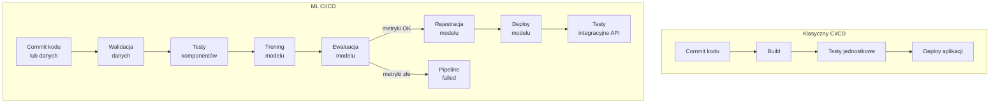

# Wykład 7: CI/CD dla Machine Learning

## Cel wykładu
Po tym wykładzie student:
- rozumie, czym jest CI/CD w kontekście ML i jak różni się od klasycznego CI/CD,
- potrafi zbudować pipeline CI/CD dla modelu ML z GitHub Actions,
- zna wzorce testowania kodu ML,
- rozumie koncepcję GitOps i Infrastructure as Code dla ML.

---

## 1. CI/CD w kontekście ML

### Klasyczny CI/CD vs ML CI/CD



### Trzy poziomy testowania w ML CI/CD

| Poziom | Co testujemy | Narzędzia |
|--------|-------------|-----------|
| **Kod** | Funkcje, klasy, logika | pytest, unittest |
| **Dane** | Schemat, rozkłady, jakość | Great Expectations, pytest |
| **Model** | Metryki, bias, latencja | pytest, locust |

---

## 2. Testowanie kodu ML

### Testy jednostkowe komponentów ML

```python
# tests/test_preprocessing.py
import pytest
import pandas as pd
import numpy as np
from sklearn.preprocessing import StandardScaler

from src.preprocessing import (
    clean_data,
    engineer_features,
    build_preprocessing_pipeline
)

class TestCleanData:
    """Testy funkcji czyszczenia danych."""
    
    @pytest.fixture
    def sample_df(self):
        """Przykładowe dane testowe."""
        return pd.DataFrame({
            'age': [25, 30, -5, 200, 45, 25],  # -5 i 200 to błędy, 25 duplikat
            'income': [50000, 60000, 70000, 80000, 55000, 50000],
            'churn': [0, 1, 0, 1, 0, 0]
        })
    
    def test_removes_negative_age(self, sample_df):
        """Test: usuwa wiersze z ujemnym wiekiem."""
        result = clean_data(sample_df)
        assert (result['age'] >= 0).all(), "Znaleziono ujemny wiek po czyszczeniu"
    
    def test_removes_unrealistic_age(self, sample_df):
        """Test: usuwa wiersze z nierealistycznym wiekiem."""
        result = clean_data(sample_df)
        assert (result['age'] <= 120).all(), "Znaleziono wiek > 120 po czyszczeniu"
    
    def test_removes_duplicates(self, sample_df):
        """Test: usuwa duplikaty."""
        result = clean_data(sample_df)
        assert not result.duplicated().any(), "Znaleziono duplikaty po czyszczeniu"
    
    def test_preserves_valid_rows(self, sample_df):
        """Test: zachowuje poprawne wiersze."""
        result = clean_data(sample_df)
        # Powinny zostać: wiersze z age=30, 45 (25 jest duplikatem)
        assert len(result) >= 2, "Zbyt mało wierszy po czyszczeniu"
    
    def test_returns_dataframe(self, sample_df):
        """Test: zwraca DataFrame."""
        result = clean_data(sample_df)
        assert isinstance(result, pd.DataFrame)


class TestFeatureEngineering:
    """Testy inżynierii cech."""
    
    @pytest.fixture
    def clean_df(self):
        return pd.DataFrame({
            'age': [25, 35, 50],
            'income': [30000, 60000, 90000],
            'churn': [0, 1, 0]
        })
    
    def test_creates_income_per_age(self, clean_df):
        """Test: tworzy cechę income_per_age."""
        result = engineer_features(clean_df)
        assert 'income_per_age' in result.columns
        assert (result['income_per_age'] == result['income'] / result['age']).all()
    
    def test_creates_age_group(self, clean_df):
        """Test: tworzy cechę age_group."""
        result = engineer_features(clean_df)
        assert 'age_group' in result.columns
        assert result['age_group'].notna().all()
    
    def test_does_not_modify_original(self, clean_df):
        """Test: nie modyfikuje oryginalnego DataFrame."""
        original_cols = set(clean_df.columns)
        engineer_features(clean_df)
        assert set(clean_df.columns) == original_cols


class TestModelPerformance:
    """Testy jakości modelu."""
    
    @pytest.fixture(scope="class")
    def trained_model(self):
        """Trenuje model raz dla całej klasy testów."""
        from sklearn.datasets import make_classification
        from sklearn.ensemble import RandomForestClassifier
        from sklearn.model_selection import train_test_split
        
        X, y = make_classification(n_samples=5000, n_features=20, random_state=42)
        X_train, X_test, y_train, y_test = train_test_split(X, y, random_state=42)
        
        model = RandomForestClassifier(n_estimators=50, random_state=42)
        model.fit(X_train, y_train)
        
        return model, X_test, y_test
    
    def test_auc_above_threshold(self, trained_model):
        """Test: AUC-ROC powyżej minimalnego progu."""
        from sklearn.metrics import roc_auc_score
        model, X_test, y_test = trained_model
        auc = roc_auc_score(y_test, model.predict_proba(X_test)[:, 1])
        assert auc >= 0.75, f"AUC {auc:.4f} poniżej progu 0.75"
    
    def test_prediction_latency(self, trained_model):
        """Test: latencja predykcji poniżej 100ms."""
        import time
        model, X_test, _ = trained_model
        
        single_sample = X_test[:1]
        
        start = time.time()
        for _ in range(100):
            model.predict_proba(single_sample)
        avg_latency_ms = (time.time() - start) / 100 * 1000
        
        assert avg_latency_ms < 100, f"Latencja {avg_latency_ms:.2f}ms > 100ms"
    
    def test_no_nan_predictions(self, trained_model):
        """Test: brak NaN w predykcjach."""
        model, X_test, _ = trained_model
        predictions = model.predict_proba(X_test)
        assert not np.isnan(predictions).any(), "Predykcje zawierają NaN"
    
    def test_predictions_in_valid_range(self, trained_model):
        """Test: predykcje w zakresie [0, 1]."""
        model, X_test, _ = trained_model
        probs = model.predict_proba(X_test)
        assert (probs >= 0).all() and (probs <= 1).all()
    
    def test_no_bias_by_age_group(self, trained_model):
        """Test: brak znaczącego biasu między grupami wiekowymi."""
        from sklearn.metrics import roc_auc_score
        import pandas as pd
        
        model, X_test, y_test = trained_model
        
        # Symulacja grup wiekowych
        np.random.seed(42)
        age_groups = np.random.choice(['young', 'middle', 'senior'], len(y_test))
        
        probs = model.predict_proba(X_test)[:, 1]
        
        aucs = {}
        for group in ['young', 'middle', 'senior']:
            mask = age_groups == group
            if mask.sum() > 10:
                aucs[group] = roc_auc_score(y_test[mask], probs[mask])
        
        # Różnica AUC między grupami nie powinna przekraczać 0.1
        auc_values = list(aucs.values())
        max_diff = max(auc_values) - min(auc_values)
        assert max_diff < 0.1, f"Zbyt duży bias między grupami: {aucs}"
```

### Testy danych

```python
# tests/test_data_quality.py
import pytest
import pandas as pd
import numpy as np

class TestDataQuality:
    """Testy jakości danych wejściowych."""
    
    @pytest.fixture
    def production_data(self):
        """Symulacja danych produkcyjnych."""
        np.random.seed(42)
        return pd.DataFrame({
            'age': np.random.normal(40, 10, 1000).clip(18, 100),
            'income': np.random.normal(50000, 15000, 1000).clip(0),
            'tenure_months': np.random.exponential(24, 1000),
            'num_products': np.random.randint(1, 5, 1000),
            'churn': np.random.binomial(1, 0.2, 1000)
        })
    
    def test_no_missing_values(self, production_data):
        """Test: brak brakujących wartości."""
        missing = production_data.isnull().sum()
        assert missing.sum() == 0, f"Brakujące wartości: {missing[missing > 0].to_dict()}"
    
    def test_age_in_valid_range(self, production_data):
        """Test: wiek w zakresie 18-100."""
        assert production_data['age'].between(18, 100).all()
    
    def test_income_non_negative(self, production_data):
        """Test: dochód nieujemny."""
        assert (production_data['income'] >= 0).all()
    
    def test_target_binary(self, production_data):
        """Test: etykieta binarna (0 lub 1)."""
        assert set(production_data['churn'].unique()).issubset({0, 1})
    
    def test_class_balance(self, production_data):
        """Test: klasy nie są skrajnie niezbalansowane."""
        churn_rate = production_data['churn'].mean()
        assert 0.05 <= churn_rate <= 0.50, \
            f"Niezbalansowane klasy: churn_rate={churn_rate:.2%}"
    
    def test_no_duplicate_users(self, production_data):
        """Test: brak zduplikowanych rekordów."""
        if 'user_id' in production_data.columns:
            assert not production_data['user_id'].duplicated().any()
```

---

## 3. GitHub Actions dla ML

### Pełny workflow CI/CD

```yaml
# .github/workflows/ml_cicd.yml
name: ML CI/CD Pipeline

on:
  push:
    branches: [main, develop]
    paths:
      - 'src/**'
      - 'tests/**'
      - 'data/**'
      - 'params.yaml'
  pull_request:
    branches: [main]
  schedule:
    - cron: '0 2 * * 1'  # co poniedziałek o 2:00 (retraining)

env:
  PYTHON_VERSION: '3.11'
  MLFLOW_TRACKING_URI: ${{ secrets.MLFLOW_TRACKING_URI }}

jobs:
  # --- Job 1: Testy kodu ---
  test-code:
    name: Code Tests
    runs-on: ubuntu-latest
    
    steps:
      - uses: actions/checkout@v4
      
      - name: Setup Python
        uses: actions/setup-python@v5
        with:
          python-version: ${{ env.PYTHON_VERSION }}
          cache: 'pip'
      
      - name: Install dependencies
        run: |
          pip install -r requirements.txt
          pip install -r requirements-dev.txt
      
      - name: Run linting
        run: |
          ruff check src/ tests/
          mypy src/ --ignore-missing-imports
      
      - name: Run unit tests
        run: |
          pytest tests/unit/ -v \
            --cov=src \
            --cov-report=xml \
            --cov-report=term-missing \
            --junitxml=reports/junit.xml
      
      - name: Upload coverage
        uses: codecov/codecov-action@v4
        with:
          file: coverage.xml

  # --- Job 2: Walidacja danych ---
  validate-data:
    name: Data Validation
    runs-on: ubuntu-latest
    needs: test-code
    
    steps:
      - uses: actions/checkout@v4
      
      - name: Setup Python
        uses: actions/setup-python@v5
        with:
          python-version: ${{ env.PYTHON_VERSION }}
          cache: 'pip'
      
      - name: Install dependencies
        run: pip install -r requirements.txt
      
      - name: Pull data with DVC
        env:
          GOOGLE_APPLICATION_CREDENTIALS: ${{ secrets.GCP_SA_KEY }}
        run: |
          dvc pull data/train.parquet.dvc
          dvc pull data/test.parquet.dvc
      
      - name: Validate data quality
        run: |
          python scripts/validate_data.py \
            --input data/train.parquet \
            --expectations expectations/train_expectations.json
      
      - name: Run data tests
        run: pytest tests/data/ -v

  # --- Job 3: Trening i ewaluacja modelu ---
  train-and-evaluate:
    name: Train & Evaluate Model
    runs-on: ubuntu-latest
    needs: validate-data
    
    steps:
      - uses: actions/checkout@v4
      
      - name: Setup Python
        uses: actions/setup-python@v5
        with:
          python-version: ${{ env.PYTHON_VERSION }}
          cache: 'pip'
      
      - name: Install dependencies
        run: pip install -r requirements.txt
      
      - name: Pull data
        run: dvc pull
      
      - name: Train model
        run: |
          python src/train.py \
            --config params.yaml \
            --output models/
        env:
          MLFLOW_TRACKING_URI: ${{ env.MLFLOW_TRACKING_URI }}
      
      - name: Evaluate model
        id: evaluate
        run: |
          python scripts/evaluate_model.py \
            --model models/model.pkl \
            --test-data data/test.parquet \
            --output reports/metrics.json
          
          # Odczytaj metryki i ustaw jako output
          AUC=$(python -c "import json; print(json.load(open('reports/metrics.json'))['auc_roc'])")
          echo "auc_roc=$AUC" >> $GITHUB_OUTPUT
          echo "Model AUC-ROC: $AUC"
      
      - name: Check model quality gate
        run: |
          python scripts/quality_gate.py \
            --metrics reports/metrics.json \
            --min-auc 0.80 \
            --min-f1 0.70
      
      - name: Upload model artifacts
        uses: actions/upload-artifact@v4
        with:
          name: trained-model
          path: |
            models/model.pkl
            reports/metrics.json
          retention-days: 30

  # --- Job 4: Testy modelu ---
  test-model:
    name: Model Tests
    runs-on: ubuntu-latest
    needs: train-and-evaluate
    
    steps:
      - uses: actions/checkout@v4
      
      - name: Download model artifacts
        uses: actions/download-artifact@v4
        with:
          name: trained-model
      
      - name: Run model tests
        run: |
          pytest tests/model/ -v \
            --model-path models/model.pkl

  # --- Job 5: Build Docker image ---
  build-docker:
    name: Build & Push Docker Image
    runs-on: ubuntu-latest
    needs: test-model
    if: github.ref == 'refs/heads/main'
    
    steps:
      - uses: actions/checkout@v4
      
      - name: Download model artifacts
        uses: actions/download-artifact@v4
        with:
          name: trained-model
      
      - name: Set up Docker Buildx
        uses: docker/setup-buildx-action@v3
      
      - name: Login to Container Registry
        uses: docker/login-action@v3
        with:
          registry: gcr.io
          username: _json_key
          password: ${{ secrets.GCP_SA_KEY }}
      
      - name: Build and push
        uses: docker/build-push-action@v5
        with:
          context: .
          push: true
          tags: |
            gcr.io/${{ secrets.GCP_PROJECT }}/churn-api:latest
            gcr.io/${{ secrets.GCP_PROJECT }}/churn-api:${{ github.sha }}
          cache-from: type=gha
          cache-to: type=gha,mode=max

  # --- Job 6: Deploy ---
  deploy:
    name: Deploy to Production
    runs-on: ubuntu-latest
    needs: build-docker
    environment: production
    
    steps:
      - uses: actions/checkout@v4
      
      - name: Deploy to Vertex AI Endpoint
        run: |
          python scripts/deploy_model.py \
            --model-uri gs://my-bucket/models/${{ github.sha }} \
            --endpoint-name churn-predictor-prod \
            --traffic-split '{"new": 10, "current": 90}'
        env:
          GOOGLE_APPLICATION_CREDENTIALS: ${{ secrets.GCP_SA_KEY }}
      
      - name: Run smoke tests
        run: |
          python scripts/smoke_test.py \
            --endpoint-url ${{ secrets.ENDPOINT_URL }}
      
      - name: Notify on success
        uses: slackapi/slack-github-action@v1
        with:
          payload: |
            {
              "text": "✅ Model wdrożony pomyślnie!\nCommit: ${{ github.sha }}\nAUC: ${{ needs.train-and-evaluate.outputs.auc_roc }}"
            }
        env:
          SLACK_WEBHOOK_URL: ${{ secrets.SLACK_WEBHOOK }}
```

---

## 4. Quality Gates – bramki jakości

```python
# scripts/quality_gate.py
import json
import argparse
import sys
from dataclasses import dataclass
from typing import Optional

@dataclass
class QualityGate:
    """Definicja bramki jakości dla modelu ML."""
    min_auc_roc: float = 0.80
    min_f1_score: float = 0.70
    max_prediction_latency_ms: float = 100.0
    max_bias_difference: float = 0.10
    min_data_coverage: float = 0.95

def check_quality_gate(metrics: dict, gate: QualityGate) -> tuple[bool, list[str]]:
    """
    Sprawdza czy model spełnia wymagania jakościowe.
    
    Returns:
        (passed, list_of_failures)
    """
    failures = []
    
    # Sprawdzenie AUC-ROC
    auc = metrics.get('auc_roc', 0)
    if auc < gate.min_auc_roc:
        failures.append(
            f"AUC-ROC {auc:.4f} < minimum {gate.min_auc_roc}"
        )
    
    # Sprawdzenie F1
    f1 = metrics.get('f1_score', 0)
    if f1 < gate.min_f1_score:
        failures.append(
            f"F1-Score {f1:.4f} < minimum {gate.min_f1_score}"
        )
    
    # Sprawdzenie latencji
    latency = metrics.get('avg_latency_ms', 0)
    if latency > gate.max_prediction_latency_ms:
        failures.append(
            f"Latencja {latency:.1f}ms > maksimum {gate.max_prediction_latency_ms}ms"
        )
    
    # Sprawdzenie biasu
    bias_diff = metrics.get('max_group_auc_difference', 0)
    if bias_diff > gate.max_bias_difference:
        failures.append(
            f"Bias między grupami {bias_diff:.4f} > maksimum {gate.max_bias_difference}"
        )
    
    passed = len(failures) == 0
    return passed, failures

def main():
    parser = argparse.ArgumentParser()
    parser.add_argument('--metrics', required=True)
    parser.add_argument('--min-auc', type=float, default=0.80)
    parser.add_argument('--min-f1', type=float, default=0.70)
    args = parser.parse_args()
    
    with open(args.metrics) as f:
        metrics = json.load(f)
    
    gate = QualityGate(
        min_auc_roc=args.min_auc,
        min_f1_score=args.min_f1
    )
    
    passed, failures = check_quality_gate(metrics, gate)
    
    if passed:
        print("✅ Quality Gate: PASSED")
        print(f"   AUC-ROC: {metrics.get('auc_roc', 'N/A'):.4f}")
        print(f"   F1-Score: {metrics.get('f1_score', 'N/A'):.4f}")
        sys.exit(0)
    else:
        print("❌ Quality Gate: FAILED")
        for failure in failures:
            print(f"   - {failure}")
        sys.exit(1)  # Niezerowy exit code zatrzymuje pipeline CI/CD

if __name__ == "__main__":
    main()
```

---

## 5. Infrastructure as Code dla ML

### Terraform dla infrastruktury ML

```hcl
# infrastructure/main.tf
terraform {
  required_providers {
    google = {
      source  = "hashicorp/google"
      version = "~> 5.0"
    }
  }
  
  backend "gcs" {
    bucket = "my-terraform-state"
    prefix = "mlops/state"
  }
}

provider "google" {
  project = var.project_id
  region  = var.region
}

# Cloud Storage bucket dla danych i modeli
resource "google_storage_bucket" "ml_artifacts" {
  name          = "${var.project_id}-ml-artifacts"
  location      = var.region
  force_destroy = false
  
  versioning {
    enabled = true
  }
  
  lifecycle_rule {
    condition {
      age = 90
    }
    action {
      type          = "SetStorageClass"
      storage_class = "NEARLINE"
    }
  }
}

# Vertex AI Endpoint
resource "google_vertex_ai_endpoint" "churn_predictor" {
  name         = "churn-predictor-prod"
  display_name = "Churn Predictor Production"
  location     = var.region
  
  labels = {
    environment = "production"
    team        = "mlops"
    model       = "churn-predictor"
  }
}

# Service Account dla ML pipeline
resource "google_service_account" "ml_pipeline_sa" {
  account_id   = "ml-pipeline-sa"
  display_name = "ML Pipeline Service Account"
}

resource "google_project_iam_member" "ml_pipeline_roles" {
  for_each = toset([
    "roles/aiplatform.user",
    "roles/storage.objectAdmin",
    "roles/bigquery.dataViewer"
  ])
  
  project = var.project_id
  role    = each.value
  member  = "serviceAccount:${google_service_account.ml_pipeline_sa.email}"
}
```

---

## 6. Makefile dla ML projektu

```makefile
# Makefile
.PHONY: setup test train deploy clean

# Zmienne
PYTHON := python3
PIP := pip3
MODEL_PATH := models/model.pkl
DATA_PATH := data/

## Konfiguracja środowiska
setup:
	$(PIP) install -r requirements.txt
	$(PIP) install -r requirements-dev.txt
	pre-commit install
	dvc pull

## Testy
test:
	pytest tests/ -v --cov=src --cov-report=term-missing

test-unit:
	pytest tests/unit/ -v

test-data:
	pytest tests/data/ -v

test-model:
	pytest tests/model/ -v --model-path $(MODEL_PATH)

## Jakość kodu
lint:
	ruff check src/ tests/
	mypy src/ --ignore-missing-imports

format:
	ruff format src/ tests/

## Trening
train:
	$(PYTHON) src/train.py --config params.yaml

train-local:
	$(PYTHON) src/train.py --config params.yaml --local

## Ewaluacja
evaluate:
	$(PYTHON) scripts/evaluate_model.py \
		--model $(MODEL_PATH) \
		--test-data data/test.parquet \
		--output reports/metrics.json

quality-gate:
	$(PYTHON) scripts/quality_gate.py \
		--metrics reports/metrics.json \
		--min-auc 0.80

## Wdrożenie
build-docker:
	docker build -t churn-api:latest .

run-local:
	docker-compose up -d

deploy-staging:
	$(PYTHON) scripts/deploy_model.py --env staging

deploy-prod:
	$(PYTHON) scripts/deploy_model.py --env production

## Czyszczenie
clean:
	find . -type f -name "*.pyc" -delete
	find . -type d -name "__pycache__" -delete
	rm -rf .pytest_cache/ .mypy_cache/ .ruff_cache/
	rm -rf reports/*.json reports/*.html

## Pipeline end-to-end
pipeline: setup lint test-unit validate-data train evaluate quality-gate
	@echo "✅ Pipeline zakończony pomyślnie"
```

---

## 7. Pre-commit hooks dla ML

```yaml
# .pre-commit-config.yaml
repos:
  - repo: https://github.com/astral-sh/ruff-pre-commit
    rev: v0.3.0
    hooks:
      - id: ruff
        args: [--fix]
      - id: ruff-format

  - repo: https://github.com/pre-commit/mirrors-mypy
    rev: v1.8.0
    hooks:
      - id: mypy
        additional_dependencies: [types-requests]

  - repo: local
    hooks:
      # Sprawdź czy nie commitujemy dużych plików danych
      - id: check-large-files
        name: Check for large files
        entry: python scripts/check_large_files.py
        language: python
        pass_filenames: true
        args: [--max-size-mb, "10"]
      
      # Sprawdź czy notebooks są wyczyszczone
      - id: clear-notebook-outputs
        name: Clear Jupyter notebook outputs
        entry: jupyter nbconvert --ClearOutputPreprocessor.enabled=True --inplace
        language: python
        files: \.ipynb$
        additional_dependencies: [jupyter]
      
      # Uruchom testy jednostkowe przed commitem
      - id: run-unit-tests
        name: Run unit tests
        entry: pytest tests/unit/ -x -q
        language: python
        pass_filenames: false
        stages: [commit]
```

---

## 8. Typowe pułapki w CI/CD dla ML

> ⚠️ **Pułapka 1: Trening w CI/CD na pełnych danych**
> Pipeline CI trwa 4 godziny, bo trenuje model na pełnym zbiorze danych. Rozwiązanie: w CI używaj **podzbioru danych** (smoke test), a pełny trening uruchamiaj osobno (np. scheduled pipeline).

> ⚠️ **Pułapka 2: Brak quality gates**
> Model jest wdrażany automatycznie bez sprawdzenia metryk. Jeden zły commit może wdrożyć model z AUC=0.50. Zawsze dodawaj bramki jakości z minimalnymi progami.

> ⚠️ **Pułapka 3: Sekrety w kodzie**
> Klucze API, hasła do baz danych i tokeny wpisane bezpośrednio w kodzie lub plikach konfiguracyjnych. Używaj GitHub Secrets, Vault lub zmiennych środowiskowych.

> ⚠️ **Pułapka 4: Brak testów danych**
> Testy kodu przechodzą, ale model jest trenowany na uszkodzonych danych (np. puste kolumny, zmieniony schemat). Zawsze testuj dane przed treningiem.

### Case Study: Lyft — CI/CD dla setek modeli ML

**Lyft** (ride-sharing) zarządza setkami modeli ML w produkcji:
- Każdy model ma własny pipeline CI/CD z automatycznymi testami kodu, danych i metryk.
- Używają **Flyte** (open-source orkiestrator) zamiast Airflow — lepsze wsparcie dla ML workflows.
- Kluczowa praktyka: **shadow deployment** — nowy model działa równolegle z produkcyjnym przez 24h, porównując predykcje bez wpływu na użytkowników.
- Automatyczne rollbacki: jeśli metryki biznesowe (czas oczekiwania, cena) pogarszają się o >2%, model jest automatycznie wycofywany.

### Checklist CI/CD dla ML

Przed wdrożeniem modelu upewnij się, że:

- [ ] Testy jednostkowe kodu przechodzą (pytest)
- [ ] Linting i type checking przechodzą (ruff, mypy)
- [ ] Dane wejściowe są zwalidowane (schemat, rozkłady, brakujące wartości)
- [ ] Model spełnia minimalne progi jakości (AUC, F1, latencja)
- [ ] Model nie wykazuje biasu między grupami demograficznymi
- [ ] Obraz Docker buduje się poprawnie i przechodzi health check
- [ ] Smoke testy na endpoincie przechodzą
- [ ] Sekrety nie są hardkodowane w kodzie
- [ ] Dokumentacja jest aktualna (README, CHANGELOG)

---

## Pytania kontrolne i do dyskusji

1. Czym różni się CI/CD dla ML od klasycznego CI/CD dla aplikacji webowej?
2. Co to jest quality gate i dlaczego jest kluczowy w pipeline'ach ML?
3. Jakie trzy poziomy testowania powinien zawierać pipeline CI/CD dla ML?
4. Wyjaśnij, jak GitHub Actions może automatycznie wyzwalać retraining modelu.
5. Dlaczego Infrastructure as Code (Terraform) jest ważne w kontekście MLOps?
6. Jakie pre-commit hooks są szczególnie przydatne w projektach ML?
7. **Dyskusja:** Czy warto trenować model w pipeline CI (przy każdym PR), czy lepiej robić to osobno? Jakie są trade-offy?

---

## Podsumowanie

- ML CI/CD rozszerza klasyczny CI/CD o walidację danych, trening i ewaluację modelu.
- **Quality Gates** automatycznie blokują wdrożenie modeli niespełniających wymagań.
- **GitHub Actions** umożliwia pełną automatyzację od commita do wdrożenia.
- Testuj kod ML jak każdy inny kod: testy jednostkowe, integracyjne, wydajnościowe.
- **Infrastructure as Code** (Terraform) zapewnia reprodukowalność środowiska.
- Używaj checklisty przed każdym wdrożeniem — automatyzuj co się da, ale nie pomijaj żadnego kroku.

## Literatura i zasoby

- [GitHub Actions Documentation](https://docs.github.com/en/actions)
- [pytest Documentation](https://docs.pytest.org/)
- [Terraform Documentation](https://developer.hashicorp.com/terraform/docs)
- [pre-commit Documentation](https://pre-commit.com/)
- [Google MLOps: CI/CD for ML](https://cloud.google.com/architecture/mlops-continuous-delivery-and-automation-pipelines-in-machine-learning)
- [Flyte Documentation](https://docs.flyte.org/)
- [Continuous Delivery for Machine Learning (martinfowler.com)](https://martinfowler.com/articles/cd4ml.html)
