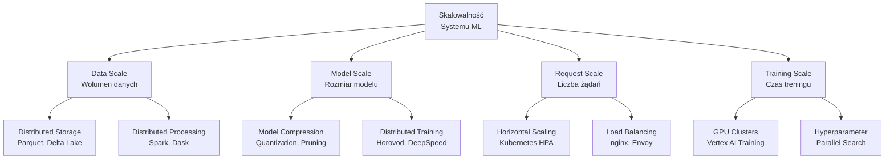
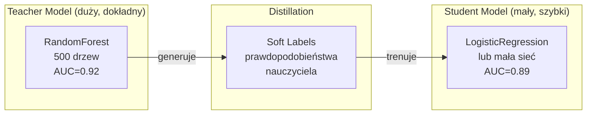
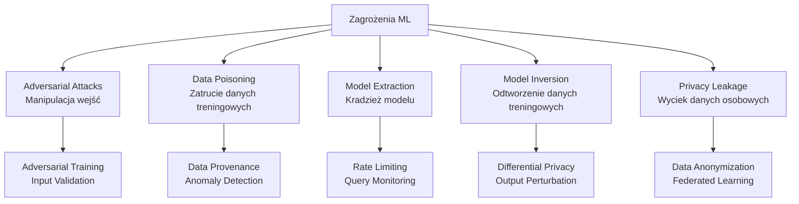
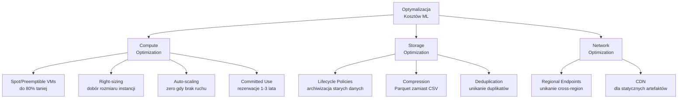
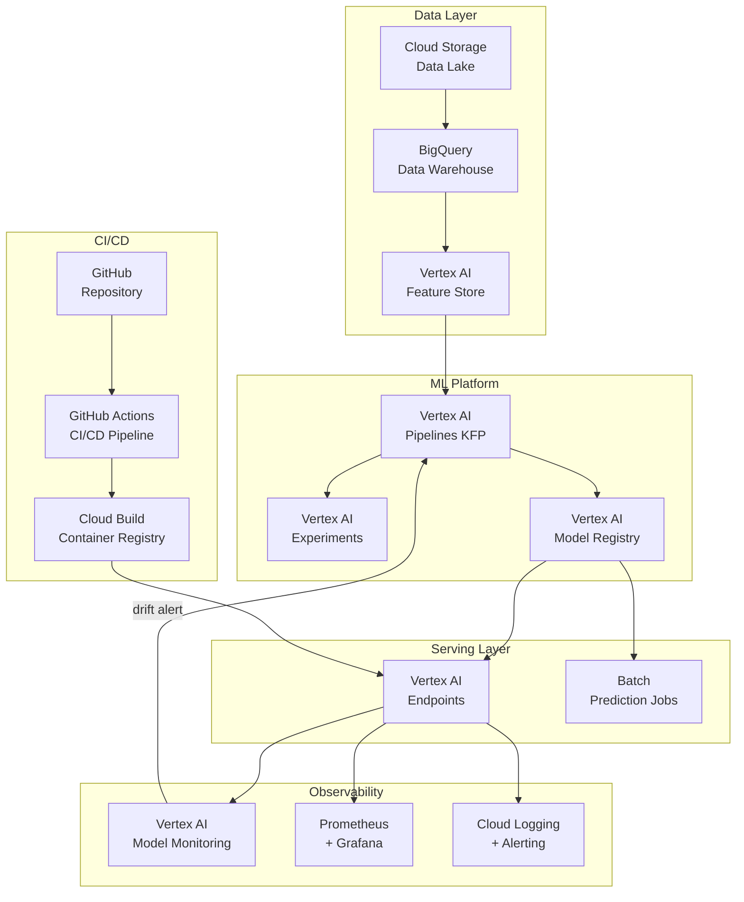

# Wykład 8: Skalowalność, Bezpieczeństwo i Optymalizacja Kosztów w MLOps

## Cel wykładu
Po tym wykładzie student:
- rozumie wzorce skalowania systemów ML,
- zna techniki optymalizacji modeli (quantization, pruning, distillation),
- potrafi zabezpieczyć system ML (IAM, szyfrowanie, audyt),
- zna strategie optymalizacji kosztów w chmurze.

---

## 1. Skalowalność systemów ML

### Wymiary skalowalności



---

## 2. Skalowanie horyzontalne serwisu ML

### Kubernetes Horizontal Pod Autoscaler (HPA)

```yaml
# kubernetes/ml-deployment.yaml
apiVersion: apps/v1
kind: Deployment
metadata:
  name: churn-predictor
  labels:
    app: churn-predictor
    version: v2.1.0
spec:
  replicas: 3
  selector:
    matchLabels:
      app: churn-predictor
  template:
    metadata:
      labels:
        app: churn-predictor
      annotations:
        prometheus.io/scrape: "true"
        prometheus.io/port: "8000"
    spec:
      containers:
        - name: churn-api
          image: gcr.io/my-project/churn-api:v2.1.0
          ports:
            - containerPort: 8080
            - containerPort: 8000  # metrics
          resources:
            requests:
              cpu: "500m"
              memory: "512Mi"
            limits:
              cpu: "2000m"
              memory: "2Gi"
          readinessProbe:
            httpGet:
              path: /health
              port: 8080
            initialDelaySeconds: 10
            periodSeconds: 5
          livenessProbe:
            httpGet:
              path: /health
              port: 8080
            initialDelaySeconds: 30
            periodSeconds: 10
          env:
            - name: MODEL_VERSION
              value: "v2.1.0"
            - name: LOG_LEVEL
              value: "INFO"
          volumeMounts:
            - name: model-storage
              mountPath: /app/models
              readOnly: true
      volumes:
        - name: model-storage
          persistentVolumeClaim:
            claimName: model-pvc

---
apiVersion: autoscaling/v2
kind: HorizontalPodAutoscaler
metadata:
  name: churn-predictor-hpa
spec:
  scaleTargetRef:
    apiVersion: apps/v1
    kind: Deployment
    name: churn-predictor
  minReplicas: 2
  maxReplicas: 20
  metrics:
    # Skalowanie na podstawie CPU
    - type: Resource
      resource:
        name: cpu
        target:
          type: Utilization
          averageUtilization: 70
    # Skalowanie na podstawie niestandardowej metryki (RPS)
    - type: Pods
      pods:
        metric:
          name: ml_predictions_per_second
        target:
          type: AverageValue
          averageValue: "100"
  behavior:
    scaleUp:
      stabilizationWindowSeconds: 60
      policies:
        - type: Pods
          value: 4
          periodSeconds: 60
    scaleDown:
      stabilizationWindowSeconds: 300  # 5 minut przed skalowaniem w dół
```

### Load Testing z Locust

```python
# locustfile.py
from locust import HttpUser, task, between
import json
import random

class MLServiceUser(HttpUser):
    """Symuluje użytkownika serwisu ML."""
    
    wait_time = between(0.1, 1.0)  # czas między żądaniami
    
    def on_start(self):
        """Inicjalizacja użytkownika."""
        # Sprawdź health przed testami
        response = self.client.get("/health")
        assert response.status_code == 200
    
    @task(10)  # waga 10 - najczęstsze żądanie
    def predict_single(self):
        """Test pojedynczej predykcji."""
        payload = {
            "user_id": random.randint(1, 100000),
            "age": random.uniform(18, 80),
            "income": random.uniform(20000, 150000),
            "tenure_months": random.randint(1, 120),
            "num_products": random.randint(1, 5)
        }
        
        with self.client.post(
            "/predict",
            json=payload,
            catch_response=True
        ) as response:
            if response.status_code == 200:
                data = response.json()
                if not (0 <= data['churn_probability'] <= 1):
                    response.failure("Nieprawidłowe prawdopodobieństwo")
                else:
                    response.success()
            else:
                response.failure(f"HTTP {response.status_code}")
    
    @task(2)  # waga 2 - rzadsze żądanie
    def predict_batch(self):
        """Test predykcji wsadowej."""
        batch_size = random.randint(10, 100)
        payload = [
            {
                "user_id": i,
                "age": random.uniform(18, 80),
                "income": random.uniform(20000, 150000),
                "tenure_months": random.randint(1, 120),
                "num_products": random.randint(1, 5)
            }
            for i in range(batch_size)
        ]
        
        self.client.post("/predict/batch", json=payload)
    
    @task(1)
    def health_check(self):
        """Test health check."""
        self.client.get("/health")

# Uruchomienie:
# locust -f locustfile.py --host=http://localhost:8080 --users=100 --spawn-rate=10
```

---

## 3. Optymalizacja modeli

### 3.1 Quantization – zmniejszenie precyzji

```python
import torch
import torch.nn as nn
import numpy as np
import time

class SimpleModel(nn.Module):
    def __init__(self, input_dim: int = 20):
        super().__init__()
        self.layers = nn.Sequential(
            nn.Linear(input_dim, 128),
            nn.ReLU(),
            nn.Linear(128, 64),
            nn.ReLU(),
            nn.Linear(64, 1),
            nn.Sigmoid()
        )
    
    def forward(self, x):
        return self.layers(x)

def benchmark_model(model, input_data: torch.Tensor, n_runs: int = 1000) -> dict:
    """Mierzy wydajność modelu."""
    model.eval()
    
    # Warmup
    with torch.no_grad():
        for _ in range(10):
            model(input_data)
    
    # Benchmark
    start = time.time()
    with torch.no_grad():
        for _ in range(n_runs):
            output = model(input_data)
    elapsed = time.time() - start
    
    return {
        "avg_latency_ms": elapsed / n_runs * 1000,
        "throughput_rps": n_runs / elapsed
    }

# Oryginalny model (FP32)
model_fp32 = SimpleModel()
input_data = torch.randn(1, 20)

# Dynamic Quantization (INT8)
model_int8 = torch.quantization.quantize_dynamic(
    model_fp32,
    {nn.Linear},
    dtype=torch.qint8
)

# Porównanie
fp32_stats = benchmark_model(model_fp32, input_data)
int8_stats = benchmark_model(model_int8, input_data)

# Rozmiar modeli
import io
def get_model_size_mb(model) -> float:
    buffer = io.BytesIO()
    torch.save(model.state_dict(), buffer)
    return buffer.tell() / 1024 / 1024

fp32_size = get_model_size_mb(model_fp32)
int8_size = get_model_size_mb(model_int8)

print("=== Porównanie FP32 vs INT8 ===")
print(f"FP32: {fp32_size:.2f} MB, latencja: {fp32_stats['avg_latency_ms']:.3f}ms")
print(f"INT8: {int8_size:.2f} MB, latencja: {int8_stats['avg_latency_ms']:.3f}ms")
print(f"Redukcja rozmiaru: {(1 - int8_size/fp32_size)*100:.0f}%")
print(f"Przyspieszenie: {fp32_stats['avg_latency_ms']/int8_stats['avg_latency_ms']:.1f}x")
```

### 3.2 Knowledge Distillation



```python
import numpy as np
from sklearn.ensemble import RandomForestClassifier
from sklearn.linear_model import LogisticRegression
from sklearn.datasets import make_classification
from sklearn.model_selection import train_test_split
from sklearn.metrics import roc_auc_score
import time

# Dane
X, y = make_classification(n_samples=50000, n_features=20, random_state=42)
X_train, X_test, y_train, y_test = train_test_split(X, y, test_size=0.2, random_state=42)

# Teacher: duży Random Forest
teacher = RandomForestClassifier(n_estimators=500, max_depth=15, random_state=42, n_jobs=-1)
teacher.fit(X_train, y_train)

# Generowanie soft labels (temperatura T=2 wygładza rozkład)
T = 2.0
teacher_probs = teacher.predict_proba(X_train)
soft_labels = teacher_probs[:, 1]  # prawdopodobieństwo klasy pozytywnej

# Student: mała regresja logistyczna trenowana na soft labels
student = LogisticRegression(C=1.0, max_iter=1000, random_state=42)
student.fit(X_train, soft_labels > 0.5)  # uproszczone - w praktyce używamy MSE loss

# Porównanie
teacher_auc = roc_auc_score(y_test, teacher.predict_proba(X_test)[:, 1])
student_auc = roc_auc_score(y_test, student.predict_proba(X_test)[:, 1])

# Latencja
sample = X_test[:1]
t0 = time.time()
for _ in range(1000): teacher.predict_proba(sample)
teacher_latency = (time.time() - t0) / 1000 * 1000

t0 = time.time()
for _ in range(1000): student.predict_proba(sample)
student_latency = (time.time() - t0) / 1000 * 1000

print("=== Knowledge Distillation ===")
print(f"Teacher: AUC={teacher_auc:.4f}, latencja={teacher_latency:.2f}ms")
print(f"Student: AUC={student_auc:.4f}, latencja={student_latency:.2f}ms")
print(f"Utrata AUC: {(teacher_auc - student_auc):.4f}")
print(f"Przyspieszenie: {teacher_latency/student_latency:.1f}x")
```

### 3.3 Caching predykcji

```python
import hashlib
import json
import time
from functools import lru_cache
from typing import Optional
import redis

class PredictionCache:
    """Cache predykcji z Redis."""
    
    def __init__(
        self,
        redis_client: redis.Redis,
        ttl_seconds: int = 3600,
        cache_threshold: float = 0.05  # cache tylko gdy prob < 0.05 lub > 0.95
    ):
        self.redis = redis_client
        self.ttl = ttl_seconds
        self.threshold = cache_threshold
        self._hits = 0
        self._misses = 0
    
    def _make_key(self, features: dict) -> str:
        """Tworzy klucz cache z cech."""
        # Zaokrąglij wartości numeryczne (unikaj problemów z float)
        rounded = {k: round(v, 2) if isinstance(v, float) else v 
                   for k, v in sorted(features.items())}
        return f"pred:{hashlib.md5(json.dumps(rounded).encode()).hexdigest()}"
    
    def get(self, features: dict) -> Optional[float]:
        """Pobiera predykcję z cache."""
        key = self._make_key(features)
        cached = self.redis.get(key)
        
        if cached is not None:
            self._hits += 1
            return float(cached)
        
        self._misses += 1
        return None
    
    def set(self, features: dict, probability: float):
        """Zapisuje predykcję do cache (tylko dla pewnych predykcji)."""
        # Cache tylko gdy model jest pewny (unikamy cache dla granicznych przypadków)
        if probability < self.threshold or probability > (1 - self.threshold):
            key = self._make_key(features)
            self.redis.setex(key, self.ttl, str(probability))
    
    @property
    def hit_rate(self) -> float:
        total = self._hits + self._misses
        return self._hits / total if total > 0 else 0.0

# Użycie w serwisie
class CachedMLService:
    def __init__(self, model, cache: PredictionCache):
        self.model = model
        self.cache = cache
    
    def predict(self, features: dict) -> dict:
        # Sprawdź cache
        cached_prob = self.cache.get(features)
        
        if cached_prob is not None:
            return {
                "probability": cached_prob,
                "source": "cache",
                "latency_ms": 0.1
            }
        
        # Oblicz predykcję
        t0 = time.time()
        X = [[features[k] for k in sorted(features.keys())]]
        probability = float(self.model.predict_proba(X)[0][1])
        latency = (time.time() - t0) * 1000
        
        # Zapisz do cache
        self.cache.set(features, probability)
        
        return {
            "probability": probability,
            "source": "model",
            "latency_ms": latency
        }
```

---

## 4. Bezpieczeństwo systemów ML

### 4.1 Zagrożenia specyficzne dla ML



### 4.2 Walidacja i sanityzacja wejść

```python
from pydantic import BaseModel, Field, validator
from typing import Optional
import numpy as np
import logging

logger = logging.getLogger(__name__)

class SecurePredictionRequest(BaseModel):
    """Bezpieczny schemat żądania z walidacją."""
    
    user_id: int = Field(..., gt=0, lt=10_000_000)
    age: float = Field(..., ge=18, le=100)
    income: float = Field(..., ge=0, le=10_000_000)
    tenure_months: int = Field(..., ge=0, le=600)
    num_products: int = Field(..., ge=1, le=20)
    
    @validator('age')
    def age_must_be_adult(cls, v):
        if v < 18:
            raise ValueError("Wiek musi być >= 18")
        return round(v, 1)  # zaokrąglij do 1 miejsca
    
    @validator('income')
    def income_sanity_check(cls, v):
        if v > 5_000_000:
            logger.warning(f"Podejrzanie wysoki dochód: {v}")
        return round(v, 2)

class InputValidator:
    """Walidator wejść dla serwisu ML."""
    
    def __init__(self, reference_stats: dict):
        """
        Args:
            reference_stats: statystyki z danych treningowych
                {'age': {'mean': 40, 'std': 10, 'min': 18, 'max': 90}, ...}
        """
        self.stats = reference_stats
        self._anomaly_count = 0
    
    def validate_features(self, features: dict) -> tuple[bool, list[str]]:
        """
        Sprawdza czy cechy są w rozsądnym zakresie.
        
        Returns:
            (is_valid, list_of_warnings)
        """
        warnings = []
        
        for feature, value in features.items():
            if feature not in self.stats:
                continue
            
            stat = self.stats[feature]
            mean, std = stat['mean'], stat['std']
            
            # Sprawdź czy wartość jest w zakresie mean ± 5*std
            z_score = abs(value - mean) / max(std, 1e-6)
            if z_score > 5:
                warnings.append(
                    f"Cecha '{feature}' ma wartość {value:.2f} "
                    f"(z-score={z_score:.1f} > 5)"
                )
                self._anomaly_count += 1
        
        is_valid = len(warnings) == 0
        if not is_valid:
            logger.warning(f"Anomalie w wejściu: {warnings}")
        
        return is_valid, warnings

# Przykład użycia
reference_stats = {
    'age': {'mean': 40, 'std': 10, 'min': 18, 'max': 90},
    'income': {'mean': 50000, 'std': 15000, 'min': 0, 'max': 500000},
    'tenure_months': {'mean': 24, 'std': 18, 'min': 0, 'max': 240}
}

validator = InputValidator(reference_stats)

# Normalne wejście
normal_features = {'age': 35, 'income': 55000, 'tenure_months': 24}
is_valid, warnings = validator.validate_features(normal_features)
print(f"Normalne: valid={is_valid}, warnings={warnings}")

# Podejrzane wejście (potencjalny atak adversarialny)
suspicious_features = {'age': 999, 'income': -1, 'tenure_months': 10000}
is_valid, warnings = validator.validate_features(suspicious_features)
print(f"Podejrzane: valid={is_valid}, warnings={warnings}")
```

### 4.3 Rate Limiting i ochrona API

```python
from fastapi import FastAPI, Request, HTTPException
from fastapi.middleware.trustedhost import TrustedHostMiddleware
import time
from collections import defaultdict
import asyncio

class RateLimiter:
    """Prosty rate limiter oparty na sliding window."""
    
    def __init__(self, max_requests: int = 100, window_seconds: int = 60):
        self.max_requests = max_requests
        self.window = window_seconds
        self._requests: dict[str, list[float]] = defaultdict(list)
    
    def is_allowed(self, client_id: str) -> tuple[bool, dict]:
        """Sprawdza czy klient może wykonać żądanie."""
        now = time.time()
        window_start = now - self.window
        
        # Usuń stare żądania
        self._requests[client_id] = [
            t for t in self._requests[client_id] if t > window_start
        ]
        
        current_count = len(self._requests[client_id])
        
        if current_count >= self.max_requests:
            return False, {
                "error": "Rate limit exceeded",
                "limit": self.max_requests,
                "window_seconds": self.window,
                "retry_after": int(self._requests[client_id][0] + self.window - now)
            }
        
        self._requests[client_id].append(now)
        return True, {
            "remaining": self.max_requests - current_count - 1,
            "reset_at": int(window_start + self.window)
        }

app = FastAPI()
rate_limiter = RateLimiter(max_requests=100, window_seconds=60)

@app.middleware("http")
async def rate_limit_middleware(request: Request, call_next):
    """Middleware rate limitingu."""
    # Identyfikacja klienta (IP lub API key)
    client_id = request.headers.get("X-API-Key") or request.client.host
    
    allowed, info = rate_limiter.is_allowed(client_id)
    
    if not allowed:
        raise HTTPException(
            status_code=429,
            detail=info,
            headers={"Retry-After": str(info.get("retry_after", 60))}
        )
    
    response = await call_next(request)
    response.headers["X-RateLimit-Remaining"] = str(info.get("remaining", 0))
    return response
```

### 4.4 Differential Privacy

```python
import numpy as np

class DifferentialPrivacyMechanism:
    """
    Implementacja mechanizmu Laplace'a dla differential privacy.
    
    Differential Privacy gwarantuje, że wyniki zapytań do modelu
    nie ujawniają informacji o konkretnych rekordach treningowych.
    """
    
    def __init__(self, epsilon: float = 1.0, sensitivity: float = 1.0):
        """
        Args:
            epsilon: parametr prywatności (mniejszy = więcej prywatności)
            sensitivity: czułość funkcji (max zmiana przy usunięciu 1 rekordu)
        """
        self.epsilon = epsilon
        self.sensitivity = sensitivity
        self.scale = sensitivity / epsilon
    
    def add_noise(self, value: float) -> float:
        """Dodaje szum Laplace'a do wartości."""
        noise = np.random.laplace(0, self.scale)
        return value + noise
    
    def privatize_prediction(self, probability: float) -> float:
        """Dodaje szum do predykcji modelu."""
        noisy_prob = self.add_noise(probability)
        return float(np.clip(noisy_prob, 0, 1))
    
    def privatize_statistics(self, values: np.ndarray) -> dict:
        """Oblicza prywatne statystyki."""
        return {
            "mean": self.add_noise(float(values.mean())),
            "count": int(self.add_noise(len(values))),
            "std": max(0, self.add_noise(float(values.std())))
        }

# Przykład
dp = DifferentialPrivacyMechanism(epsilon=0.5)

true_probability = 0.85
private_probability = dp.privatize_prediction(true_probability)
print(f"Prawdziwe prawdopodobieństwo: {true_probability:.4f}")
print(f"Prywatne prawdopodobieństwo: {private_probability:.4f}")
print(f"Szum: {abs(true_probability - private_probability):.4f}")
```

---

## 5. Optymalizacja kosztów w chmurze

### 5.1 Strategie oszczędzania



### 5.2 Monitorowanie kosztów

```python
import pandas as pd
from datetime import datetime, timedelta
from dataclasses import dataclass

@dataclass
class MLCostTracker:
    """Śledzenie kosztów operacji ML."""
    
    # Ceny GCP (USD) - przykładowe
    TRAINING_GPU_HOUR = 2.48      # n1-standard-8 + T4 GPU
    TRAINING_CPU_HOUR = 0.38      # n1-standard-8
    ENDPOINT_HOUR = 0.10          # per node
    STORAGE_GB_MONTH = 0.02       # Cloud Storage Standard
    BIGQUERY_TB_QUERY = 5.00      # BigQuery on-demand
    
    def estimate_training_cost(
        self,
        duration_hours: float,
        use_gpu: bool = True,
        n_nodes: int = 1
    ) -> dict:
        """Szacuje koszt treningu."""
        rate = self.TRAINING_GPU_HOUR if use_gpu else self.TRAINING_CPU_HOUR
        cost = rate * duration_hours * n_nodes
        
        return {
            "duration_hours": duration_hours,
            "n_nodes": n_nodes,
            "use_gpu": use_gpu,
            "cost_usd": round(cost, 2),
            "cost_pln": round(cost * 4.0, 2)  # przybliżony kurs
        }
    
    def estimate_serving_cost(
        self,
        requests_per_day: int,
        avg_latency_ms: float = 50,
        n_replicas: int = 2
    ) -> dict:
        """Szacuje miesięczny koszt serwowania."""
        # Koszt endpointu (per godzinę)
        endpoint_monthly = self.ENDPOINT_HOUR * 24 * 30 * n_replicas
        
        # Szacowany koszt na żądanie
        cost_per_request = endpoint_monthly / (requests_per_day * 30)
        
        return {
            "requests_per_day": requests_per_day,
            "n_replicas": n_replicas,
            "monthly_cost_usd": round(endpoint_monthly, 2),
            "cost_per_1k_requests_usd": round(cost_per_request * 1000, 4)
        }
    
    def recommend_optimizations(self, monthly_cost_usd: float) -> list[str]:
        """Rekomenduje optymalizacje kosztów."""
        recommendations = []
        
        if monthly_cost_usd > 500:
            recommendations.append(
                "💡 Rozważ Committed Use Discounts (1-3 lata) - oszczędność do 57%"
            )
        
        recommendations.extend([
            "💡 Użyj Spot/Preemptible VMs do treningu - oszczędność do 80%",
            "💡 Skonfiguruj auto-scaling z minReplicas=0 dla środowisk dev/staging",
            "💡 Archiwizuj dane starsze niż 90 dni do Coldline Storage",
            "💡 Używaj Parquet zamiast CSV - redukcja rozmiaru o 60-80%",
            "💡 Włącz caching pipeline'ów KFP - unikaj ponownego treningu",
            "💡 Monitoruj i usuwaj nieużywane Endpointy"
        ])
        
        return recommendations

# Przykład użycia
tracker = MLCostTracker()

# Koszt treningu
training = tracker.estimate_training_cost(
    duration_hours=4,
    use_gpu=True,
    n_nodes=2
)
print(f"Koszt treningu: ${training['cost_usd']} ({training['cost_pln']} PLN)")

# Koszt serwowania
serving = tracker.estimate_serving_cost(
    requests_per_day=100_000,
    n_replicas=3
)
print(f"Miesięczny koszt serwowania: ${serving['monthly_cost_usd']}")
print(f"Koszt na 1000 żądań: ${serving['cost_per_1k_requests_usd']}")

# Rekomendacje
recs = tracker.recommend_optimizations(serving['monthly_cost_usd'])
print("\nRekomendacje optymalizacji:")
for rec in recs:
    print(f"  {rec}")
```

---

## 6. Distributed Training

### Horovod – rozproszony trening

```python
import horovod.torch as hvd
import torch
import torch.nn as nn
from torch.utils.data import DataLoader, TensorDataset, DistributedSampler

def train_distributed(model, X_train, y_train, epochs=10, lr=0.001):
    """
    Trenuje model w trybie rozproszonym z Horovod.
    
    Uruchomienie:
        horovodrun -np 4 python train_distributed.py
    """
    # Inicjalizacja Horovod
    hvd.init()
    
    # Przypisanie GPU do procesu
    if torch.cuda.is_available():
        torch.cuda.set_device(hvd.local_rank())
        device = torch.device(f'cuda:{hvd.local_rank()}')
    else:
        device = torch.device('cpu')
    
    model = model.to(device)
    
    # Skalowanie learning rate proporcjonalnie do liczby workerów
    optimizer = torch.optim.Adam(model.parameters(), lr=lr * hvd.size())
    
    # Distributed optimizer
    optimizer = hvd.DistributedOptimizer(
        optimizer,
        named_parameters=model.named_parameters()
    )
    
    # Broadcast parametrów z rank 0 do wszystkich workerów
    hvd.broadcast_parameters(model.state_dict(), root_rank=0)
    hvd.broadcast_optimizer_state(optimizer, root_rank=0)
    
    # Distributed sampler - każdy worker dostaje inną część danych
    dataset = TensorDataset(
        torch.FloatTensor(X_train),
        torch.FloatTensor(y_train)
    )
    sampler = DistributedSampler(
        dataset,
        num_replicas=hvd.size(),
        rank=hvd.rank()
    )
    loader = DataLoader(dataset, batch_size=256, sampler=sampler)
    
    criterion = nn.BCELoss()
    
    for epoch in range(epochs):
        sampler.set_epoch(epoch)
        model.train()
        
        for X_batch, y_batch in loader:
            X_batch, y_batch = X_batch.to(device), y_batch.to(device)
            
            optimizer.zero_grad()
            output = model(X_batch).squeeze()
            loss = criterion(output, y_batch)
            loss.backward()
            optimizer.step()
        
        # Loguj tylko z rank 0
        if hvd.rank() == 0:
            print(f"Epoch {epoch+1}/{epochs}, Loss: {loss.item():.4f}")
    
    return model
```

---

## 7. Architektura referencyjna MLOps



---

## 8. Typowe pułapki w skalowalności i bezpieczeństwie ML

> ⚠️ **Pułapka 1: Przedwczesna optymalizacja**
> Zespół spędza tygodnie na quantization i distillation modelu, który obsługuje 10 żądań na minutę. Najpierw zmierz, potem optymalizuj. Profiling przed optymalizacją!

> ⚠️ **Pułapka 2: Brak load testów przed wdrożeniem**
> Model działa świetnie na laptopie, ale pada przy 100 RPS na produkcji. Zawsze przeprowadzaj load testy (Locust) przed wdrożeniem.

> ⚠️ **Pułapka 3: Ignorowanie kosztów GPU**
> Zostawienie uruchomionych instancji GPU na noc/weekend. Jedna instancja z GPU T4 kosztuje ~$2.50/h = ~$1800/miesiąc. Używaj auto-scaling z minReplicas=0 dla środowisk dev.

> ⚠️ **Pułapka 4: Brak ochrony przed atakami adversarialnymi**
> Model jest dostępny publicznie bez rate limitingu i walidacji wejść. Atakujący może wyekstrahować model (model extraction) lub znaleźć słabości (adversarial examples).

### Case Study: OpenAI — skalowalność GPT

**OpenAI** skaluje modele GPT do milionów użytkowników:
- Używają **model parallelism** — jeden model jest rozdzielony na wiele GPU (tensor parallelism, pipeline parallelism).
- **KV-cache** — cache dla attention mechanism, który drastycznie redukuje koszt generowania kolejnych tokenów.
- **Quantization** — modele są kwantyzowane do INT8/INT4 dla inference, co zmniejsza wymagania pamięciowe 2-4x.
- Koszt treningu GPT-4 szacowany na **$100M+** — optymalizacja kosztów jest krytyczna.

### Case Study: Revolut — bezpieczeństwo ML w fintech

**Revolut** używa ML do wykrywania fraudów i musi spełniać rygorystyczne wymagania regulacyjne:
- **Differential privacy** — model nie może ujawniać informacji o konkretnych transakcjach klientów.
- **Explainability** — regulacje (GDPR, PSD2) wymagają wyjaśnialności decyzji modelu. Używają SHAP i LIME.
- **Adversarial robustness** — model musi być odporny na próby obejścia przez fraudsterów (np. drobne modyfikacje kwot transakcji).
- **Audit trail** — pełna historia decyzji modelu jest przechowywana przez 7 lat.

---

## Pytania kontrolne i do dyskusji

1. Wyjaśnij różnicę między skalowaniem horyzontalnym a wertykalnym. Kiedy użyjesz każdego?
2. Jak działa quantization i jakie są trade-offy (rozmiar vs dokładność)?
3. Co to jest knowledge distillation i kiedy warto ją zastosować?
4. Wymień trzy zagrożenia bezpieczeństwa specyficzne dla systemów ML.
5. Jak działa differential privacy i kiedy jest wymagana?
6. Jakie strategie optymalizacji kosztów zastosujesz dla serwisu ML w chmurze?
7. **Dyskusja:** Czy model ML powinien być traktowany jako „czarna skrzynka" w kontekście regulacji (GDPR, AI Act)? Jakie są implikacje?

---

## Podsumowanie

- **Skalowalność** osiągamy przez Kubernetes HPA, load balancing i distributed training.
- **Optymalizacja modeli**: quantization (4x mniejszy model), distillation (szybszy student), caching (eliminacja powtarzających się obliczeń).
- **Bezpieczeństwo ML**: walidacja wejść, rate limiting, differential privacy, ochrona przed atakami adversarialnymi.
- **Optymalizacja kosztów**: Spot VMs (80% taniej), auto-scaling, lifecycle policies, Parquet zamiast CSV.
- Architektura referencyjna łączy wszystkie komponenty MLOps w spójny system.
- Regulacje (GDPR, AI Act) wymagają explainability, audit trail i ochrony prywatności.

## Literatura i zasoby

- [Kubernetes HPA Documentation](https://kubernetes.io/docs/tasks/run-application/horizontal-pod-autoscale/)
- [PyTorch Quantization](https://pytorch.org/docs/stable/quantization.html)
- [Horovod Documentation](https://horovod.readthedocs.io/)
- [Differential Privacy – Google's DP Library](https://github.com/google/differential-privacy)
- [Google Cloud Pricing Calculator](https://cloud.google.com/products/calculator)
- [Locust Load Testing](https://locust.io/)
- [EU AI Act – Summary](https://artificialintelligenceact.eu/)
- [SHAP Documentation](https://shap.readthedocs.io/)
- [Adversarial Robustness Toolbox (ART)](https://github.com/Trusted-AI/adversarial-robustness-toolbox)
