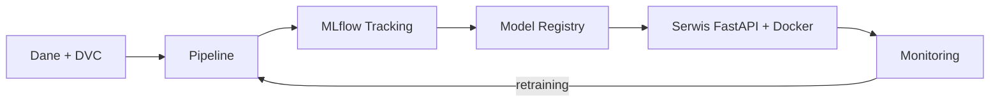

# Sprawozdanie z projektu końcowego: [Nazwa projektu]

## Informacje podstawowe

| Pole | Wartość |
|------|---------|
| **Przedmiot** | MLOps i Inżynieria Systemów ML |
| **Nazwa projektu** | [np. fraud-detection-mlops] |
| **Autor / zespół** | [imiona i nazwiska, nr albumów] |
| **Grupa** | [grupa] |
| **Prowadzący** | [imię i nazwisko] |
| **Data oddania** | [RRRR-MM-DD] |
| **Repozytorium** | [link] |
| **Wersja (tag/commit)** | [np. v1.0.0 / abc1234] |

---

## Streszczenie

[Krótkie podsumowanie projektu: problem, podejście, kluczowe wyniki (5–8 zdań).]

## 1. Opis problemu

- **Problem biznesowy:** [opis]
- **Typ problemu ML:** [klasyfikacja / regresja / NLP / inne]
- **Metryka sukcesu ML:** [np. AUC ≥ 0.85]
- **Metryka biznesowa:** [np. redukcja strat o X%]
- **Wymagania niefunkcjonalne:** [np. latencja p95 < 100 ms]

## 2. Dane

| Element | Opis |
|---------|------|
| Źródło | [link / opis] |
| Rozmiar | [liczba wierszy, kolumn] |
| Zmienna docelowa | [nazwa, rozkład klas] |
| Wersjonowanie | [DVC – remote, wersje danych] |
| Walidacja | [np. Great Expectations / Pandera – lista reguł] |

[Opis eksploracji danych, czyszczenia i feature engineeringu.]

## 3. Architektura systemu



[Opis komponentów i przepływu danych.]

| Komponent | Technologia | Odpowiedzialność |
|-----------|-------------|------------------|
| Wersjonowanie danych | [DVC] | [...] |
| Pipeline | [DVC / KFP] | [...] |
| Śledzenie eksperymentów | [MLflow] | [...] |
| Serwowanie | [FastAPI + Docker] | [...] |
| Monitoring | [Evidently / Prometheus / Grafana] | [...] |
| CI/CD | [GitHub Actions] | [...] |

## 4. Eksperymenty i modelowanie

| Run / model | Algorytm | Kluczowe parametry | Metryka 1 | Metryka 2 | Uwagi |
|-------------|----------|--------------------|-----------|-----------|-------|
| baseline | [...] | [...] | [...] | [...] | [...] |
| [wariant] | [...] | [...] | [...] | [...] | [...] |

- **Wybrany model:** [nazwa, wersja w Model Registry, uzasadnienie]
- **Zrzuty ekranu z MLflow:** [załączniki]

## 5. Pipeline ML

[Opis etapów pipeline'u (np. `dvc.yaml` / KFP), parametrów, artefaktów i sposobu uruchomienia.]

```bash
# polecenia odtworzenia pipeline'u
```

## 6. Serwowanie modelu

- **Endpointy API:** [np. `POST /predict`, `GET /health`]
- **Przykładowe żądanie / odpowiedź:**

```bash
curl -X POST http://localhost:8000/predict -H "Content-Type: application/json" -d '{...}'
```

- **Konteneryzacja:** [Dockerfile, rozmiar obrazu, docker-compose]
- **Wydajność:** [latencja, przepustowość]

## 7. Monitoring i wykrywanie dryftu

- **Monitorowane metryki:** [techniczne i ML]
- **Wykrywanie dryftu:** [metoda, progi]
- **Alerty i retraining:** [warunki uruchomienia]

## 8. CI/CD i jakość kodu

| Workflow | Wyzwalacz | Kroki |
|----------|-----------|-------|
| [ci.yml] | [push / PR] | [lint, testy, build] |
| [cd.yml] | [tag / merge] | [build obrazu, deploy] |

- **Testy:** [liczba testów, pokrycie kodu]
- **Pre-commit / lintery:** [ruff, ...]

## 9. Instrukcja uruchomienia

```bash
git clone [repozytorium]
cd [projekt]
pip install -r requirements.txt
dvc pull
dvc repro
docker compose up
```

## 10. Napotkane problemy i rozwiązania

| Problem | Przyczyna | Rozwiązanie |
|---------|-----------|-------------|
| [...] | [...] | [...] |

## 11. Ocena realizacji wymagań

| Wymaganie | Status | Gdzie w repozytorium |
|-----------|--------|----------------------|
| Wersjonowanie danych (DVC) | ✅ / ⚠️ / ❌ | [ścieżka] |
| Walidacja danych | ✅ / ⚠️ / ❌ | [ścieżka] |
| Tracking eksperymentów (MLflow) | ✅ / ⚠️ / ❌ | [ścieżka] |
| Model Registry | ✅ / ⚠️ / ❌ | [ścieżka] |
| REST API + Docker | ✅ / ⚠️ / ❌ | [ścieżka] |
| Monitoring i dryft | ✅ / ⚠️ / ❌ | [ścieżka] |
| Pipeline ML | ✅ / ⚠️ / ❌ | [ścieżka] |
| CI/CD | ✅ / ⚠️ / ❌ | [ścieżka] |
| Testy | ✅ / ⚠️ / ❌ | [ścieżka] |
| Dokumentacja | ✅ / ⚠️ / ❌ | [ścieżka] |

## 12. Podział pracy (dla zespołów)

| Osoba | Zakres prac |
|-------|-------------|
| [imię i nazwisko] | [...] |

## 13. Wnioski i dalszy rozwój

- [Wniosek 1]
- [Wniosek 2]
- **Możliwe usprawnienia:** [...]

## 14. Bibliografia i źródła

1. [Źródło 1]
2. [Źródło 2]

## Oświadczenie

Oświadczam/y, że projekt został wykonany samodzielnie. Wykorzystane źródła i narzędzia (w tym narzędzia AI) zostały wskazane w treści.
